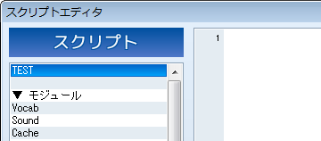
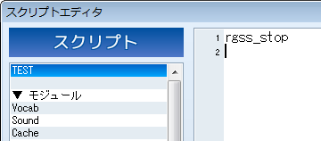

# 始めましょう


- [プロジェクトの作成](#project)
- [セクションの作成](#section)
- [プログラムの終了](#stop)
- [コメント](#comment)
- [コメントアウト](#comment_out)
- [文法とライブラリ](#syntax)


基礎編では、単体で完結する短いプログラムを作りながら RGSS の基本を 解説していきます。

まずは、学習を始めるための準備をしましょう。

## プロジェクトの作成


最初に、スクリプト入門用の新しいプロジェクトを作成しましょう。

スクリプトはゲームの実行そのものにかかわるデータですから、現在作成中 のプロジェクトをそのまま使用すると、誤ってゲームを正常に実行できなくして しまう可能性がないとも限りません。そこで、壊れても構わないプロジェクトを 使って学習を進めていくことをお勧めします。

なお、VX Ace のスクリプトデータは Data フォルダ内の Scripts.rvdata2 と いうファイルに保存されていますので、このファイル (もしくはプロジェクト 全体) のバックアップを取っておけば、既存のプロジェクトを使用しても構い ません。

## セクションの作成
 

プロジェクトを作成したら、メインメニューの [ツール] から [スクリプトエディタ] を選択しましょう。

スクリプトエディタが表示されたら、一番上に新しいセクションを作成 してください。一番上にはデフォルトで空白のセクションがありますから、 そこを使用することもできますが、セクションを作成する方法をここで確認 しておきましょう。右クリックすると表示されるポップアップメニューから [挿入] を選択すれば OK です。

セクションの名前は何でも構いませんが、わかりやすいように、ここでは "TEST" としておきます。名前の入力はウィンドウの左下にある [名前] から行えます。

## プログラムの停止


まずは、次のように入力してください。

```

rgss_stop
```

 

Ruby ではアルファベットの大文字と小文字は区別されます。 必ず、半角小文字でこの通りに入力してください。 入力が終わったら [OK] ボタンを押してスクリプトエディタを閉じ、 実行 (テストプレイ) してみましょう。[フルスクリーンで起動] オプション は OFF にしておくことをお勧めします。

テストプレイをしようとすると、タイトル画面が表示されずに真っ黒な 画面で停止するはずです。つまり、ここで書いた **rgss_stop** というのが、プログラムを停止させる命令というわけです (名前からおわかりの ように、これは RGSS 独自の命令です) 。

最初の TEST セクション内に rgss_stop と書かれているため、プログラムは そこで停止します。それ以下のセクションに書かれているスクリプトが実行 されることはありません。今後のサンプルプログラムでは省略しますが、何か 試す際には、最後の行に rgss_stop を書くようにしてください。 書かないで実行すると、そのたびにゲームのタイトル画面が表示されて しまうからです。

## コメント


Ruby では、# 文字から行末までを**コメント**と みなします。

コメントはプログラムの実行に全く影響を与えませんので、作り手のみが 見ることのできるメモを書き込むために使用できます。

```

rgss_stop # プログラムの停止
```


これはイベントコマンド [注釈] の役割と同じで、プログラムが処理 している内容の簡単な説明を記述し、わかりやすくするために使います。 たとえ自分が作ったプログラムであっても、時間が経つとどのような処理を していたのか忘れてしまったりするものです。学習用ではなく実際に使う プログラムを組むときには、なるべくコメントをつけるように心がけること をお勧めします。

なお、プログラムの説明として、以降のページではスクリプトの横に コメントを書くことが多々あります。その場合、あえてコメントの内容まで 真似て書く必要はありません。# 以降の文章は、あくまでもわかりやすく 説明するために書いてあるものだと判断してください。

## コメントアウト


処理内容の説明を書くのではなく、プログラムの実行部分を一時的に 無効にするためにコメントの機能を使うことがあります。

1 行目にカーソルを合わせ、Ctrl+Q を押してみてください。

```

#~ rgss_stop # プログラムの停止
```


このようになったはずです。もう一度押すと元に戻ります。

見たとおり、rgss_stop という命令そのものがコメントになっていますので、 この行は実行されません。バグの原因を探している最中など、プログラムを 消したくはないけれど実行もさせたくないという場合に使用します。 このような操作を**コメントアウト**と呼びます。

#~ という記号は Ruby で意味を持つものではありませんが、自動コメント アウト機能の目印として使用しています。複数の行を選択した状態で Ctrl+Q を 押せば、その範囲を一括してコメントアウト、およびその解除を行うことが できます。

## 文法とライブラリ


プログラミング言語の構造は大まかに**文法**と**ライ ブラリ**に分けることができます。

**文法**というのは、言語を使って何かの処理を記述する際の ルールのことです。日本語や英語などの自然言語と同じように、プログラミング 言語にも文法があるのです。たとえば条件分岐の文法、ループの文法といった 具合です。「# という文字から行末までがコメントになる」というのも文法の ひとつです。「言語」という言葉は、狭い意味ではこの「文法」だけを指す場合 があります。

**ライブラリ**というのは、文字列の処理や画像の表示など、 応用的な機能を持った部品集のことです。日本語や英語などの自然言語で「単語」 や「熟語」に相当するものだと考えればわかりやすいでしょう。英語の文法を学ん だだけでは英語を使えるようにならないのと同様に、語彙を増やす (ライブラリの 使い方を覚える) 必要があるわけです。

この「スクリプト入門」基礎編では、文法の学習が中心となります。最初の うちは「文法を学習して、具体的に何の役に立つのか」ということが見えにくい ため退屈に感じるかもしれませんが、基本的な文法を理解してロジックを組み立て るという最初の壁さえ越えられれば、リファレンスを読んで実践的な使い方を覚え ていくことは、実はそれほど難しいことではありません。また、プログラミングの 基本的な考え方はどの言語でも一緒ですから、RGSS を使いこなせるようになれば、 他の言語を習得するのも簡単です。

それでは始めましょう！

######
