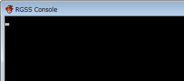
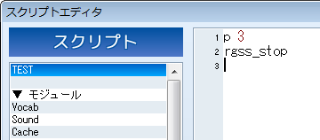

# 数値の計算


- [コンソールの表示](#console)
- [数値](#number)
- [表示](#display)
- [計算の方法](#calculate)


Ruby における数値や計算の基礎を解説します。 例として電卓のように簡単な計算を使って解説していきましょう。

## コンソールの表示
 

最初に、VX Ace の［ゲーム］メニューから［コンソールの表示］にチェックを 入れてください。このオプションを有効にすると、テストプレイを実行したとき、 ゲームウィンドウと同時にコンソールウィンドウが開くようになります。

コンソールウィンドウは、文字情報を表示するための専用のウィンドウです。 デバッグ時などに、適宜文字を表示して動作をチェックするのが主な使用目的と なります。実際の完成したゲームで表示されることはありません。

## 数値


Ruby で扱える数値には、**整数**と**浮動小数点 数**の 2 種類があります。

```

3 # 整数
52 # 整数
-99 # 整数
1.5 # 浮動小数点数
3.0 # 浮動小数点数
```


浮動小数点数というのは、主に小数点以下の計算が必要なときに使用する 数です。同じ数でも 3 と書けば整数として、3.0 と書けば浮動小数点数とし て扱われます。整数のほうが計算が高速なため、小数点以下が不要な場合には 整数を使用します。

注意として、たとえば 15 を表現するときに 015 というように先頭に 0 を つけて書いてはいけません。この場合は 8 進数と解釈され、別の意味になって しまいます。8 進数とは何かという説明は省略しますが、普通に数字を書く ときには先頭に 0 をつけないということを覚えておいてください。

## 表示
 

数値をコンソールに表示してみましょう。何かの値を表示したいとき は、**p** という命令を使います。

小文字の p、半角スペース、表示したい値の順に入力して改行してくだ さい。今後いろいろな命令や記号が出てきますが、コメントなどを除いては すべて半角文字で入力する必要があります。うっかり全角スペースなどを入れ てしまうと、発見しにくいエラーになりますので注意しましょう。

```

p 3
```


うまくいけば、コンソールウィンドウに 3 と表示されるはずです。 この p という命令はデバッグ時によく使われますが、勉強のために数値 などを表示する目的にも便利です。

なお、p 関数は RGSS2 まではメッセージボックスに表示するようになって いましたが、この仕様は RGSS3 で変更されました。 従来のようにメッセージボックスに表示したい場合は、msgbox 関数を使用してください。

## 計算の方法


Ruby に計算をさせてみましょう。

```

p 1 + 1 # 加算 (足し算)
p 10 - 3 # 減算 (引き算)
p 7 * 5 # 乗算 (掛け算)
p 24 / 4 # 除算 (割り算)
```


このように、普通の式を書けばその結果が出力されます。+ や - などの 記号は**演算子**と呼びます。

なお、プログラムでは、掛け算を *、割り算を / で表します。 慣れていない方は、重要なことなので覚えておきましょう。

### 優先順位


普通の計算と同じように、* と / は + と - よりも優先されます。 この順序を変えたいときはカッコ ( ) を使って計算します。

```

p 2 * 2 + 3 * 4 # => 16
p 2 * (2 + 3) * 4 # => 40
p 2 * (2 + 3 * 4) # => 28
```


1 番目の式は 4+12、2 番目の式は 2*5*4、3 番目の式は 2*14 と解釈される ので、このように違う計算結果になります。

カッコは何重にも重ねることができます (二重三重に括る場合でも使う記号は 同じです) 。

なお、サンプルプログラムのコメント中に => という記号が使われている ときは、主にその行の出力結果を表すものとします。これは説明をわかりやすく するための便宜的なものです。

### 小数点以下の計算


整数を整数で割った場合、余りは切り捨てられ、答も整数になります。 小数点以下の答を出したい場合は、浮動小数点数 (小数点以下を明記した形) を使用します。

```

p 15 / 4 # => 3
p 15.0 / 4.0 # => 3.75
```


割られる数か割る数のどちらかが一方が浮動小数点数ならば、もう片方が 整数であっても、答は浮動小数点数になります。

```

p 15.0 / 4 # => 3.75
p 15 / 4.0 # => 3.75
```


上記の例で 4 や 15 は整数ですが、浮動小数点数が入った式で あるため、それぞれ 4.0、15.0 とみなされて計算されることになります。

### 剰余の計算


剰余 (割り算の余り) を求めるには、% という記号を使います。

```

p 14 % 4 # => 2
p 13 % 4 # => 1
p 12 % 4 # => 0
```


たとえば 1 番目の式を実行した場合、14 を 4 で割った場合の余りの数、 すなわち 2 という数値が計算結果として出力されます。

### べき乗の計算


無理に覚える必要はありませんが、べき乗 (同じ数を指定回数だけ掛け算 した答) を求めるには、** という記号を使います。

```

p 2 ** 4 # => 16
```


この例では 2 の 4 乗、つまり 2*2*2*2 を計算しています。

######
