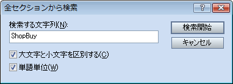

# Vocab モジュール


- [モジュールの定義](#define_module)
- [定数](#constant)
- [sprintf](#sprintf)
- [モジュールメソッド](#module_method)
- [用語データの取得](#read_terms)


上のセクションから順に見ていくことにしましょう。Vocab は、 用語とメッセージを扱うモジュールです。

## モジュールの定義


まずは、左のリストから Vocab セクションを選択してください。

1 ～ 6 行目はコメントですから問題ありませんね。8 行目を見てください。

```

module Vocab
```


ここでは、Vocab という名前の新しいモジュールを定義しています。 基礎編で[画像の表示](109_graphics.md)を行うときには Graphics という組み込みモジュールを使用しました。クラスと同様、 モジュールを自分で定義することも可能です。具体的には、

```

module モジュール名
end
```


という文法を使用します。これは[クラス定義](112_class.md)の 方法とほとんど同じです。モジュールは、インスタンスを作ることができない ということ以外、ほぼクラスと同じものだと考えておいても良いでしょう。

実際には、モジュールにはもうひとつの重要な機能があります。 基礎編の[配列](110_array.md)の章で 最後に解説した [Enumerable](../rgss/sm_enumerable.md) モジュールのように、別のクラスに対して自分のメソッドを追加するという 機能です。これを **Mix-in** と呼びます。ただしこれは「RGSS リファレンスにて『インクルードしているモジュール』に書かれている メソッドも使用できる」という理解があれば十分で、プリセットのスクリプト でも Mix-in は使用していませんので、さほど気にしなくても構いません。

なお、Vocab という名前は vocabulary (語彙) という英単語を省略した ものです。

## 定数


アルファベットの大文字で始まる識別子は、**定数**として 扱われます。定数とは、いったん定義されたら書き換わることがないような データのことです。定数という名前ですが、必ずしも「数」である必要は ありません。文字列やその他のオブジェクトも定数として使用できます。

```

 ShopBuy = "購入する"
 ShopSell = "売却する"
 ShopCancel = "やめる"
 Possession = "持っている数"
```


Vocab セクションの 11 ～ 14 行目では、このように定数を定義しています。 この文字列の内容を書き換えれば、ショップ画面のコマンド名などを変更する ことができます。このように、あとから書き換える可能性があるものを一か所に まとめておくというのが、定数の一般的な利用方法のひとつです。 

さて、この定数が実際にスクリプトのどこから参照されているのかを探して みましょう。このような場合には [全セクションから検索] 機能を使います。

Ctrl+Shift+F を押して [全セクションから検索] ダイアログボックスを 開き、ShopBuy という文字列を検索してみてください。このとき、通常の検索 ウィンドウ (Ctrl+F) と間違わないように注意が必要です。今回は [単語単位] オプションにチェックを入れて検索してください。

検索に成功すれば、2 件の検索結果が表示されるはずです。このうちひとつは 現在開いている Vocab モジュール内での定義ですから、もうひとつの検索結果を ダブルクリックしてください。

```

 add_command(Vocab::ShopBuy, :buy)
 add_command(Vocab::ShopSell, :sell, !@purchase_only)
 add_command(Vocab::ShopCancel, :cancel)
```


Window_ShopCommand というセクションが開き、上のような箇所にカーソルが 移動しましたね。すなわちこれが、モジュール内の定数の参照の仕方です。

```

モジュール名::定数名
```


'::' という演算子は、前章でデータベースの内容を解説するとき、RPG::Actor といった形でも出てきました。クラスやモジュールの名前も定数と同じように 扱われますから、これはつまり RPG というモジュールの中で Actor という クラスが定義されている、という意味だったのです。

Window_ShopCommand セクションのその他の部分は今は関係ありませんの で、Vocab モジュールに戻ってください。

## sprintf


Vocab モジュールの定義を上から順に見ていくと、'%s' という 記号が含まれた文字列が見つかります。

```

 Emerge = "%sが出現！"
 Preemptive = "%sは先手を取った！"
 Surprise = "%sは不意をつかれた！"
 EscapeStart = "%sは逃げ出した！"
```


比較的わかりやすそうなものを抜き出してみました。 これを見ると、'%s' という部分が、キャラクターやアイテムの 名前などに置き換わるのだということが想像できると思います。

これは、[sprintf](../rgss/s_functions.md#L000402) という 組み込み関数の**書式文字列**です。sprintf というのは C 言語などで伝統的に使用される関数です。s は string (文字列) の 頭文字、print は出力の意味で、f は format (書式) の頭文字です。

Ruby では、たとえば次のように使用します。TEST セクションで 実験してみてください。

```

p sprintf("%sに %s のダメージを与えた！", "ドラゴン", 999)
```


書式文字列を最初の引数とし、2 番目以降に、埋め込む文字列や数値など順番に 指定すると覚えてください。's' は文字列を埋め込む**指示子**です が、999 などの数値を指定しても、Ruby では自動的に文字列に変換されますから 心配ありません。この例では文字列や数値を直接引数にしていますが、もちろん 実際には変数を使用することのほうが多いでしょう。

書式が適用された新しい文字列が sprintf の戻り値となりますので、それを 別の変数に代入したり、例のように p 関数などを使って表示したりすることが できます。

sprintf を使うと、文字列を埋め込むだけでなく、数値を指定した桁数だけ出力 したりなど、いろいろな細かい制御が可能です。現時点では '%s' の役割がわかれば 問題ありませんが、将来必要になったときには [ sprintf フォーマット](../rgss/appendix02.md)を参照してください。

## モジュールメソッド


さらに順に見ていくと、次のような個所があります。

```

 def self.basic(basic_id)
 $data_system.terms.basic[basic_id]
 end
```


メソッドの定義のように見えますが、'self.' という文字がついていますね。 これは**モジュールメソッド**の定義です。

ちなみに、同じ定義をクラス定義の中で行った場合は**クラス メソッド**と呼び、これらを合わせて、より一般的には**特異 メソッド**とも呼びます。この概念は Ruby 独特のものなので、ほかの 言語の経験者の方であっても少し戸惑ってしまうかもしれません。

難しい話はさておき、モジュール内でメソッドを定義するときには 'self.' をメソッド名の前につけると覚えておけば、実用上は十分です。

上のように定義しておくことで、

```

Vocab.basic(0)
```

 または

```

Vocab::basic(0)
```


このような呼び出し方ができるようになります。実際のスクリプトでは、 定数の参照方法と見た目を統一するために後者の記法を使用しています。

もし、このメソッドの定義を、

```

 def basic(basic_id)
 $data_system.terms.basic[basic_id]
 end
```


このように「普通のメソッド」として書いてしまうと、Vocab.basic(0) のような参照方法では「メソッドが見つからない」というエラーになって しまいますので注意してください。

なお、[関数](107_function.md)の定義方法を学習した際、 途中で中断する場合以外は return を省略することが可能と説明しました。 ここでは return を省略した書き方になっていますが、省略せずに書くと 次のようになります。

```

 def self.basic(basic_id)
 return $data_system.terms.basic[basic_id]
 end
```


## 用語データの取得


メソッドの内容を確認しておきましょう。

```

 $data_system.terms.basic[basic_id]
```


前章で[データベース](201_database.md)のアクセス方法を きちんと確認した方なら、これは難しくはないでしょう。

$data_system は [RPG::System](../rgss/gc_rpg_system.md) クラスのインスタンスを指す変数で、その中の terms という属性は [RPG::System::Terms](../rgss/gc_rpg_system_terms.md) クラスのインスタンスを指しています。basic は基本ステータスの文字列が 格納された配列を指しており、たとえば basic_id が 0 なら [レベル] に 対応する用語を取得することになります。 ツクールのデータベースでは [システム] と [用語] のタブが分かれていますが、 データ上では [用語] は [システム] の一項目という扱いになっています。

さらに続けて見ていくと、次のような行があります。

```

 def self.level; basic(0); end # レベル
```


同じような定義が大量にあるため、セミコロンを使用することでメソッドの 定義を一行で済ませています。普通の書き方をすると次のようになります。

```

 # レベル
 def self.level
 basic(0)
 end
```


これは、Vocab::basic(0) の代わりに、わかりやすく Vocab::level と書けるようにするためのメソッドです。残りの行の役割も同様です。

######
