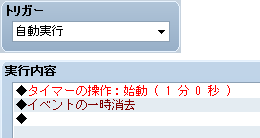

# タイマーの改造


- [イベントの作成](#event)
- [スクリプト素材の作成](#material)
- [改造個所の探し方](#find)
- [クラスとメソッドの再定義](#redefine)
- [メソッド定義の変更](#change)
- [エイリアス](#alias)


実践編では、実際にゲームの改造を行いながら、必要な知識を解説して いきます。

まずは簡単な例として、イベントコマンド［タイマーの操作］で使用する タイマーの表示を変更することを目標とします。

## イベントの作成
 

最初に、いったんスクリプトエディタを閉じ、テスト用のイベントを 作成します。

右の画面写真のように、自動実行イベントに [タイマーの操作] を設定し、 テストプレイでタイマーがどのように表示されるか、すぐに確認できる 状態にしておいてください。

## スクリプト素材の作成


基礎編の最初で一番上に作成したセクションはもう使用しませんので、 削除してください。代わりに、下の方にある「▼ 素材」というセクション の下に新しいセクションを作成してください。名前は適当で結構です。

プリセットのスクリプトを直接編集しても構わないのですが、自分が 改変した部分を一か所にまとめておけば、いろいろと便利です。 このため、改造したスクリプトを素材として他人に配布するつもりがない 場合でも「素材」のような扱いで作成することをお勧めします。

## 改造個所の探し方


スクリプト素材を作成する際、最初にすることは、どのあたりを改造 すれば目的の動作が得られるかの見当をつけることです。

今回はタイマーの改造をしたいので、まずは「タイマー」という文字列 を全セクションから検索してみましょう。[単語単位] オプションには チェックを入れないでください。検索結果が何件か表示されたら、 順に見ていけば、タイマーの表示に関係のありそうな部分を見つけることが できます。

この場合は **Sprite_Timer** クラスが正解です。[スプライトの管理](206_sprites.md)の最初の表にも載って いますね。改造個所の特定はいつもこのように簡単ではありませんが、 コツを覚えれば、比較的短時間で探すことができるようになります。

## クラスとメソッドの再定義


素材の位置に新しく作成したセクションに移動し、次のように 入力してください。

```

class Sprite_Timer
end
```


Ruby では、いったん定義したクラスを後から変更することができます。 この中にメソッドなどを記述すれば、それは Sprite_Timer クラス自体の 定義として扱われるというわけです。

オリジナルの Sprite_Timer クラスを読んでいくと、create_bitmap というメソッドが見つかるはずです。これは、スプライトの転送元 ビットマップを作成し、文字のサイズと色を設定するという内容の メソッドです。今回はこの部分を改造したいので、create_bitmap メソッドをコピーし、素材の方に貼り付けます。

```

class Sprite_Timer
 def create_bitmap
 self.bitmap = Bitmap.new(96, 48)
 self.bitmap.font.size = 32
 self.bitmap.font.color.set(255, 255, 255)
 end
end
```


同名のメソッドを定義した場合、後から定義された方が優先されます ので、これで create_bitmap メソッドだけを差し替えることができます。

## メソッド定義の変更


実際にタイマーの表示を変更してみましょう。

```

class Sprite_Timer
 def create_bitmap
 self.bitmap = Bitmap.new(128, 96)
 self.bitmap.font.size = 64
 self.bitmap.font.color.set(255, 0, 0)
 end
end
```


上記のように数字を変更し、テストプレイをしてください。タイマーが 大きな赤い字で表示されていれば成功です。

ここで変更した数字の意味がよくわからない方は、自分で他の数字に 変更してみて、どのような表示になるかを実験してみましょう。 設定内容の詳細を確認したい場合は、[Bitmap](../rgss/gc_bitmap.md)、[Font](../rgss/gc_font.md)、[Color](../rgss/gc_color.md) クラスのリファレンスを参照してください。

## エイリアス


以上で「タイマーを大きな赤い字で表示するスクリプト素材」が完成した わけですが、本当に「素材」として配布する場合、既存のメソッド全体を 置き換えてしまうと、他の素材との競合が問題になる可能性があります。 メソッドを置き換えるのではなく、既存の処理の前や後ろに何かを追加したい 場合は**エイリアス** (別名) という機能を使用します。

```

class Sprite_Timer
 alias xxx001_create_bitmap create_bitmap
 def create_bitmap
 xxx001_create_bitmap
 self.bitmap.font.color.set(255, 0, 0)
 end
end
```


上記のようにすると、古い create_bitmap メソッドの内容を実行した 上で、フォントの色だけを変更することができます。

```

 alias xxx001_create_bitmap create_bitmap
```


この行で、古い create_bitmap メソッドに xxx001_create_bitmap という別名をつけて退避させています。このようにしておけば、新しい create_bitmap の中で古い処理を呼び出すことができるというわけです。 ただし、エイリアスの名前自体が被るとやはり競合が発生してしまいます から、xxx001 の部分が他の素材と被らないよう、独自の名前をつける ことが必要となります。これは、自分自身が複数の素材で同じ個所を 再定義する場合でも同様です。

やや混乱を招きやすい部分ですが、create_bitmap メソッドを再定義 することによって、古いほうの create_bitmap メソッドの内容が上書き されるわけではありません。別のメソッドが同じ名前で定義され、外から 見たときだけメソッドの内容が入れ替わっているように見えるという イメージです。古いメソッドをエイリアスで退避しておけば、その内容が 再定義の影響を受けて変化するようなことはありません。

######
