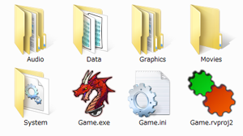

# RGSS の仕様


- [RGSS3 の新機能](#whats_new)
- [ゲームの起動](#game_run)
- [Game.ini](#game_ini)
- [RGSS-RTP](#rgss_rtp)

 - [インストール情報](#rgss_rtp_install)

- [暗号化アーカイブ](#encryption_archive)
- [その他](#others)

 - [拡張ライブラリ](#ext_lib)
 - [文字コード](#character_code)
 - [プロパティ](#property)


## RGSS3 の新機能 (RGSS3)


『RPGツクールVX Ace』に組み込まれている RGSS3 では、『RPGツクールVX』の RGSS2 からいくつか変更されている点があります。主要な変更点は次のとおりです。

- Ruby 1.9.2 を用いて再構築されました。Ruby 1.9 には、処理速度の向上をはじめとしたさまざまな改良が含まれています。
- 日本語版と英語版の DLL が統合されました。Windows が日本語環境であるかを 自動判別し、それ以外であれば英語でメッセージを表示します。
- 暗号化アーカイブの内部仕様が刷新され、大容量のゲームで起動に 時間がかかる問題が解消されました。
- F12 キーによるリセットで戻る位置を制御できるようになりました。 [rgss_main](g_functions.md#rgss_main) 関数を使用します。
- [Window](gc_window.md) クラスにて、 枠と内容の間にある余白を調整できるようになりました。
- [Font](gc_font.md) クラスにて、縁取り文字の 描画が標準でサポートされました。
- エディタ側のオプションにて、テストプレイ時にデバッグ出力用の コンソールウィンドウを開くことが可能になりました。
- 上記に伴い、print 関数と p 関数でメッセージボックスに 出力する仕様は廃止されました。これらの関数はそれぞれ [msgbox](g_functions.md#msgbox) および [msgbox_p](g_functions.md#msgbox_p) と改名されました。
- Ogg Theora ムービーの再生がサポートされました。[Graphics.play_movie](gm_graphics.md#play_movie) メソッドを使用します。
- [Audio](gm_audio.md) モジュールにて、ogg および wav ファイルの途中からの再生がサポートされました。
- [Input](gm_input.md) モジュールにて、ボタン名を シンボルで指定できるようになりました。Input.trigger?(:C) というように、従来よりも短く表記できます。
- Syntax Error が発生したとき、その詳細をメッセージボックスに 表示するようになりました。


上記のほかにも、いくつかの細かい変更が加えられています。

このマニュアルでは、RGSS3 で新しく追加された機能、仕様が 変更された部分などに (RGSS3) という印を つけています。

## ゲームの起動
 

RGSS は通常、ゲーム起動ファイル Game.exe (Windows のオプション 「登録されている拡張子は表示しない」が有効になっている場合は、Game とのみ 表示されます) のアイコンをダブルクリックすることにより実行します。 このファイルがあるフォルダを「ゲームフォルダ」と呼びます。

ツクールで編集中のゲームは、メニューの [テストプレイ]、またはデータベース [敵グループ] の [戦闘テスト] から起動することができます。これらの場合、 グローバル変数 $TEST の値が true にセットされます。 戦闘テストの場合は $BTEST という変数も true になります。

ゲームの動作は、構成設定ファイル [Game.ini](#game_ini) で指定します。

## Game.ini


Game.ini ファイルはツクールにより自動的に作成、更新されますが、 メモ帳などのテキストエディタで直接編集することもできます。

例:

```

[Game]
RTP=RPGVXAce
Library=System\RGSS300.dll
Scripts=Data\Scripts.rvdata2
Title=RubyQuest
```


### RTP


このゲームで使用する [RGSS-RTP](#rgss_rtp) の登録名。 通常「RPGVXAce」です。

指定された RTP がインストールされていない場合は エラーメッセージが表示されます。

### Library


RGSS 本体の DLL 名。このファイルは通常、ゲームフォルダ内の "System" フォルダにコピーされたものを使用します。 (RGSS3)

### Scripts


スクリプトが格納されているデータファイル。ゲームフォルダからの相対パスで 指定します。

Ruby は拡張子 .rb のテキストファイルをスクリプトとして実行するのが普通 ですが、RGSS では独自形式でパッケージングされた単一のファイルを使用します。 このファイルは通常、ツクールのスクリプトエディタを通さないと編集することは できません。データは複数のセクションから成っており、リストの表示順に実行 されていきます。

### Title


ゲームタイトル。ウィンドウのタイトルバーにこの名前が表示されます。

## RGSS-RTP


RTP (Run-Time Package) は、配布するゲームデータの容量を小さくするための 機構です。RTP には、多くのゲームで共通して使用される汎用的な画像、音声素材 などが含まれています。ゲームをプレイする側は、それらの素材データをあらかじ め共通ファイルとしてインストールおくことにより、重複するファイルを何度も ダウンロードする必要がなくなるという利点があります。

RTP の構成ファイルは、組み込みゲームライブラリの以下のメソッドに おいて、ゲームフォルダに存在するのと同じようにアクセスすることができます。 これらのメソッドに渡すファイル名は、すべて拡張子を省略することが可能です (".png" や ".mid" などが自動的に判定されます) 。

[Bitmap.new](gc_bitmap.md#new)、[Audio.bgm_play](gm_audio.md#bgm_play)、[Audio.bgs_play](gm_audio.md#bgs_play)、[Audio.me_play](gm_audio.md#me_play)、[Audio.se_play](gm_audio.md#se_play)、[Graphics.transition](gm_graphics.md#transition)

### インストール情報


『RPGツクールVX Ace』標準の RTP は "RPGVXAce" 一種類のみですが、 構造的には異なる RTP を使用することもできるようになっています。インストーラ 作成の知識があれば、以下の規則に従い、ユーザーレベルで独自の RTP を作成する ことも可能です。

RTP はデフォルトで、次のフォルダにインストールされます。

```

[CommonFilesFolder]\Enterbrain\RGSS3\[RTPName]
```

 ここで [CommonFilesFolder] は Windows の「共通ファイルフォルダ」の 場所、[RTPName] は RTP の登録名です。実際には次のようなパス名になります。

```

C:\Program Files\Common Files\Enterbrain\RGSS3\Standard
```


RTP のインストーラは、レジストリキー "HKEY_LOCAL_MACHINE\SOFTWARE\Enterbrain\RGSS3\RTP" に文字列値 (名前は RTP の登録名) を作成し、その値としてパス名を設定します。このキーに 設定されている文字列が、RGSS から RTP として認識されることになります。

## 暗号化アーカイブ


暗号化アーカイブは、ゲームの内容を他人に解析、改造されにくくするための 機構です。通常 Game.rgss3a という名前のファイルで、これにはすべてのデータ ファイルと画像ファイルが含まれています (音声ファイル、フォントファイルは 含まれません) 。 ツクールで [ゲームデータの圧縮] を行うときに [暗号化アーカイブを作成する] チェックボックスにチェックを入れることで作成できます。

暗号化アーカイブ内にあるファイルは、組み込みゲームライブラリの以下の メソッドにおいて、ゲームフォルダに存在するのと同じようにアクセスすることが できます。

[load_data](g_functions.md#load_data)、[Bitmap.new](gc_bitmap.md#new)、[Graphics.transition](gm_graphics.md#transition)

ゲームフォルダに暗号化アーカイブが存在する 場合、[Game.ini](#game_ini) の Sctipts で定義されるスクリプト データ (通常 Data\Scripts.rvdata) は必ずアーカイブ内から読み出されます。 これは、外部のスクリプトによってアーカイブ内のファイルが読み取られて しまうことを防止するための制限です。

機能の性質上、暗号化アーカイブの内部フォーマットは公開されません。 これを解析することはご遠慮ください。

## その他


### 拡張ライブラリ


RGSS は C 言語で書かれた Ruby の拡張ライブラリをロードすることができません。 このため、以下の拡張ライブラリは例外的に組み込み扱いになっています。

- dl
- zlib
- single_byte
- utf_16_32
- japanese_sjis
- Win32API


### 文字コード


RGSS の処理する文字コードは UTF-8 です。UTF-8 とは、Unicode (世界中の文字 を表現可能にする文字コード) の表記方法の一種です。

ツクールの出力するスクリプトデータや、その他の文字列データはすべて UTF-8 になっており、通常、文字コードの違いを特に意識する必要はありません。

### プロパティ


[ゲームライブラリ](g_index.md)の解説において「プロパティ」 という用語が使用されています。これは Ruby の言語仕様にある概念ではなく、RGSS 独自の用語です。

たとえばスプライトの X 座標 ([Sprite#x](gc_sprite.md#x)) は、 次のように取得、設定が可能です。

```

x = sprite1.x # 取得
sprite2.x = x + 32 # 設定
```


この x のように、代入演算子を使って取得 (読み込み) と設定 (書き込み) の 両方ができるように定義されているメソッドを、便宜的にプロパティと呼んでいます。

[Color](gc_color.md) クラスや [Tone](gc_tone.md) クラス、[Rect](gc_rect.md) クラスなどのオブジェクトがプロパティとして 定義されている場合、呼び出し元に返されるのはそのオブジェクト自体への参照であり、 コピーではありません。したがって、

```

color = font1.color
color.set(255, 0, 0)
```


このような書き方でもフォントの色が変更されることになります。

######
