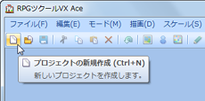
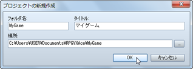
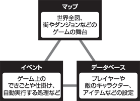

# ゲーム作成の始め方

## プロジェクトの作成

本ソフトでゲーム作品を作るには、まず“プロジェクト”を作る必要があります。プロジェクトとは、ひとつのゲームを構成するデータや素材をまとめたものです。自作の画像や音楽も、プロジェクトにファイルを取り込むことで使えるようになります。

プロジェクトの作成方法は以下のとおりです。

### ●（1）プロジェクトを新規作成する

ツールバーの［プロジェクトの新規作成］ボタンをクリックするか、メニューバーの［ファイル］→［プロジェクトの新規作成］をクリックします。

### ●（2）保存先とタイトルを入力する

プロジェクトの名前（半角英数字を推奨）、［タイトル］にゲームの作品名を入力します。［場所］には、プロジェクトの保存場所が表示されます。変更するには右端の［…］をクリックして保存先を指定します。

以上を設定し［OK］ボタンをクリックすると、最小限のデータを設定した状態でプロジェクトが作られ、ゲームの作成が可能になります。  

## プロジェクトの管理

### ●プロジェクトの保存／読み出し

ゲームの作成を中断するときは、プロジェクトを保存してからソフトを終了しましょう。［プロジェクトの保存］のボタン（または［ファイル］→［プロジェクトの保存］）をクリックすると、編集中のプロジェクトの内容が上書き保存されます。

ゲームの作成を再開するには、［プロジェクトを開く］のボタン（または［ファイル］→［プロジェクトを開く］）をクリックし、プロジェクトフォルダの中にある“Game” （または“Game.rvproj2”）のファイルを選択して［開く］をクリックします。

### ●バックアップ／削除

プロジェクトの内容は、プロジェクトの新規作成時に指定したフォルダにまとめて保存されます。バックアップするには、このフォルダをまるごと別のメディアなどにコピーしてください。不要になったプロジェクトを削除するには、フォルダを通常の方法で削除します。

## ゲーム作成の進め方
 

本ソフトで作成できるRPGというタイプのゲームは、プレイ画面のグラフィック、プレイヤーが操作するキャラクター、アイテムや魔法の設定、仕掛けやストーリーなどの様々な要素から成り立っています。

本ソフトではこれらの要素を、舞台を作る“マップ”、できごとなどを表現する“イベント”、キャラクターなどの設定を決める“データベース”という3種類のデータを中心にして作る仕組みです。

ゲームの作成に決まった手順はありません。本ソフトで初めてゲームを作る場合は、マップの作成から始めるとよいでしょう。そのうえで作りたいゲームの内容に合わせて、イベントやキャラクターなどのデータを用意します。

######
