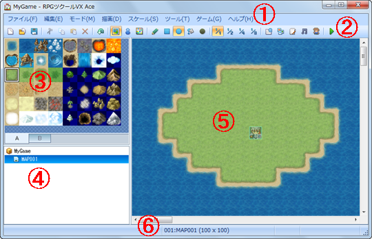

# 基本操作

## ウィンドウ各部の名称と機能

プロジェクトを開いた後に表示される画面を“メインウィンドウ”といいます。メインウィンドウでは、主にマップやイベントを編集するのに使います。“データベース”や“素材管理”などのツールは、メインウィンドウのメニューから呼び出します。各部の機能は以下のとおりです。 

### ●メニューバー（1）

本ソフトに用意された機能をここから選択します。

### ●ツールバー（2）

ボタンをクリックすることで特定の機能を実行できます。

### ●タイルパレット（3）

マップに配置できるタイルセットが表示されます。下のタブでセットを切り替えられます。

### ●マップリスト（4）

作成中のゲームに含まれるマップデータの一覧です。

### ●マップビュー（5）

選択中のマップの内容を表示します。デザインの編集やイベントの配置場所の指定などに使います。

### ●ステータスバー（6）

選択中の機能の内容やマップ名、マップ座標を表示します。

## 設定項目の編集方法

本ソフトでのゲーム作成は、各種のウィンドウに用意された設定項目に、作りたいものに合わせて文字や項目などを指定することが作業の中心となります。設定項目のタイプと編集方法は以下のとおりです。

### ●文字の入力

設定欄をクリックすると、“｜”のカーソルが表示されます。この状態で、キーボードから文字を入力します。入力した文字は、カーソルの位置に挿入されます。カーソルは、キーボードのカーソルキーで移動させることも可能です。文字入力の方法は、お使いの日本語入力ソフト（IME）によって異なります。

### ●数値の入力

文字の入力と同様に設定欄をクリックすると“｜”のカーソルが表示されます。この状態でキーボードから数値を半角で入力します。設定欄の右端にある［∧］［∨］のボタンをクリックして値を増減させることもできます。

### ●ラジオボタン

複数の項目から適用するものをひとつ指定します。［○］をクリックして黒丸を入れた設定が有効になります。

### ●チェックボックス

項目名で示す設定の有効／無効を指定します。［□］をクリックして、チェックマークを付けると設定が有効になります。もう一度クリックするとチェックが消えます。

### ●プルダウンリスト

リストに表示される項目から適用するものをひとつ指定します。リストは設定欄の右側にある［∨］をクリックすると開きます。

### ●リストボックス

複数の設定を一覧表示します。項目をダブルクリックするとウィンドウが開き、内容の追加や変更が可能です。

### ●［…］ボタン

設定欄の右側に［…］とある項目は、その内容を別のウィンドウで指定します。［…］をクリックし、表示されたウィンドウに従って設定を行ないます。

### ●［OK］［キャンセル］［適用］ボタン

変更した設定項目の内容は、それを確定することで設定が有効になります。確定してウィンドウを閉じる場合は［OK］、項目の変更を取りやめてウィンドウを閉じる場合は［キャンセル］、ウィンドウを閉じずに確定のみ行なうには［適用］ボタンをクリックします。

######
