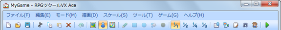

# メニューバーの内容
 

メインウィンドウのメニューバーに収められた項目の内容は以下のとおりです。

メニューの項目の頭にアイコンが添えられているものは、ツールバーにある同じアイコンのボタンをクリックすることでも実行できます。また項目の末尾にショートカットキーの表示があるものは、そのキーを押すことでも実行できます。

たとえばメニューの［編集］→［元に戻す］の項目は、ツールバーの［元に戻す］のボタンをクリックするか、キーボードで「Ctrl」キーを押しながら［Z］キーを押すことでも実行できます。

### ●［ファイル］メニュー

### プロジェクトの新規作成

新しいプロジェクトを作成します。すでにプロジェクトを開いている場合、新規作成後にそのプロジェクトは閉じられます。

### プロジェクトを開く

保存されているプロジェクトを開き、ゲームの内容を編集できる状態にします。［開く］ウィンドウで、プロジェクトのフォルダ内の“GAME”（または“Game.rvproj2”）のファイルを指定します。

### プロジェクトを閉じる

プロジェクトを閉じます。保存されていないデータがあると、確認のウィンドウが表示されます。保存してから閉じる場合は［はい］、保存しないで閉じる場合は［いいえ］を選択します。

### プロジェクトの保存

編集中のプロジェクトの内容を上書き保存します。

### ゲームデータの圧縮

編集中のプロジェクトをひとつのファイルに圧縮し、配布しやすい形にします。詳しくは[“補助ツールの使い方”](1140_intro_supporttool.md#archive)の項目をご覧ください。

### RPGツクールVX Aceの終了

本ソフトを終了します。［プロジェクトを閉じる］と同様に、プロジェクトに保存していないデータが存在する場合は確認ウィンドウが表示されます。

### ●［編集］メニュー

### 元に戻す

直前に行なった編集を取り消し、ひとつ前の状態に戻せます。最大で16手順前の状態にさかのぼれます。

### 切り取り

選択しているマップデータやマップイベントを、クリップボードに取り込んだうえで削除します。

### コピー

選択しているマップデータやマップイベントを、クリップボードに取り込みます。

### 貼り付け

クリップボードに取り込んだ内容を、新しいマップデータやマップイベントとして追加します。

### ●［モード］メニュー

### マップ

マップのデザインを編集するモードに切り替えます。

### イベント

マップイベントを作成・編集するモードに切り替えます。マップビューにはタイルの大きさで区切られた罫線が表示されます。

### リージョン

敵グループの出現地域（エンカウントする地域）を定義する“リージョン”の編集モードに切り替えます。

### ●［描画］メニュー

マップの編集モードでタイルの描画に使うツールを収めます。詳細は[“マップデザインの編集”](2120_map_design.md)の項目を参照してください。

### ●［スケール］メニュー

マップビューに表示されるマップの表示倍率を切り替えます。［1/1］を標準（等倍表示）とし、［1/2］［1/4］［1/8］を選択すると、それぞれの倍率でマップが縮小表示されます。

### ●［ツール］メニュー

### データベース

キャラクターやアイテムなどの要素を作成／編集する［データベース］の設定ウィンドウを開きます。

### 素材管理

ゲームの作成に使う画像や音楽、動画などの素材ファイルを管理するツールを表示します。詳しくは[“補助ツールの使い方”](1140_intro_supporttool.md#material)の項目をご覧ください。

### スクリプトエディタ

ゲームのシステムに近い部分を構成する［スクリプトエディタ］のツールを表示します。詳しくは[“補助ツールの使い方”](1140_intro_supporttool.md#script_editor)の項目をご覧ください。

### サウンドテスト

プロジェクトに素材ファイルとして読み込まれている音声を試聴できます。詳しくは[“補助ツールの使い方”](1140_intro_supporttool.md#sound_test)の項目をご覧ください。

### キャラクター生成

あらかじめ用意されたパーツを組み合わせて、歩行グラフィックや顔グラフィックを作成できます。詳しくは[“補助ツールの使い方”](1140_intro_supporttool.md#chara_tkool)の項目をご覧ください。

### オプション

エディタ上の画像の透明色とグリッドの表示に関する設定を行なえます。詳しくは[“補助ツールの使い方”](1140_intro_supporttool.md#option)の項目をご覧ください。

### ●［ゲーム］メニュー

### テストプレイ

テストプレイを開始します。詳しくは[“補助ツールの使い方”](1140_intro_supporttool.md#testplay)の項目をご覧ください。

### フルスクリーンで起動

ゲーム開始時にフルスクリーンで起動する設定を切り替えます。項目を選択するたびに有効（チェックマークを表示）／無効を切り替えられます。

### コンソールを表示

デバッグ出力用のコンソールウィンドウを表示する設定を切り替えます。項目を選択するたびに機能の有効（チェックマークを表示）／無効を切り替えられます。

### ゲームフォルダを開く

プロジェクトの保存フォルダを開きます。プロジェクトフォルダの場所を確認したりフォルダ内のファイルを手作業で操作したりするときに使います。

### ●［ヘルプ］メニュー

### 目次

ヘルプ（このウィンドウ）を表示します。

### ツクールweb

既定のWebブラウザーで『ツクールweb』（[http://tkool.jp/](http://tkool.jp/)）のWebサイトを開きます。本ソフトに関するサポート情報の確認などにお使いください。

### バージョン

本ソフトのバージョン情報を表示します。

######
