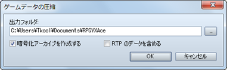
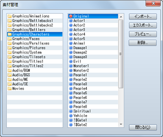
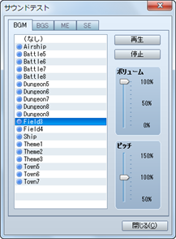
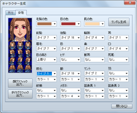
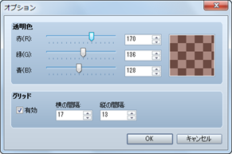
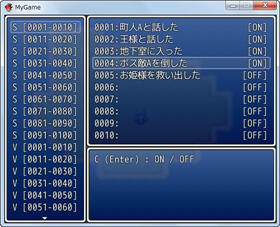
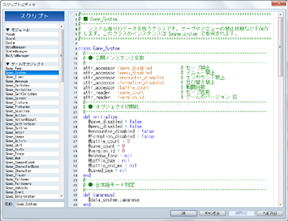
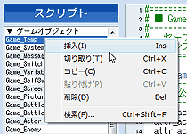
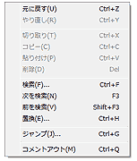

# 補助ツールの使い方

## ゲームデータの圧縮
 

［ファイル］→［ゲームデータの圧縮］を選択すると、プロジェクトの内容を圧縮したファイルを保存できます。完成したゲームを配布するのに便利です。表示される［出力フォルダ］でファイルの保存先を指定してください。

保存の際、［暗号化アーカイブを作成する］を有効にすると、プロジェクトの内容を見られないように暗号化します。［RTPのデータを含める］を有効にすると、RTPのデータを含めて圧縮します。ゲームをプレイするのにRTPをダウンロードする必要がなくなりますが、ファイルの容量が著しく大きくなりますのでご注意ください。

なお、約2GB（※）を超えるゲーム作品によっては、［ゲームデータの圧縮］が失敗する場合があります。
 ※数値は目安です。この容量は、お使いのPC環境や設定されたゲームの内容によって変動する場合がございます。

## 素材管理
 

［ツール］→［素材管理］で呼び出せる［素材管理］のツールでは、プロジェクトに含まれる素材ファイルを管理できます。ウィンドウ各部の内容やボタンの機能は以下のとおりです。なおオリジナルの画像や音楽などのファイルをゲームの作成に使用するには、所定の規格に準じる必要があります。詳しくは[“素材規格”](6100_resource.md)の項目をご覧ください。

### ●フォルダリスト

素材ファイルを収めるフォルダのリストです。素材ファイルをプロジェクトに取り込むときはは、ここで用途に応じたフォルダを指定します。

### ●ファイルリスト

［フォルダリスト］で選択したフォルダに含まれるファイルを表示します。ファイル名の頭のマークは、赤色が独自にインポートした素材ファイル、青色がRTPに含まれる素材ファイルを表わします。

### ●インポート

プロジェクト素材ファイルを取り込みます。取り込み先のフォルダを［フォルダリスト］で指定したうえでこのボタンをクリックし、対象の素材ファイルを指定します。なお、画像を取り込む際は、透明色（非表示）として扱う色をクリック、半透明色として扱う色を右クリックで指定します。

### ●エクスポート

プロジェクトの素材ファイルをプロジェクト外部に保存します。［ファイルリスト］で対象の素材ファイルを選択したうえでこのボタンをクリックし、保存先を指定します。エクスポートしても、プロジェクト内の素材ファイルは残ります。なお［ファイルリスト］の素材ファイルはドラッグすると複数選択でき、まとめてエクスポートすることが可能です。

### ●プレビュー

［ファイルリスト］で選択したグラフィックの素材ファイルの内容を表示します。音声ファイルを確認するには［サウンドテスト］のツールを使用してください。

### ●削除

［ファイルリスト］で選択した素材ファイルをプロジェクトから削除します。RTP標準の素材ファイル（頭に青色のマークが付いたもの）は削除できません。なお、削除したデータは元に戻せませんので注意してください。

## サウンドテスト
 

［ツール］→［サウンドテスト］で呼び出せる［サウンドテスト］のツールでは、プロジェクトに含まれる音楽や音声の素材ファイルを試聴できます。音楽の再生はウィンドウを閉じた後も継続しますので、ゲーム作成中にBGMを流す機能としても利用できます。

ウィンドウは［BGM］（背景音楽）、［BGS］（背景音）、［ME］（効果音楽）、［SE］（効果音）の4つのタブにわかれています。それぞれのタブのファイルリストから曲をクリックで指定します。そのうえで［再生］をクリックすると音楽の再生が開始されます。再生を止めるには［停止］をクリックします。

再生音量は［ボリューム］（0～100％）で、ピッチ（音律）は［ピッチ］（50～150％）のスライダーでそれぞれ調節できます。

## キャラクター生成
 

［ツール］→［キャラクター生成］で呼び出せる［キャラクター生成］のツールでは、アクターやイベントに割り当てられる人物画像を手軽に作成できます。

作成するには、まず［男性］［女性］のどちらかのタブをクリックして画面を切り替えます。そのうえで顔の部分や服装ごとに用意された設定項目で、パーツのタイプを指定します。なお［ランダム］のボタンをクリックすると、各項目のパーツがランダムで指定されます。

各項目の設定を変化させると、基本的に顔グラフィックと歩行グラフィック両方が連動して変化します。ただし、項目によっては、いずれかのグラフィックしか変化しないものもあります。

画像が完成したら、それを画像ファイルとして保存します。［顔グラフィック出力］［歩行グラフィック］のボタンをクリックし、表示されたウィンドウで、ファイル名（半角英数字を推奨）を入力して［保存］をクリックします。なお、標準で指定されるフォルダ（“Face”または”Character”）に保存した場合、そのファイルを［素材管理］でプロジェクトに取り込む必要はありません。

## オプション
 

メニューバーで［ツール］→［オプション］を選択すると表示される［オプション］のツールでは、エディター上での透明色とグリッドの表示に関する設定を行なえます。これらの設定はプレイするゲームには一切影響を与えません。

### ●透明色

グラフィックの“透明色”に設定された部分の表示に使用する色の設定です。表示色を［赤］［緑］［青］の3要素をもとに指定します。透明色の部分は、指定色を用いた市松模様で表示されます。

### ●グリッド

マップの編集モードにおいて、マップビューにグリッド（格子状の罫線）を表示する設定です。グリッドを表示する場合は［有効］にチェックを付け、［横の間隔］［縦の間隔］のそれぞれにグリッドの間隔をタイル数（2～100）で指定します。

## テストプレイ
 

メニューバーで［ゲーム］→［テストプレイ］で実行できるテストプレイの機能は、作成中のゲームをその場でテストするものです。設定やイベントが意図したとおりに動作するかを、配布するゲームと同じように確認できます。

### ●デバッグ機能の使い方

テストプレイ中に［F9］キーを押すとデバッグ画面が表示されます。この画面では、表示時点のスイッチや変数の値を変えることができます。

変数の値を変えるには、画面左側のリストで対象のスイッチ／変数の範囲（頭の［S］がスイッチ、［V］が変数、数字が番号の範囲を表わします）を選択して決定ボタンを押し、右側のリストで対象のスイッチ／変数にカーソルを合わせます。そのうえでスイッチの値（ON／OFF）の値は決定ボタン、変数の値は左右の方向ボタンとL／Rボタンで変更します。

### ●テストプレイの終了

テストプレイの実行中、ゲームの内容を編集することはできません。テストプレイを終了するには、ウィンドウの［×］（閉じる）のボタンをクリックします。［Alt］＋［F4］キーを押すか、ゲーム内のメニューで［シャットダウン］の項目を選択することでも終了できます。

## スクリプトエディタ

ゲームの実行をつかさどる簡易的なプログラムのことをスクリプトと呼びます。

一般的には［文章の表示］のような命令をスクリプトと呼ぶ場合がありますが、本ソフトウェアでは、イベントコマンドよりもさらに上のプログラムに近い概念を指してスクリプトと呼んでいます。すべてのイベントコマンドは、実はプログラム本体ではなく、このスクリプトのレベルで解釈され実行されています。

スクリプトの編集は、ゲームシステムそのものをカスタマイズするという上級者向けの機能であるため、難易度が高くなっています。しかし、普通にゲームを作成するだけならば、まったく覚える必要はありません。最初はスクリプトのことは気にせずにゲームを作成し、デフォルトのシステムだけでは物足りなくなったときにあらためて挑戦すると良いでしょう。

本ソフトウェアのスクリプトエンジンには、独自の簡易言語などではなく、実績のある『Ruby』というスクリプト言語が採用されています。『Ruby』の公式ページは[http://www.ruby-lang.org/](http://www.ruby-lang.org/) です。

『Ruby』は、まつもと ゆきひろ氏を中心に開発されているフリーソフトウェアで、大規模なゲームを記述するのにも十分な性能を持っています。しかし、もともとはテキスト処理などを得意としている言語なので、そのままでゲームを開発するのは困難です。そこで、『Ruby』をゲーム開発用途に特化させたのが『RGSS』(Ruby Game Scripting System)というシステムです。詳細は [RGSS リファレンス](../rgss/index.md)を参照してください。

### ●スクリプトの編集

 

メインメニューの［ツール］から［スクリプトエディタ］を選択すると、スクリプトを編集するための大きなダイアログボックスが表示されます。

RPGのように大規模なゲームを実行するには非常にたくさんのプログラムが必要なので、全体を適当な単位に分割して管理する必要があります。本ソフトウェアでは、この単位のことをセクションと呼びます。スクリプトエディタの左側に表示されているのがセクションのリストです。

スクリプトエディタは、データベースと同じような感覚で操作できるように設計されています。データベースと同じように［F4］キー、［F5］キーを押すと、それぞれ前のセクション、次のセクションをワンタッチで選択することができます。これに加え、［F6］キーには、カーソル位置にある単語をセクションの名前としてコピーするという機能が割り当てられています。

### ●セクションの操作

 

セクションの名前を右クリックするとコンテキストメニューが表示されます。ここで［挿入］を選択すると、選択されていた位置の前に空白のセクションが新しく追加されます。同じく、［切り取り］や［貼り付け］などの操作を行なうことにより、セクションの順序を変更することができます。

データベースと異なり、各セクションはIDで管理されているわけではありません。各セクションは、リストに表示されている順、つまり上から下に向かって実行されていきます。プリセットのスクリプトでは最下部に“Main”というセクションがあり、各種の定義がすべて終わった後に実際のゲームの動作が始まるという仕組みになっています。

### ●編集操作

 

ウィンドウ右側のテキストエディタ部分を右クリックすると、右図のようなコンテキストメニューが表示されます。ここで［切り取り］や［貼り付け]、および［検索］や［置換］といった基本的な編集操作を行なうことができます。

［Ctrl］＋［F］や［Ctrl］＋［G］などのショートカットキーは、テキストエディタにフォーカスがない場合でも有効です。

編集中のセクションだけでなく、すべてのセクションを対象として文字列の検索を行ないたい場合は、セクションのほうのポップアップメニューから［検索］を選択します。ショートカットキーは［Ctrl］+［Shift］+［F］ です。

### ●スクリプトの使用方法

スクリプトは、スクリプトエディタで直接編集する以外に、次の4種類の使用方法があります。

1. イベントコマンド［スクリプト］で使用。
2. イベントコマンド［条件分岐］の条件として使用。
3. イベントコマンド［変数の操作］のオペランドとして使用。
4. ［移動ルート］内のコマンドとして使用。

これらは、たとえば“スクリプトエディタで独自に追加したイベントコマンドを呼び出す”といった場合に利用できます。工夫次第でいろいろと面白い使い方ができるかもしれません。

######
