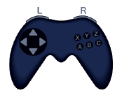
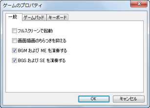

# ゲームのプレイ方法

## 基本操作

### ●ゲームの起動

本ソフトウェアで作成したゲームを起動するには、ゲームデータのフォルダに含まれる“Game.exe”（または“Game”）のファイルをダブルクリックします。圧縮されたゲームデータの場合は、事前にダブルクリックで解凍します。

### ●操作方法

本ソフトウェアで作成したゲームの操作は、6ボタンタイプのゲームパッドの使用を基準としています。便宜的なボタン名としてA、B、Cなどの名前がつけられています。標準的なゲームで使用するゲームパッドのボタン／キーボードのキーと機能との対応は以下のとおりです。キャラクターやカーソルの移動には、ゲームパッドの方向ボタンまたはキーボードの矢印キーを使います。 

| 名前 | ゲームパッド | キーボード | 主な機能 |
| --- | --- | --- | --- |
| A | ボタン 1 | Shift | ダッシュ |
| B | ボタン 2 | Esc, Num 0, X | キャンセル、メニュー |
| C | ボタン 3 | Space, Enter, Z | 決定 |
| X | ボタン 4 | A | - |
| Y | ボタン 5 | S | - |
| Z | ボタン 6 | D | - |
| L | ボタン 7 | Q, Pageup | 前ページ |
| R | ボタン 8 | W, Pagedown | 次ページ |

### ●ゲームのプロパティ
 

ゲームの実行中に［F1］キーを押すと右図のウィンドウが表示されます。このウィンドウで、ゲームパッドやキーボードのボタン割り当てをカスタマイズすることができます。［リセット］ボタンを押すと標準設定に戻ります。

［一般］のタブでは次の設定が行なえます。

### フルスクリーンで起動

ゲームの起動時に、自動でフルスクリーンモードに切り替えます。

### 画面描画のちらつきを抑える

微細なちらつきを最小限に抑えます。画面の描画処理がやや遅くなる場合があります。

### BGMおよびMEを演奏する

ゲームのプレイ中に音楽を再生するかどうかを指定します。

### BGSおよびSEを演奏する

ゲームのプレイ中に効果音を再生するかどうかを指定します。

### ●その他の操作

| キー | 機能 |
| --- | --- |
| Alt+Enter | ウィンドウモードとフルスクリーンモードの切り替えを行ないます。 |
| Alt+F4 | 強制的にゲームを終了します。 |
| F12 | 強制的にタイトル画面に戻します。 |
| F2 | タイトルバーにFPS (1秒あたりのフレーム数) を表示します。 |
| F9 | テストプレイ時、移動中に押すことでデバッグ画面 (スイッチ、変数の一覧) を呼び出します。 |
| Ctrl | テストプレイ時、押しながら移動するとランダムエンカウントが無効になり、通行不可のタイルをすり抜けて移動できます。 |

## ゲーム内のメニュー操作

### ●タイトルメニュー

ゲームを起動するとタイトル画面が表示されます。以下の項目から実行するものを選択します。

### ニューゲーム

初めからゲームを開始します。

### コンティニュー

以前に保存したセーブデータからゲームを再開します。セーブデータを選択します。

### シャットダウン

ゲームを終了します。

### ●移動時のメニュー

プレイヤーがマップ上を移動しているとき、キャンセルボタンを押すとメニューが表示されます。左上にならぶコマンドで、アクターの状態を回復するアイテムの使用や、プレイ中のゲームの状態の保存などの操作が行なえます。各コマンドの内容は以下のとおりです。

### アイテム

パーティが所持するアイテムを確認／使用します。使用する場合は、一覧でアイテムを選択します（アイテムによっては効果を及ぼす対象のアクターも続けて選択します）。

### スキル

スキル（魔法など）を確認／使用します。使用する場合は、一覧でスキルを選択します（スキルによっては効果を及ぼす対象のアクターも続けて選択します）

### 装備

装備の確認／変更します。対象のアクターを選択し、装備を変更する場合は、変更したい部位と装備するもの（装備を解除する場合は空白の項目）を続けて選択します。

### ステータス

アクターのステータスを確認します。対象のアクターを選択します。

### 並び替え

アクターを並び順を変えます。並び順を入れ替える2人のアクターを続けて選択します。

### セーブ

現在のプレイ状況を保存します。4つのセーブデータから保存先を選択します。

### ゲーム終了

ゲームを終了します。［タイトルへ戻る］、［シャットダウン］（プログラムの終了）、［やめる］（操作をキャンセル）のいずれかを選択します。

### ●戦闘時のメニュー

ゲーム中に敵キャラと遭遇すると戦闘画面に切り替わります。以下のコマンドを選んで戦闘を進めます。パーティメンバー全員のHPが0になるとゲームオーバーになります。

### パーティコマンド

ターンごとに表示されるコマンドです。戦闘を続ける場合は［戦う］、敵キャラから逃げる場合は［逃げる］を選択します。ただし［逃げる］を選んでも敵に回り込まれると、そのターンが終わるまで敵キャラしか行動できなくなります。

### アクターコマンド

パーティコマンドで［戦う］を選んだ場合は、各パーティメンバーの行動を選択します。主な行動に［攻撃］（装備中の武器で攻撃）、［防御］（身を守りダメージを軽減）、［アイテム］（所持アイテムを使用）があります。選択できる行動はアクターの設定により異なります。

######
