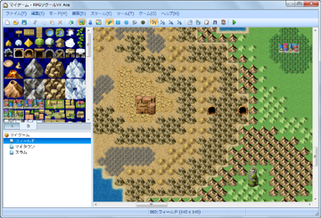
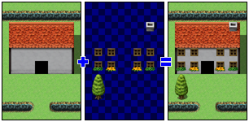

# マップの編集

## マップとは
 

マップとはゲームの舞台を表現するデータです。プレイするゲームは、マップ上をプレイヤーのキャラクターが移動する画面を中心に展開します。

マップのデザインは、“タイル”という構成用のパーツ（小片）を組み合わせることで編集します。

## マップの基本仕様

### ●タイルの役割

タイルとは、マップの見た目となるグラフィックに、キャラクターが通行できるかなどの設定を付与したものです。

ひとつのマップには、複数のタイルをまとめた“タイルセット”というデータをひとつ割り当てられ、それをもとにマップの形状をデザインできる仕組みです。使用するタイルセットを変えることで、マップの見た目を一変させることもできます。タイルセットの内容は[［データベース］](3310_db_tileset.md)で編集します。

### ●タイルの種別

 

ひとつのタイルセットには、A～Eの5種類のタイルを含めることができます。Aは地形や地面などを表現する下層用、B～Eは地上の樹木や看板などを表現するのに用いる上層用のタイルです。

マップには、同じ位置に上層用と下層用のタイルを配置できます。この二層構造を利用することで、マップの表現の幅を広げることが可能です。

標準（RTPに含まれるタイルセット）では、下層用に海や草原、床や壁などを表現するタイル、上層用には、それらを装飾するタイルが用意されています。

### ●マップの大きさと表示方法

マップの大きさはタイルを単位とし、幅（横）は17～500タイル、高さ（縦）13～500タイルの間で指定できます。

プレイするゲームの画面に一度に表示される範囲は、幅17タイル×高さ13タイル相当の大きさになります。これより大きいマップは、プレイヤーの位置を中心に表示範囲が自動的に移動します（スクロール処理）。またマップの端同士をつなぐことで、惑星のように循環移動できる舞台を表現できます（ループ処理）。

### ●マップ上の位置

マップ上のタイルの位置は“マップ座標”で表わします。マップ座標は左上角のタイルを原点（0，0）とし、ここから右方向にXタイル離れた位置がX座標、Yタイル離れた位置がY座標となります。たとえば500×500タイルの大きさを持つマップの右下角のタイルのマップ座標は（499,499）となります。ステータスバーには、編集中のタイルのマップ座標が表示されます。

このマップ座標は、変数をもとにパーティの移動先を指定したり、パーティの現在位置を監視するといったイベントコマンドの処理で利用できます。

######
