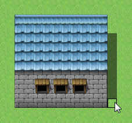

# マップデザインの編集

## 基本的な編集方法

### ●編集モードの切り替え

マップのデザインを編集するには、ツールバーの［マップ］のボタン（またはメニューの［モード］→［マップ］を）クリックして編集モードを切り替えます。

### ●マップデータの選択

ウィンドウ左下のマップリストで編集対象のマップデータをクリックで選択します。そのマップの形状がウィンドウ右側のマップビューに表示されます。

### ●タイルの選択

タイルパレットから描画するタイルをクリックで選択します。選択中のタイルは白枠で囲まれます。タイルパレットに表示されるタイルは、下にあるA～Eのタブをクリックすると切り替えられます。

タイルパレット上をドラッグすると、その範囲のタイルをまとめて描画対象に指定できます。

### ●描画ツールの選択と描画

ツールバーでタイルの描画に使うツール（下記の4種類）をクリックで選択します。そのうえで、ウィンドウ右側のマップの表示エリア（マップビュー）をクリックまたはドラッグするとタイルが描画されます。各ツールは［描画］メニューからでも選択できます。

描画したタイルは、透明のタイルを描画することで消去できます。上層用は［B］タブの左上にあるものが透明タイルです。

### 鉛筆

クリックした場所に選択中のタイルを描画します。

### 四角形

ドラッグの始点と終点を結ぶ線を対角線とする四角形の内部に選択したタイルを敷き詰めます。

### 楕円

ドラッグの始点と終点を結ぶ線を対角線とする四角形の範囲に、楕円状に選択したタイルを描画します。

### 塗りつぶし

クリックした位置のタイルと、その位置から同種のタイルが連続する範囲にタイルを描画します。

## その他の編集機能

### ●スポイト

マップビュー上を右クリックすると、その位置のタイルを描画タイルとして設定できます。上層と下層のタイル両方が描画された位置で右クリックした場合は、両方が重なった状態を描画タイルとして設定可能です。

### ●オートタイル

タイルパレットの［A］タブに表示されるタイルには、“オートタイル”と呼ばれる機能を持ったものが含まれています。オートタイルは1種類のタイルに複数のパターンを持っており、並べ方に応じて境界が自動的に調節されます。オートタイルの機能を持つタイルは、データベース[［タイルセット］](3310_db_tileset.md)にて［A1］～［A4］に指定されているものです。

なお、オートタイルの機能は、［Shift］キーを押しながらタイルの描画やスポイトを行なうことで一時的に無効にすることができます。

### ●影の自動生成

オートタイルの中には、縦に２タイル以上並べることで、自動的にその右下のタイルに影が描画されるものがあります。ただし、特定のタイルには影が描画されません。

### ●影ペン
 

影ペンは、壁や建物の影を描画するツールです。タイルの4分の1の大きさの単位で色合いを暗くすることができます。

編集するには、ツールバーの［影ペン］のボタン（またはメニューの［描画］→［影ペン］）をクリックし、マップビュー上をクリックします。影のない部分をクリックすると影を描画し、すでに影のある部分をクリックすると影を消去します。

### ●下層タイルの特殊仕様

タイルパレットの［A］タブに表示されるタイルのうち、［タイルセット］の設定で［A2］にあたるもの（タイルパレット上で上から3～6段目）は、“ベース”（左から1～4列目、左半分）と“装飾”（左から5～8列目、右半分）のタイルにわかれています。装飾のタイルは、ベースのタイルに重ねて配置可能です。

ただし、［タイルセット］の設定で［モード］が［フィールドタイプ］になっているタイルセットでは、ベースの2列目か4列目のタイルに重ねて装飾のタイルを配置した場合、ベースのタイルが1列目または3列目のものに変化します。

######
