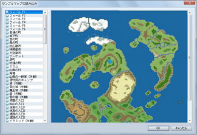
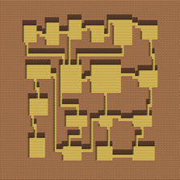
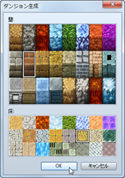
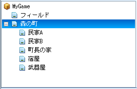

# マップデータの操作

## コンテキストメニューによる操作

マップリストでマップデータの項目を右クリックすると、そのマップを対象に設定変更やコピーなどの操作が行なえます。各項目の機能は以下のとおりです。

### マップの作成

新しいマップデータを追加します。設定項目の詳細は[“マップデータの設定”](2140_map_setting.md)をご覧ください。

### マップの設定

マップデータの設定ウィンドウを開きます。設定項目の詳細は[“マップデータの設定”](2140_map_setting.md)をご覧ください。

### サンプルマップの読み込み
 

サンプルのデータをもとに新しいマップデータを作成します。表示されるウィンドウの一覧でデータ名をクリックして内容を確認し、［OK］をクリックします。

### コピー

マップデータをクリップボードに取り込みます。

### 貼り付け

クリップボード内のマップデータを追加します。

### 削除

マップデータを削除します。

### シフト

マップ全体のタイル配置をずらします。ずらす方向とタイル数を指定します。

### ダンジョン生成
  

迷路状のマップを自動生成します。壁用と地面用に使うタイルを指定すると、自動的にいくつかの部屋を通路でつないだ迷路状のマップが描画されます。

ダンジョンの生成は選択したマップ全体を対象に行なわれますので、広いダンジョンを作りたい場合はマップのサイズを大きくしてください。マップのサイズが小さすぎると、ダンジョンらしいマップが描画されません。

## マップのグループ化
 

マップリスト上のマップデータの項目を別の項目にドラッグすると、後者のマップデータの下位に表示されます。街のマップの下に、建物の内部マップをまとめるというように、マップデータをグループ化して管理するのに便利です。下位に移動したマップは、プロジェクト名のフォルダにドラッグすれば最上層に移動できます。

この階層表示はマップリスト上の表示の仕方のみを変えるものです。マップのデザインや設定には一切影響を与えません。

######
