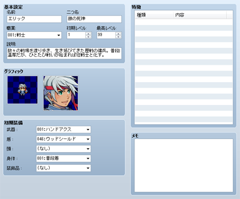

# アクターの設定

## データの役割

プレイヤーが操作するキャラクターを表現するのがアクターのデータです。アクター固有の特徴を持たせることもできます。

## 設定項目の内容
 

### ●名前／二つ名

［名前］はプレイ中に表示するアクターの名前、［二つ名］は主人公のキャッチフレーズです。長い名前の場合、プレイ中のメニューや戦闘画面ですべて表示されないことがあります。［二つ名］は、アクターのステータス一覧画面の右上に表示されます。

### ●職業

アクターの属する職業です。使用できるスキルや装備可能な武器やアイテムなどに影響します。具体的な内容は[［職業］](3220_db_job.md)のタブで編集します。

### ●初期レベル／最高レベル

［初期レベル］はゲーム開始時のアクターのレベル数、［最高レベル］は上限のレベル数です。プレイ中［最高レベル］を超えてレベルアップすることはありません。どちらも1～99の範囲で指定します。

### ●説明

アクターの紹介文です。プレイ中、アクターのステータス一覧画面の下部に表示されます。

### ●グラフィック

アクターの画像です。左枠がマップ上を移動中に表示する歩行グラフィック、右枠でステータス画面などで表示する顔グラフィックの設定欄です。どちらも枠内をダブルクリックすると表示される画像の一覧画面で使う画像を指定します。画像を表示しない場合は「（なし）」を指定します。

### ●初期装備

プレイ開始時のアクターの装備品です。［武器］［盾］［頭防具］［身体防具］［装飾品］の部位ごとに、プルダウンリストからひとつを選択してください。選択できるのはアクターの属する職業が装備可能なものに限られます。「（なし）」を指定した場合、その部位には何も装備しません。

### ●特徴

アクター固有の特徴です。設定欄の各行をダブルクリックと表示されるウィンドウで内容を定義します。詳細は[“特徴の設定方法”](3410_db_feature.md)を参照してください。

######
