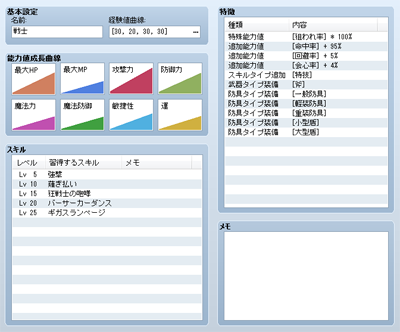
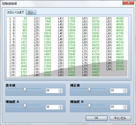
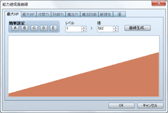

# 職業の設定

## データの役割

アクターの能力に関する特徴をまとめたのが職業のデータです。アクターは、いずれかの職業に属する必要があり、その設定をもとにレベルアップの仕方や能力値の上がり方、習得できるスキルなどが決まります。職業固有の特徴も付与できます。

## 設定項目の内容
 

### ●名前

職業の名前です。プレイ中、メニュー画面やステータス一覧画面の上部に表示されます。

### ●経験値曲線

 

レベルアップの基準となる経験値の設定です。アクターがレベルごとの必要経験値を獲得するごとに、アクターのレベルが1段階アップし、能力値が上昇したりスキルを習得したりします。

必要経験値は、設定欄の［…］をクリックすると表示されるウィンドウで下記の4つの値をもとに設定します。ウィンドウの［次のレベルまで］タブでは、各レベルごとの必要経験値が一覧表示され、背景にはグラフで示されます。これらを参考にしながら設定するとよいでしょう。［累計］タブでは、各レベルに達するまでの経験値の累計を表示します。

### 基本値

必要経験値を算出するための基準値です。値を小さくすると全体的に必要経験値が下がります。

### 補正値

各レベルの必要経験値に指定値を加算します。

### 増加度A

必要経験値の増加量を調節します。値を大きくすると、レベルの上昇に応じて必要経験値が比例的に増加します。

### 増加度B

必要経験値の増加量を調節します。値を大きくすると、主に高いレベルで必要経験値の増加率が大きくなります。

### ●能力値成長曲線

レベルごとの能力値の設定です。グラフをダブルクリックすると設定ウィンドウが開きます。設定方法は後述の[“能力値成長曲線の設定方法”](#status_setting)をご覧ください。

### ●スキル

レベルアップに応じて習得するスキルです。欄内をダブルクリックすると表示されるウィンドウで、習得するレベルとスキルを指定します。［メモ］はゲーム作成中のメモ書きに使えます。

### ●特徴

この職業を設定したアクターに与える特徴です。詳細は[“特徴の設定方法”](3410_db_feature.md)を参照してください。

## 能力値成長曲線の設定方法
 

［能力値成長曲線］のウィンドウでは、レベルごとの能力値を以下の項目をもとに指定します。能力値の名前のタブをクリックすることで編集対象を切り替えられます。編集後［OK］をクリックすると指定した値が反映されます（［キャンセル］をクリックすると内容が破棄されます）。

### ●簡単設定

全レベルの能力値にあらかじめ用意された値を適用します。値のパターンには［A］～［E］の5種類あり、それぞれのボタンをクリックすると適用されます。

### ●レベル／値

レベルごとの能力値を直接編集します。［レベル］で対象のレベル数（1～99）を指定した後、そのレベルのときの能力値を［値］（最大HP／最大MPは1～9999、これら以外は1～999）に指定します。

### ●曲線生成

レベル1とレベル99のときの値をもとに、その間のレベルの値を自動算出します。

クリックすると表示される［曲線生成］ウィンドウで、［レベル1］［レベル99］に、それぞれのレベルのときの値（最大HP／最大MPは1～9999、これら以外は1～999）を指定します。

次にスライダーで成長タイプを決めます。左側（早熟）にするとレベルの上昇に合わせて成長率（能力値の上昇分）が緩やかになり、右側（晩熟）にするほど成長率が高くなります。［OK］ボタンをクリックすると指定内容に基づいて能力値が設定されます。

### ●グラフ

各レベルに設定された能力値を棒グラフで表示します。表示範囲をクリック／ドラッグすると、その箇所に応じたレベルの能力値が変わります。

######
