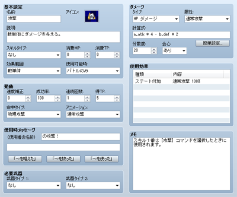

# スキルの設定

## データの役割

戦闘中の攻撃や防御、技能（特技と魔法）といったアクターがとる行動を定義するデータです。行動できる状況や条件、成功率、対象者に与えるダメージなどの一連の内容を設定することで、様々な行動を表現できます。

## 設定項目の内容
 

### ●名前

スキルの名前です。名前が長いとプレイ画面ですべて表示されない場合があります。

### ●アイコン

プレイ中、スキルの名前に添えて表示する画像です。ダブルクリックすると開く［アイコン］ウィンドウで、任意の画像を指定します。スキルの特徴に応じたものを選ぶのが一般的です。

### ●説明

プレイ画面でスキルにカーソルを合わせたときに表示される説明文です。

### ●スキルタイプ

スキルの種別を指定します。デフォルトで用意されているのは［特技］［魔法］のみですが、[［用語］](3340_db_terms.md)の設定で変更できます。［なし］以外に設定したものは、それぞれ［スキルタイプ追加］の特徴を付与したアクターや職業でのみ使えるようになります。

### ●消費MP／消費TP

スキルの使用時に消費するMP（0～9999）、TP（0～100）です。使用者のMP／TPがこの値に満たないとスキルを使用できません。

### ●効果範囲

スキルの使用時の効果が及ぶ対象です。以下からひとつ指定します。

### なし

対象範囲の指定が不要のもの

### 敵単体

相手グループのうちの指定の1体

### 敵全体

味方グループ全体

### 敵x体ランダム

ランダムに選ばれる相手グループの数体（xは対象の数）

### 味方単体

味方グループのうちの指定の1体

### 味方全体

味方グループ全体

### 味x体ランダム

ランダムで選ばれる味方グループの数体（xは対象の数）

### 使用者

使用者自身

### ●使用可能時

使える状況を選択します。［常時］（バトル中、メニューの両方で選択可）、［バトルのみ］（バトル中のみ選択可）、［メニューのみ］（メニューのみ選択可）、［使用不可］のいずれかを指定します。

### ●速度補正

スキルの実行時に敏捷性に加算する値（-2000～2000）です。バトル中の行動順序の判定に影響し、“効果は小さいがすばやく発動できる”、“効果は大きいが発動に時間がかかる”といった特徴を表現できます。

### ●成功率

使用すること自体の成功確率（0～100％）です。実際の成功率は、相手の有効度が影響します。

### ●連続回数

1度の使用で効果を及ぼす回数（1～9）です。

### ●得TP

発動に成功し、相手に効果を与えたときに得られるTP（0～100）です。

### ●命中タイプ

命中判定の種別です。以下からひとつ指定します。

### 必中

スキルの発動が成功した時点で必中（必ず命中）したものとみなします。反撃、魔法反射、身代わりは無効です。

### 物理攻撃

使用者の命中率、対象者の回避率をもとに判定します。反撃、身代わりの対象になります。

### 魔法攻撃

対象者の魔法回避率をもとに判定します。魔法反射、身代わりの対象になります。

### ●アニメーション

バトル中、使用対象に表示するアニメーションです。

### ●使用時メッセージ

バトル中、スキルを使うときに表示するメッセージの定型文（2行まで）を指定します。［～を唱えた］［～を放った］［～を使った］のボタンを押すと、それぞれの定型文を入力できます。

### ●武器タイプ1／武器タイプ2

スキル使用条件として装備が必要な武器です。2つの欄にそれぞれ武器のタイプを指定します。どちらも［なし］の場合はスキルを無条件で使えます。2種類設定した場合は、どちらかのタイプの武器を装備している場合に使えます。

### ●ダメージ

相手にダメージを与える効果を持たせる場合、そのタイプや効果量の計算式を指定します。

### タイプ

HP、MPに関する効果の種類です。6種類からひとつ指定します。項目の「ダメージ」は減少、「回復」は増加、「吸収」は移し替え（対象者の減少分と同じ値を使用者に追加）を意味します。

### 属性

効果に付加する属性です。

### 計算式

効果量の計算式です。

計算式を直接指定する場合、参照するパラメータを以下の文字列で指定します。攻撃者の値を参照する場合は“x”を“a”に、対象者の値を参照する場合は“b”に変えます。“a.atk”と表記すると“攻撃者の攻撃力”の値を参照します。このほか“v[n]”（nは数値）と記述することでn番の変数の値も参照できます。演算子には一般的な四則演算の記号（+、-、*、/）が使えます。

“a.atk * 4 - b.def * 2”と表記すれば、“（攻撃者の攻撃力×4）-（対象者の防御力×2）”で計算される値が効果量になります。

なお［簡単作成］のボタンで計算式を生成することもできます。表示されるウィンドウで、計算の基本値を［基本効果量］に、使用者の攻撃力と対象者の防御力が影響する度合いを［打撃関係度］（0～1000／100が標準）に、使用者の魔法力と対象者の魔法防御が影響する度合いを［魔法関係度］（0～1000／100が標準）に指定し、［OK］をクリックします。

なお属性や防御行動による効果は別途反映されるため、ここでの計算式には含みません。

| x.atk | 攻撃力 |
| --- | --- |
| x.def | 防御力 |
| x.mat | 魔法力 |
| x.mdf | 魔法防御 |
| x.agi | 敏捷性 |
| x.agi | 敏捷性 |
| x.luk | 運 |
| x.mhp | 最大HP |
| x.mmp | 最大MP |
| x.hp | 現在のHP |
| x.hp | 現在のMP |
| x.tp | 現在のTP |
| x.level | レベル |

### 分散度

効果量のバラつき（0～100％）です。算出した効果量を、指定の比率の範囲で増減させます。算出効果量が100、分散度が20の場合、効果量は80～120（100±20）の範囲で変動します

### 会心

会心の一撃の有無を［あり］［なし］のどちらかで指定します。［あり］の場合、使用者の会心率、対象者の会心回避率をもとに発生を判定します。

### ●使用効果

ダメージ以外の効果の内容です。ダブルクリックすると開く［使用効果］ウィンドウで設定します。詳細は[“使用効果の設定方法”](3420_db_effect.md)を参照してください。

######
