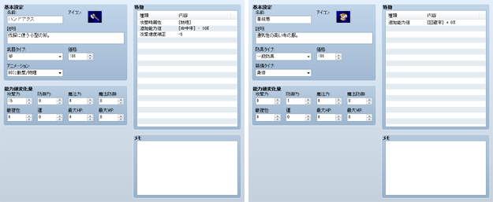

# 武器／防具の設定

## データの役割

アクターの装備品を表現するのが武器と防具のデータです。装備中のアクターを対象に、特定の能力値を増減したり、特別な能力などを付与したりできます。

## 設定項目の内容
 

### ●名前

武器／防具の名前です。名前が長いとプレイ画面ですべて表示されない場合があります。

### ●アイコン

プレイ中、武器／防具の名前に添えて表示する画像です。ダブルクリックすると開く［アイコン］ウィンドウで画像を指定します。

### ●説明

プレイ画面で項目を選んだときに表示される説明です。

### ●武器タイプ／防具タイプ

武器／防具の種類です。アクターや職業の特徴設定で、装備できるかを判定する基準になります。選択できる武器／防具の種類は、[［用語］](3340_db_terms.md)の設定で変更できます。

### ●装備タイプ（防具データのみ）

装備する部位（盾／頭／身体／装飾品）です。アクターはそれぞれの部位に、対応する防具をひとつずつ装備できます。

### ●価格

お店で買うときの価格です。売却時の価格は一律半額になります。0にすると売却できないものになります。

### ●能力値変化量

装備中のアクターの各能力値に加える値です。［最大HP］［最大MP］は-5000～5000、これら以外は-500～500の範囲で指定します。マイナス値を設定すると能力値が減少します。

### ●特徴

装備中のアクターに付与する特徴です。設定欄の各行をダブルクリックと表示されるウィンドウで内容を定義します。詳細は[“特徴の設定方法”](3410_db_feature.md)を参照してください。

######
