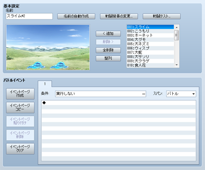
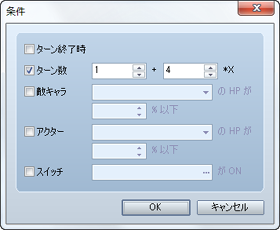

# 敵グループの設定

## データの役割

敵グループは、ゲーム中に出現する敵キャラの集団を設定するデータです。マップの移動中やイベントコマンドによってプレイヤーと戦闘させる敵キャラは、このデータをもとに指定します。敵1体のみと戦闘させる場合も“敵1体のみ登録した敵グループ”のデータを用意する必要があります。“バトルイベント”（戦闘中のイベント処理）も敵グループごとに設定します。

## 設定項目の内容
 

### ●名前

敵グループの名前です。この設定はエディタのみで使用されます（プレイ中のゲームへの影響はありません）。［名前の自動作成］ボタンを押すと、登録した敵キャラをもとに名前が自動で生成されます。

### ●戦闘背景の変更

配置ビューに表示する戦闘背景を変更します。表示されるウィンドウの左欄で遠景、右欄で地面用の画像をそれぞれ指定します。この設定はエディタのみで使用され（プレイ中のゲームへの影響はありません）、他のデータの編集時にも共通して使われます。

### ●戦闘テスト

敵グループとの戦闘をテスト実行します。表示されるウィンドウの［1］～［4］のタブで、戦闘に参加させるアクター、装備品、レベル数をそれぞれ指定します（［ステータス］には設定内容に基づいた能力値が表示されます）。［OK］をクリックすると、ウィンドウが開き戦闘が始まります。ウィンドウを閉じるとテスト実行が終了します。

### ●配置ビュー

グループに登録された敵キャラです。ひとつの敵グループには最大8体まで（同種を含む）の敵キャラを登録できます。

配置ビュー上の敵キャラはドラッグすると位置を変えられます（通常は8ドット単位、［Alt］キーを押しながらドラッグすると2ドット単位で移動します）。また右クリックして［途中から出現］を選ぶと、バトルイベントで［敵キャラの出現］のイベントコマンドを実行するまで出現しない敵キャラになります。

登録内容は下記のボタンを使って編集します。

### 追加

右側の敵キャラリストでクリックで選択した敵キャラを配置ビューに追加します。敵キャラリストの項目をダブルクリックすることでも追加可能です。敵キャラを追加した順番は、戦闘中に表示する敵キャラの選択リストの順番にも反映されます。

### 削除

配置ビュー上でクリックして選択した敵キャラを削除します。

### 全削除

配置ビュー上の敵キャラをすべて削除します。

### 整列

配置ビュー上の敵キャラの位置を、登録順に左から並べます。

## バトルイベントの設定内容

［バトルイベント］では、敵グループと戦闘中に実行するイベントの条件や実行内容を設定します。マップイベントと同じように、イベントページと出現条件で、処理する内容を“場合分け”することが可能です。

### ●イベントページの操作

左側に並ぶ［イベントページ作成］［イベントページコピー］［イベントページ貼り付け］［イベントページ削除］［イベントページクリア］でイベントページの操作が行なえます。マップイベントと同様の機能です。

### ●条件

 

イベントページの処理を実行する条件です。［…］ボタンを押すと表示される［条件］ウィンドウで、以下の5つから条件に用いる項目を有効にし、それぞれ判定基準を設定します。マップイベントと違い、バトルイベントは何らかの条件を指定しないとイベントページが実行対象になりません。また条件を満たすイベントページが複数ある場合、番号が一番小さいイベントページが実行対象になります。

### ターン終了時

ターンの終了時点を条件とします。

### ターン数

戦闘開始から指定のターン数が経過したときを条件とします。左欄に開始からのターン数、右欄にターンの周期数を指定します。

### 敵キャラ

敵キャラのHPが基準値以下になったとき条件とします。対象の敵キャラと、基準値（最大HPに対する比率）を指定します。

### アクター

アクターのHPが基準値以下になったときを条件とします。対象のアクターと、基準値（最大HPに対する比率）を指定します。

### スイッチ

指定のスイッチがONのときを条件とします。

### ●スパン

イベントページが実行対象になったとき、実行内容の処理を開始するタイミングを指定します。

### バトル

戦闘開始から初めて条件を満たした場合に限り処理を開始します。一度実行すると、その後は一切実行されません。

### ターン

ターンごとに条件判定を行ない、条件を満たしている場合に処理を開始します。

### モーメント

条件を満たしている間、繰り返し処理を行ないます。スイッチなどで処理を制御しないと、戦闘が進行しなくなる場合がありますので注意してください。

### ●実行内容

［条件］と［スパン］を満たしたときに実行する処理をイベントコマンドをもとに設定します。編集方法はマップイベントの[［実行内容］](4140_ev_mapevent_setting.md#command_list)と同じです。

######
