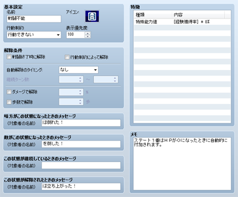

# ステートの設定

## データの役割

ステートとは“毒”や“混乱”など、キャラクターの体調や行動に影響を与える状態異常のことです。データには、ステートが付加された場合の具体的な影響を設定します。“毒に冒されてHPが減る”といったマイナスの影響だけでなく、“興奮して攻撃力がアップする”というプラスの効果を持つステートも用意できます。

なお、001番の［戦闘不能］は、アクターや敵キャラのHPが0になったときに自動で付加される特殊なステートです。パーティメンバー全員にこのステートが付与されるとゲームオーバーになります。

## 設定項目の内容
 

### ●名前

ステートの名前です。ステートはアイコンで示されますので、名前がゲーム中に使用されることはありません。

### ●アイコン

ステートの付加中、アクターの名前に表示する画像です。ダブルクリックすると表示される［アイコン］ウィンドウでの画像を指定します。ステートの内容がわかる画像を指定するようにしましょう。

### ●制約

ステート付加中のキャラクターについて行動を制限します。以下の6項目をもとに制限内容を指定します。複数の制約が適用した場合、リストの下にあるものを優先します。

### なし

行動は制約されません。

### 敵を攻撃する

必ず敵を攻撃します。

### 敵か味方を攻撃する

必ず敵か味方の一体を攻撃します。

### 味方を攻撃する

必ず味方を攻撃します。

### 行動できない

一切行動できなくなります。

### ●表示優先度

ステートのアイコンの表示優先度（0～100）です。複数のステートが付与されている場合、最大の優先度を設定したステートのアイコンが表示されます。優先度が同じ場合は最も若いIDのステートが優先されます。

### ●解除条件

ステートを解除する条件です。以下の項目をもとに条件を指定します。複数の条件を設定した場合、それぞれの基準を判定して解除します。

### 戦闘終了時に解除

有効にすると戦闘終了時に解除します。

### 行動制約によって解除

有効にすると、別の行動制約を持つステートが付加された場合に解除します。

### 自動解除のタイミング／継続ターン数

ターンの経過後に解除します。［行動終了時］では行動者の行動が終わったとき、［ターン終了時］ではターンが終了し行動選択に戻る前に解除します。［継続ターン数］にはステートの付加から解除までのターン数の下限と上限（0～9999）を指定します。

### ダメージで解除

何らかのダメージを受けたとき、指定の確率（0～100％）で解除します。

### 歩数で解除

指定したタイル数（0～9999）の距離をマップ上を移動したタイミングで解除します。

### ●メッセージ

戦闘中、このステートが付加／解除されたときに表示するメッセージです。［味方がこの状態になったとき］［敵がこの状態になったとき］［この状態が継続しているとき］［この状態が解除されたとき］の4つの状況ごとに、対象者の名前に続けて表示する文言を指定します。

### ●特徴

ステートが付加されている対象者に付与する特徴です。詳細は[“特徴の設定方法”](3410_db_feature.md)の項目を参照してください。

######
