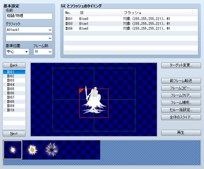
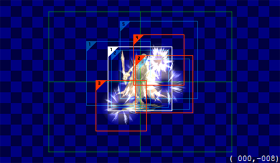

# アニメーションの設定

## データの役割

アニメーションは、戦闘画面で敵キャラに攻撃するときや、マップ画面上などで再生できる視覚演出用のデータです。画像のパターン（セル）を“フレーム”に配置することで作成します。

## 設定項目の内容
 

### ●名前

アニメーションの名前です。この設定はエディタのみで使用されます（プレイ中のゲームへの影響はありません）。

### ●グラフィック

アニメーションの作成に用いる画像ファイル（2点まで）です。各欄の［…］ボタンを押すと表示される［アニメーショングラフィック］ウィンドウで使用するファイルを指定します。その際、［色相］をスライダーで指定するとグラフィックの色合いを変えた状態で使えます。ファイルを指定すると、パターン画像が［パターンパレット］に表示されます。

### ●基準位置

アニメーションを表示する位置を指定します。［頭上］［中心］［足元］にすると、それぞれ対象キャラクターの上端、中央、下端を基準にします。［画面］にすると画面全体にかぶせるように表示します。なお、このアニメーションを設定したスキルやアイテムの効果範囲が全体のとき、［頭上］［中心］［足元］に設定したアニメーションは、キャラクターごとに表示されます。

### ●フレーム数

アニメーション全体のフレームの数（1～200）です。［…］ボタンを押すと表示されるウィンドウで指定します。ここで指定した数のフレームが、フレームリストに表示されます。フレーム数を減らすと、それを超える番号のフレームが削除されます。

### ●SEとフラッシュのタイミング

アニメーション中に、指定のフレームでSEの演奏や画面のフラッシュを行なう設定です。リスト内の各行（新規作成の場合は空白の行）をダブルクリックすると表示される［SEとフラッシュのタイミング］ウィンドウで、以下の内容を指定します。

 リストの項目を右クリックするとメニューが表示され、［編集］［切り取り］［コピー］［削除］が行なえます。

### フレーム

処理対象のフレーム番号を指定します。

### SE

再生する効果音を指定します。

### フラッシュ

フラッシュの処理内容を指定します。キャラクターをフラッシュさせる場合は［対象］、画面全体をフラッシュさせるには［画面］を指定し、フラッシュ時の色を［赤］［緑］［青］、不透明度を［強さ］で指定します（値はいずれも1～255）。［時間］には再生時間をフレーム数（1～200）を指定します。［対象消去］は対象キャラクターを一時的に消去するもので、キャラクター全身のアニメーションを表示したい場合などに使用します。

### ●フレームリスト

アニメーション内のフレームのリストです。クリックで選択した番号のフレームが編集対象になり、内容がフレームビューに表示されます。リストの上下にある［Back］［Next］ボタンのクリックすると編集フレームを前後に移動できます。またフレーム番号を右クリックすると表示されるメニューで、フレーム単位で［コピー］［貼り付け］［クリア］［挿入］［削除］の操作が行なえます。

### ●フレームビュー

フレームの内容です。ここにパターンパレットの画像を“セル”として配置することで表示内容を設定します。緑色の四角形はゲームウィンドウでの表示範囲を表わします。

編集方法は後述の“フレームビューの操作方法”の項目をご覧ください。

### ●ターゲット変更

フレームビューに表示する敵キャラのグラフィックを変更します。この設定はエディタのみで使用されます（プレイ中のゲームへの影響はありません）。

### ●前フレーム転送

ひとつ前のフレーム上に配置されたセルを、そのまま編集中のフレームに貼り付けます。

### ●フレームコピー

指定範囲のフレームをまとめてコピーします。対象フレームの始めと終わりの番号を指定し、［to］の右側にコピー先のフレーム番号を指定します。

### ●フレームクリア

指定範囲のフレームをまとめて消去します。対象フレームの始めと終わりの番号を指定します。

### ●フレーム補完

指定したふたつのフレームをもとに、その間のフレームのセルを自動で設定します。［フレーム］［セル］に補完対象のフレームとセルの範囲、［補完項目］で補完する項目にチェックを付けて［OK］をクリックします。たとえば同じセルをフレーム1番には左端、10番には右端に置いた状態で、位置を対象に1～10番のフレームの補完を行なうと、2～9番のフレームに左から右に向けて位置をずらしたセルが自動で設定されます。

### ●セル一括設定

指定範囲のフレーム内のセルを同じ内容します。［フレーム］［セル］に設定対象のフレームとセルの範囲を指定し、設定対象の項目にチェックを付け、それぞれ設定値を指定します。

### ●全体のスライド

指定範囲のフレーム内のセルをまとめて移動します。［フレーム］に対象フレームの始めと終わりの番号を指定し、［移動量］の［X座標］［Y座標］に、それぞれの方向への移動距離をドット数で指定します。左または上に移動させるには［X座標］「Y座標」にマイナス値を指定します。

### ●再生

ボタンをクリックすると作成中のアニメーションを再生します。

### ●パターンパレット

［グラフィック］で指定したファイルに収めたパターン画像を表示します。クリックすると、そのパターンがフレームへの配置対象になります。パターンは、パレットの左上にあるものを1とし、右に向かって順に番号（パターン番号）が割り振られます。

## フレームビューの操作方法
 

### ●セルの配置

フレームに配置する画像を［パターンパレット］で選択し、フレーム編集エリアの空いているところをクリックします。すると、その画像を適用したセルが配置されます。ひとつのフレームには16個までセルを配置できます。

### ●表示

セルには枠と番号が表示されます。枠の色は白が選択中、赤が配置済み、青がひとつ前のフレームに配置されたものを表わします。番号はセルの優先順位で、大きいものほど手前に表示されます。

### ●編集するセルの選択

セルをクリックすると枠が白色になり、編集対象として選択されます。他のセルと重なった番号の小さいセルは、［Ctrl］キーを押しながらクリックすると選択できます。

### ●セルの移動

セルを移動するにはドラッグします（通常8ドット単位で移動し、［Alt］キーを押しながらドラッグすると2ドット単位で移動できます）。選択中のセルの位置は、フレーム編集エリアの右下に座標として表示されます。座標は画面中央のX座標、Y座標を（0,0）とし、X座標は-272～272、Y座標は-208～208の値で示されます。

### ●コンテキストメニューによる操作

セルを右クリックするとメニューが表示され、以下の操作を実行できます。［セルの設定］のウィンドウは、ダブルクリックすることでも開けます。

### ▼コンテキストメニューの項目

### 設定

セルの設定ウィンドウを開きます（後述）。

### 元に戻す

直前の操作を取り消し、操作前の状態に戻します。最大で8手順前までの状態に戻せます。

### やり直し

［元に戻す］で戻した状態から操作後の状態にします。

### 切り取り

選択中のセルをクリップボードに取り込み削除します。

### コピー

選択中のセルをクリップボードに取り込みます。

### 貼り付け

クリップボード上のセルを配置します。

### 削除

選択中のセルを削除します。

### 上へ／下へ

セルの表示の優先順（手前／奥）を変更します。

### ▼セルの設定ウィンドウの内容

### パターン

パターンの番号です。番号を変えると対応するものに変わります。

### X座標／Y座標

セルの表示位置です。X座標（-272～272）、Y座標（-208～208）を指定します。

### 拡大率

セルの表示倍率です。元画像の大きさを100％とした比率（20～800％）で指定します。

### 回転角度

セルを表示角度（1～360度）です。指定の角度だけ時計回りに回転して表示されます。多用すると、ゲームの処理速度が遅くなる場合があります。

### 左右反転

［あり］にするとセルのパターンを左右方向に反転表示します。

### 不透明度

セルの不透明度（0～255）です。値が小さいほど透明度が高くなり、0にすると見えなくなります。

### 合成方法

別のセルと重なったときの色合いの混ぜ合わせ方です。［通常］を標準とし、［加算］にすると白っぽく、［減算］にすると黒っぽく表示されます。

######
