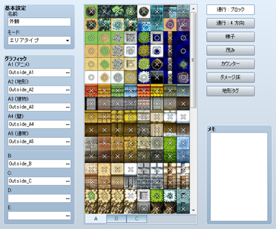
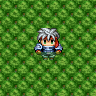
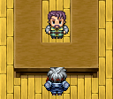

# タイルセットの設定

## データの役割

タイルセットとは、ひとつのマップをデザインするのに使う“タイル”をまとめたデータです。タイル用のグラフィックに、キャラクターが通行できるかなど、ゲームにおける挙動を設定することで作成します。

マップ用に作成したオリジナルの画像も、その画像ファイルを設定したタイルセットを作り、それをマップデータに割り当てることで使えるようになります。

なお、タイル上を乗り物（小型船／大型船）が通行できるかどうかは、タイルセット上の位置で決まっています。詳しくは[“素材規格”](6100_resource.md#tileset)の項目をご覧ください。
 飛行船については、すべてのタイルを通行可能となっています。ただし、着陸できるのは、歩行できる場所のみです。

## 設定項目の内容
 

### ●名前

タイルセットの名前です。この設定はエディタのみで使用されます（プレイ中のゲームへの影響はありません）。

### ●モード

タイルセットの用途です。主に[下層タイルの特殊仕様](2120_map_design.md#notice)や[戦闘背景の取り扱い](2140_map_setting.md#battlebg)に影響します。
 基本的には、海や陸地など世界全図を表現するものの場合は［フィールドタイプ］、それ以外の場合は［エリアタイプ］を選んでください。

『RPGツクールVX』用に作成された素材を使用する場合は、［VX互換タイプ］を選択してください。

### ●グラフィック

タイルに使う画像ファイルの設定です。種別（A～Eのセット）ごとに設定欄の［…］ボタンを押すと表示される［タイルセットグラフィック］ウィンドウで、使用するファイルを指定します。ファイルを指定すると、その内容が右の［タイルリスト］に表示されます。

### ●タイルリスト

［グラフィック］に設定されたタイル用の画像が表示されます。下の［A］～［E］のタブをクリックすると、表示する画像を切り替えられます。［A］のタブには［グラフィック］の［A1］～［A5］で指定したファイルのタイルを順に表示します。

各タイルには、現在の設定編集モードにおける設定値を表わすマークが重ねて表示されます。これをクリックすると設定値を変更できます。

### ●通行：ブロック

タイル上を通行できるかどうかの編集モードに切り替えます。タイルリストに表示されるマークは［○］が通行可、［×］が通行不可を表わします。［☆］も通行可能なタイルですが、建物の背後にキャラクターが隠れる表現となります（［A］以外のタブにのみ設定可）。

### ●通行：4方向

タイル上を通行できる方向の編集モードに切り替えます。［通行：ブロック］の補助的な設定で、特定の方向にしか移動できないタイルを作るのに使います。たとえば崖を表現するタイルで端にあたる部分を移動不可にすれば、その端と隣り合うタイルの間は移動できなくなり、“高低差”を表現できます。

タイルリストに表示されるマークは、上下左右の4方向について、矢印ありが移動可、矢印なしが移動不可を表わします。なお［通行：ブロック］の設定値を変えると、この設定値も自動的に変わります。

### ●梯子

梯子設定の編集モードに切り替えます。この設定を付与すると、タイル上を通行するキャラクターの向きが上に固定され、梯子やロープなどで昇降する様子などを表現できます。

設定の有無はタイルリスト上のマークをクリックして変更します。設定を付与したタイルにはマーク（梯子の絵柄）が表示されます。 

### ●茂み

茂み設定の編集モードに切り替えます。この設定を付与すると、タイル上を通行するキャラクターの下から8ドットぶんが非表示になり、生い茂る草地で足元が隠れる様子などを表現できます。

ただし、［A1］～［A4］に含まれるタイルに設定した場合、画像によっては、一部のタイルで半透明になりません。詳しくは[“素材規格”](6100_resource.md#tileset)の項目をご覧ください。

設定の有無はタイルリスト上のマークをクリックして変更します。設定を付与したタイルにはマーク（二つの波線）が表示されます。
 

### ●カウンター

カウンター設定の編集モードに切り替えます。この設定を付与すると、キャラクターとイベントが隣り合っていない状態でもタイル越しにイベントを開始させることができるようになり、“机を挟んで人物に話しかける”様子などを表現できます。

なお、［A2］のタイルに設定した場合、この属性を持つタイルのパターン下端は８ドット分下にずれて表示されます。

設定の有無はタイルリスト上のマークをクリックして変更します。設定を付与したタイルにはマーク（菱形の四角形）が表示されます。

### ●ダメージ床

ダメージ床の編集モードに切り替えます。この設定を付与すると、タイル上を通行するキャラクターがダメージを受けるようになります。毒の沼地やトゲが突き出す床など危険な地面を表現するのに使います。

設定の有無はタイルリスト上のマークをクリックして変更します。設定を付与したタイルにはマーク（二つの三角形）が表示されます。

### ●地形タグ

地形タグの編集モードに切り替えます。地形タグとはタイルに付与する0～7の数値のことです。［指定位置の情報取得］のイベントコマンドで取得でき、地形タグをもとにイベントを発生させるなどの用途に使うことができます。

設定値はタイルリストの数字をクリック／右クリックすることで切り替えられます。なお複数のタイルを重ねた地形の場合、イベントコマンドで取得する地形タグの値は、0以外の地形タグを設定した上層のタイルが優先されます。

######
