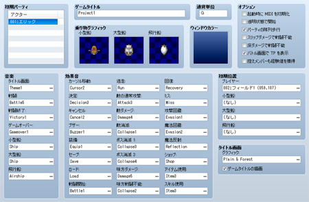
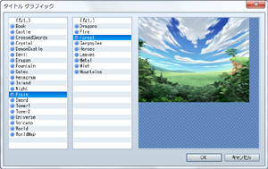

# システムの設定

## データの役割

システムのデータは、ゲームの初期設定などをまとめたものです。ゲームスタート時のパーティのメンバーの構成や位置、プレイ中のさまざまな場面で再生する音楽などを指定できます。

## 設定項目の内容
 

### ●初期パーティ

ゲームスタート時のパーティの構成メンバーです。

パーティには無制限にアクターを登録できますが、戦闘に参加できるのは先頭4人のみです。

アクターを追加・変更するにはリスト内の項目（追加する場合は空白部分）をダブルクリックし、アクターを指定します。アクターを外すには、その項目を右クリックすると表示されるメニューで［削除］を指定します。

### ●ゲームタイトル

ゲームの作品名です。プロジェクト作成時に［タイトル］で入力した名前は、ここに設定されます。この名前はゲーム画面のタイトルやウィンドウのタイトルバーに表示されます。

### ●乗り物グラフィック

マップ上に表示される乗り物（小型船／大型船／飛行船）の画像です。各欄をダブルクリックすると表示されるウィンドウで画像を指定します。グラフィックを表示しない場合は［（なし）］を指定します。

### ●通貨単位

ゲームにおけるお金の単位の名前です。メニュー画面の所持金の表示などに使われます。

### ●ウィンドウカラー

ゲーム上のウィンドウの背景色です。欄内をダブルクリックすると表示されるウィンドウで、［赤］［緑］［青］の成分比（-255～255）をもとに指定します。

### ●オプション

ゲームの動作に関する特別な処理やルールを設定します。

### 起動時にMIDIを初期化

有効にすると、ゲームのスタート時に“DirectMucic”の初期化処理を行ないます。Windows Vitsa／7では初期化に時間がかかる場合があります。

### 透明状態で開始

有効にすると、プレイヤーのグラフィックを透明（非表示）にした状態でゲームがスタートします。通常表示に戻すには［透明状態の変更］のイベントコマンドを使います。

### パーティの隊列歩行

有効にすると、マップ移動時、先頭のアクターについていくように2番目以降のアクターの歩行グラフィックを表示する設定でゲームがスタートします。パーティが5人以上いる場合でも、歩行グラフィックが表示されるのは先頭から4人のみです。

### スリップダメージで戦闘不能

有効にすると、“毒”などのステートから受けるダメージによってHPが0になることを許可します。無効にした場合はHPが1以下になりません。

### 床ダメージで戦闘不能

有効にすると、マップ上のタイル（ダメージ床）から受けるダメージによってHPが0になることを許可します。無効にした場合はHPが1以下になりません。

### バトル画面でTPを表示

有効にすると、戦闘画面でパーティメンバーのステータスウィンドウにTPの値を表示します。

### 控えメンバーも経験値を獲得

有効にすると、戦闘の勝利時、パーティメンバーで戦闘に参加しなかったアクターも経験値を獲得するようにします。

### ●音楽

プレイ中に再生する音楽です。シーンごとの設定項目に再生するBGMまたはMEのファイルを指定します。各設定項目が示すシーンは以下のとおりです。なお、マップ上をプレイヤーが移動しているときに再生する音楽はマップデータに設定します。

| タイトル画面 | タイトル画面で再生するBGM |
| --- | --- |
| 戦闘 | 戦闘画面で再生するBGM |
| 戦闘終了 | 戦闘終了（プレイヤーが勝利した場合）に再生するME |
| ゲームオーバー | ゲームオーバー画面で再生するME |
| 小型船 | 小型船に乗っているときに再生するBGM |
| 大型船 | 大型船に乗っているときに再生するBGM |
| 飛行船 | 飛行船に乗っているときに再生するBGM |

### ●効果音

プレイヤーの操作したときや、戦闘時の行動開始時などに再生する効果音（SE）です。状況ごとの設定項目に再生するSEファイルを指定します。各設定項目が示す状況は以下のとおりです。

| カーソル移動 | カーソルを移動したとき |
| --- | --- |
| 決定 | 使用するコマンドを決定したとき |
| キャンセル | メニュー画面などでコマンドをキャンセルとき |
| ブザー | メニュー画面などで使用できないコマンドを選択したとき |
| 装備 | メニュー画面で装備を変更したとき |
| セーブ | ゲームをセーブしたとき |
| ロード | ゲームをロードしたとき |
| 戦闘開始 | 敵とエンカウントしたとき |
| 逃走 | 戦闘時で逃げるとき |
| 敵の通常攻撃 | 戦闘画面で敵が攻撃するとき |
| 敵ダメージ | 戦闘画面で敵キャラがダメージを受けたとき |
| 敵消滅 | 戦闘画面で敵キャラが倒されたとき |
| ボス消滅1 | ［特徴］の［消滅エフェクト］が［ボス］の敵キャラが倒されたとき |
| ボス消滅2 | ［特徴］の［消滅エフェクト］が［ボス］の敵キャラの消失エフェクトを表示しているとき |
| 味方ダメージ | アクターがダメージを受けとき |
| 味方戦闘不能 | 戦闘画面でアクターが戦闘不能のステートになったとき |
| 回復 | バトル画面で回復のメッセージが表示するとき |
| ミス | 物理攻撃に失敗してダメージを与えられなかったとき |
| 攻撃回避 | 物理攻撃を回避したとき |
| 魔法回避 | 魔法攻撃を回避したとき |
| 魔法反射 | 魔法攻撃を跳ね返したとき |
| ショップ | ショップのイベントでアイテムなどを購入／売却したとき |
| アイテム使用 | メニュー画面でアイテムを使用したとき |
| スキル使用 | メニュー画面でスキルを使用したとき |

### ●初期位置

プレイヤーと乗り物（小型船／大型船／飛行船）のゲームスタート時の位置です。各欄の［…］をクリックして設定ウィンドウを開き、左欄でマップ名、右欄で位置をクリックすることで指定します。

初期位置に指定した場所には、マップ上に［S］の文字を添えたアイコンが表示されます。この［S］マークはマップイベントと同様にドラッグで移動、［Del］キーで削除できます。

ただし、プレイヤーの初期位置が未設定の状態（アイコンを削除）では、ゲームをスタートすることができません。

### ●タイトル画面

 

ゲームスタート後、プレイ画面に最初に表示する画像です。設定欄の［…］をクリックすると表示されるウィンドウで画像を指定します。［ゲームタイトルの描画］を有効にすると、タイトル画面の上方に［ゲームタイトル］に設定した作品名を表示します（画像にタイトル名を含めている場合は無効にします）。

######
