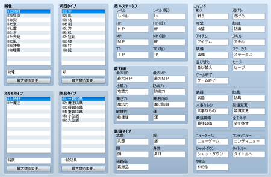

# 用語の設定

## データの役割

用語のデータは、ゲームのコマンドや能力値などの名称の設定をまとめたものです。標準の名称を世界観に合わせたものに変えれば、作品のオリジナリティーを一層高められます。

それぞれの名称は設定欄に収まる範囲の文字を入力できます。ただし長すぎるとゲーム中にすべて表示されない場合があります。

## 設定項目の内容
 

### ●属性

属性名の一覧です。名称を変更するにはリスト内で対象の項目をクリックで選択し、下の欄に名称を入力します。項目数を増減するには［最大数の変更］をクリックし、項目数を指定します。

この名称はエディタ上で選択する際に使われます。属性の具体的な内容は、スキルや武器などのデータで設定します。

### ●スキルタイプ

スキルデータの［スキルタイプ］で指定する種別前の一覧です。名称の変更方法などは［属性］の設定項目と同じです。

### ●武器タイプ

武器データの［武器タイプ］で指定する種別名の一覧です。名称の変更方法などは［属性］の設定項目と同じです。

### ●防具タイプ

防具データの［防具タイプ］で指定する種別名の一覧です。名称の変更方法などは［属性］の設定項目と同じです。

### ●基本ステータス

レベル、HP、MP、TPの名称です。既定の名称ごとに用意された設定項目に、適用する語句を指定します。［（短）］とある設定項目では、戦闘画面のステータスウィンドウなどで短縮表示する場合の名称を指定します。

### ●能力値

能力値の名称です。既定の名称ごとに用意された項目に、適用する語句を指定します。

### ●装備タイプ

装備品する部位の名称です。既定の名称ごとに用意された項目に、適用する語句を指定します。

### ●コマンド

ゲームのメニュー画面などに表示されるコマンドや選択肢の名称です。既定の名称ごとに用意された項目に、適用する語句を指定します。

######
