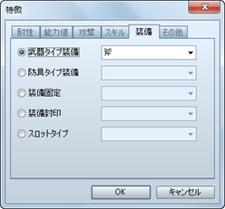

# 特徴の設定方法

## 設定の概要

アクター、職業、武器、防具、敵キャラ、ステートの各データの［特徴］の設定は、個々のデータ特有の性質や機能を定義するものです。

付与できる性質には下記の24種類があります。これらを作成したいデータの内容に合わせて付与することで、複雑な特徴を持たせることができます。

職業、武器、防具、ステートの特徴は、それぞれのデータがキャラクターに付加（装備）されている間、そのキャラクターの特徴として反映されます。

なお、行動を永久的に制約する特徴の設定には注意してください。たとえば“武器の装備を固定する”特徴を設定した武器は、アクターが装備すると同時に解除できなくなります。

## 設定方法
 

特徴を設定するには欄内の空行をダブルクリックします。表示されたウィンドウで性質の種類を選択し、影響を与える内容を指定します。

設定した性質の内容は［特徴］のリストに表示されます。この項目をダブルクリックすると、指定した内容を再編集できます。また項目を右クリックすると表示されるコンテキストメニューで、設定のコピーや削除などの操作が行なえます。

## 各特徴項目の内容

### ●［耐性］タブ

### 属性有効度

属性を伴う攻撃を受けたときのダメージを変動させます。対象の属性と変動率（0～1000％）を指定します。100％を超える変動率にすればダメージが標準より大きくなり、指定の属性に対して弱いことを表現できます。

### 弱体有効度

スキルやアイテムに設定された［能力弱体］の効果の成功率を変動させます。対象の能力値と、成功率の変動率（0～1000％、100％は変動なし）を指定します。

### ステート有効度

スキルやアイテムに設定された［ステート付加］の効果の成功率を変動させます。対象のステートと、成功率の変動率（0～1000％、100％は変動なし）を指定します。

### ステート無効化

指定したステートの付加を無効にします。［戦闘不能］を指定すると、HPが0になっても戦闘不能にならなくなります。

### ●［能力値］タブ

### 通常能力値

最大HP、攻撃力などの能力値を一定の比率で増減します。対象の能力値と変動率（0～1000％、100％は変動なし）を指定します。

### 追加能力値

命中率や回避率などの追加能力値を増減します。対象の能力値と加算する比率（-100～100％、初期値は0％）を指定します。

### 特殊能力値

狙われ率、防御効果率などの特殊能力値を増減します。対象の能力値と変動率（0～1000％、初期値は100％）を指定します。

### ●［攻撃］タブ

### 攻撃時属性

通常攻撃に指定した属性を付与します。

### 攻撃時ステート

通常攻撃にステート変化の効果を付与します。対象の効果と成功率の変動率（0～1000％、100％は変動なし）を指定します。

### 攻撃速度補正

戦闘時に通常攻撃を選択したとき、敏捷性を増減させます。増減値（-999～999）を指定します。

### 攻撃追加回数

通常攻撃で対象者にダメージを与える回数（標準は1回）を増やします。増やす回数を指定します。

### ●［スキル］タブ

### スキルタイプ追加

指定したスキルタイプのコマンドを選択できるようにします。

### スキルタイプ封印

指定したスキルタイプのスキルを選択できないようにします。

### スキル追加

指定したスキルを使えるようにします。

### スキル封印

指定したスキルを使えないようにします。

### ●［装備］タブ

### 武器タイプ装備

指定したタイプの武器を装備できるようにします。

### 防具タイプ装備

指定したタイプの防具を装備できるようにします。

### 装備固定

指定した部位の装備を変更できないようにします。一時的にパーティに加わるアクターの装備を変えたくない場合に使います。

### 装備封印

指定した部位に装備品を装備できないようにします。盾の装備を封印する“両手持ち”の武器や、頭の装備を封印する“全身にまとう服装”などを表現できます。

### スロットタイプ

［二刀流］のみ設定できます。盾を装備できなくする代わりに、ふたつの武器を装備できるようにします。

### ●［その他］タブ

### 行動回数増加

指定した確率で戦闘中の行動回数を1回増やします。この項目を複数付与した場合、個別に指定の確率のもと回数を増やすかを判定します。たとえば確率50％の設定を2つ付与した場合、行動回数が2回増える確率と、1回も増えない確率は、どちらも25％（50％×50％）になります。

### 特殊フラグ

戦闘時の行動に関する特徴を付与します。

| 自動戦闘 | プレイヤーのコマンドを受け付けずに独自に行動します。 |
| --- | --- |
| 防御 | 受けるダメージを一定割合で減らします。 |
| 身代わり | HPが少なくなった味方が攻撃されたとき、代わりにダメージを受けます。 |
| TP持ち越し | 蓄積したTPを次の戦闘に持ち越します。 |

### 消滅エフェクト

敵キャラに対してのみ有効な項目です。戦闘不能になって消滅するときのエフェクトを指定のものに変更します。

### パーティ能力

パーティの行動に関する特徴を付与します。それぞれの特徴を備えたアクターが1人でもパーティに含まれている間、パーティ全体の特徴として反映されます。

| エンカウント半減 | マップ移動時にエンカウントする頻度が半減します。 |
| --- | --- |
| エンカウント無効 | マップ移動時にエンカウントしなくなります。 |
| 不意打ち無効 | 戦闘発生時に不意打ち（最初のターンで敵グループのみ行動できる状態）が起こらなくなります。 |
| 先制攻撃率アップ | 戦闘発生時に先制攻撃（最初のターンでパーティのみ行動できる状態）の確率が高まります。 |
| 獲得金額二倍 | パーティが戦闘に勝利した場合に得るお金が通常の2倍になります。 |
| アイテム入手率二倍 | パーティが戦闘に勝利した場合に、敵キャラからアイテムを入手できる確率が通常の2倍になります（倒した敵キャラにアイテムが設定されている場合のみ）。 |

######
