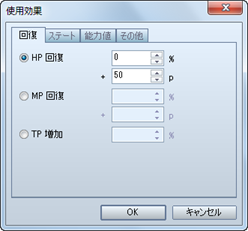

# 使用効果の設定方法

## 設定の概要

スキルとアイテムのデータにある［使用効果］の設定は、アクター／敵キャラが使ったとき、対象のキャラクターに与える効果を定義するものです。

付与できる効果には下記の13種類があります。複数の効果を設定すれば、複合的な効果を持つスキル／アイテムを表現できます。

## 設定方法
 

効果を設定するには欄内の空行をダブルクリックします。表示されたウィンドウで効果の種別を選択し、効果を及ぼす対象や効き目の大きさなどを指定します。

設定した効果の内容は［使用効果］のリストに表示されます。この項目をダブルクリックすると、指定した内容を再編集できます。また項目を右クリックすると表示されるコンテキストメニューで、設定のコピーや削除などの操作が行なえます。

## 使用効果の項目の内容

### ●［回復］タブ

### HP回復

HPを回復（現在値に加算）します。回復値を、対象キャラクターの最大HPに対する比率（0～100％）と一定値（0～9999）の和で指定します。どちらか一方の基準で値で指定したい場合、もう一方の値を0にします。アイテムにこの効果を設定する場合、使用者の［薬の知識］の特殊能力値に応じて回復値が増減します。

### MP回復

MPを回復（現在値に加算）加えます。回復値を、対象キャラクターの最大MPに対する比率（0～100％）と一定値（0～9999p）の和で指定します。どちらか一方で値で指定したい場合、もう一方の値を0にします。

### TP回復

MPを回復（現在値に加算）加えます。回復値を、対象キャラクターの最大TPに対する比率（0～100％）で指定します。

### ●［ステート］タブ

### ステート付加

ステートを付加します。対象のステートと成功率（0～1000％）を指定します。100％より高くすると、本来の有効度よりも高い確率で付与に成功します。

### ステート解除

ステートを解除します。対象のステートと成功率（0～100％）を指定します。

### ●［能力値］タブ

### 能力強化

戦闘中の能力値の変動レベルを1段階引き上げます。対象の能力値と効果が継続するターン数（1～1000）を指定します。変動レベルは-2～+2の範囲で変化し、1レベルにつき本来の能力値の25％が増減します。

### 能力弱体

戦闘中の能力値の変動レベルを1段階引き下げます。対象の能力値と効果が継続するターン数（1～1000）を指定します。変動レベルは-2～+2の範囲で変化し、1レベルにつき本来の能力値の25％が増減します。

### 能力強化の解除

戦闘中の能力値の変動レベルがプラスのとき、それをリセットして本来の能力値に戻します。

### 能力弱体の解除

戦闘中の能力値の変動レベルがマイナスのとき、それをリセットして本来の能力値に戻します。

### ●［その他］タブ

### 特殊効果

［逃げる］のみ設定可能です。対象のキャラクターを戦闘から離脱させます。アクターが効果を受けた場合、経験値などの付与の対象外になります。

### 成長

能力値を恒久的に引き上げます。対象の能力値と加算値（1～1000）を指定します。

### スキル習得

アクターに指定のスキルを習得させます。敵キャラには、この効果は反映されません。

### コモンイベント

指定したコモンイベントを実行します。この効果は、ひとつのデータにひとつしか設定できません。

######
