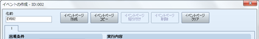
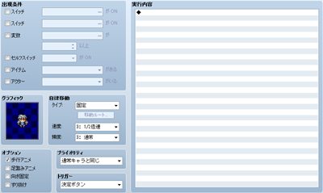

# マップイベントの設定

## 共通設定とイベントページの操作
 

### ●ID（タイトルバーに表示）

イベントの固有番号です。番号はマップごとに作成順に自動で設定されます。このIDは、変数などでイベントを指定する際などに用いられます。

### ●名前

マップイベントの名前です。この設定はエディタのみで使用されます（プレイ中のゲームへの影響はありません）。初期状態ではIDを使用した名前が自動で入力されます。必要に応じてイベントの内容を識別しやすいものに変更します。

### ●イベントページ番号

イベントに含まれるイベントページの番号です。タブをクリックすることで編集対象を切り替えます。

### ●イベントページの操作ボタン

画面上方に並ぶボタンでは、イベントページの作成や削除などの操作が行なえます。各ボタンの機能は以下のとおりです。

### イベントページ作成

編集中のイベントページの次の番号で新しいイベントページを作成します。追加ページ以降の各イベントページは、番号が1ずつ繰り上がります。

### イベントページコピー

編集中のイベントページの内容をクリップボードに取り込みます。

### イベントページ貼り付け

クリップボード上のイベントページを、編集中のイベントページの次の番号で追加（挿入）します。追加したもの以降の各イベントページは、番号が1ずつ繰り上がります。

### イベントページ削除

編集中のイベントページを削除します。削除したもの以降のイベントページは番号が1ずつ繰り下がります。

### イベントページクリア

編集中のイベントページの設定内容をすべて消去します（初期状態に戻します）。

## イベントページの設定項目
 

### ●出現条件

マップ上に、このイベントページの設定にもとづいてマップイベントが出現する条件です。［スイッチ］［変数］［セルフスイッチ］［アイテム］［アクター］から条件に用いる項目を有効にし、その判定基準を設定します。

無条件でイベントを出現させる場合は、出現条件を設定しないようにします。複数の項目を指定した場合、すべての項目に合致する場合のみ条件を満たすことになります。

条件を満たすイベントページが複数ある場合、番号が一番大きいイベントページの内容に基づいてイベントが出現します。条件を満たすページがひとつもない場合、イベントは出現しません。

### ●グラフィック

マップに出現する場合に表示する画像です。枠内をダブルクリックすると表示される［グラフィック］ウィンドウで、ファイルリスト（左側）、画像（右側）を順にクリックして指定します。

グラフィックを指定しない場合は見えない状態でマップ上に出現します。設定したグラフィックを消去するには、［グラフィック］ウィンドウのファイルリストの一番上にある［（なし）］を指定します。

### ●自律移動

マップイベントの移動方法を［タイプ］［速度］［頻度］の3項目をもとに指定します。［速度］は移動する際の速さで、値が大きいほど高速で移動するようになります。［頻度］は移動する周期で、番号が大きいほど移動周期が短くなります。［タイプ］では移動の仕方を次の4種類から指定します。

### 固定

移動しません。

### ランダム

ランダムに動き回ります。

### 近づく

プレイヤーの位置に近寄るように移動します。

### カスタム

指定したルートに沿って移動します。ルートは［移動ルート］をクリックすると表示されるウィンドウで指定できます。詳細は[“移動ルートの設定”](5410_ev_routesetting.md)の項目を参照してください。

### ●オプション

グラフィックの表示方法です。必要に応じて適用する項目を有効にします。

### 歩行アニメ

移動時にアニメーションを表示します。人物や動物のキャラクターが歩行する様子を表現するのに使います。

### 足踏みアニメ

停止中にアニメーションを表示します。揺れる海面や炎などを表現するのに使います。

### 向き固定

移動時にグラフィックの向きを変えないようにします。

### すり抜け

通行できない地形やイベントをすり抜けられるようにします。

### ●プライオリティ

プレイヤーや他のイベントとの高低の位置関係を以下からひとつ指定します。イベントとプレイヤーが重なることができる場合、上に位置する方のグラフィックの表示が優先されます。

### 通常キャラの下

このイベントの上をプレイヤーなどが歩行できるようになります。ただし、［グラフィック］でタイルが選択されている場合、通行可否はそのタイルの設定に準じます。

### 通常キャラと同じ

プレイヤーと同じ高さに位置し、このイベントのある場所に進入できなくなります。

### 通常キャラの上

このイベントの下をプレイヤーなどが歩行できるようになります。

### ●トリガー

マップ上に出現するイベントについて、［実行内容］の処理を開始するタイミングを以下からひとつ指定します。

### 決定ボタン

プレイヤーがイベントに隣接し、かつイベントのある方向に向いた状態（重なることができるイベントの場合は重なった状態）で決定ボタンを押したとき。

### プレイヤーから接触

このマップイベントにプレイヤーから接触したとき（重なることができるイベントの場合は重なったとき）、およびその状態で決定ボタンを押したとき。

### イベントから接触

イベントの自律移動によってプレイヤーとぶつかったとき（重なることができるイベントの場合は重なったとき）、および［プレイヤーから接触接触］と同じ状態のとき。

### 自動実行

出現条件を満たしてマップ上に出現したとき。

### 並列処理

出現条件を満たしてマップ上に出現したとき（実行内容の処理を周期的に繰り返します）。

### ●実行内容

［トリガー］の内容を満たしたときに実行する処理のリストです。詳細は次の“実行内容の編集方法”の項目を参照してください。

## 実行内容の編集方法

### ●実行内容のリストの見方

実行内容では、プレイ中のゲームに加える処理を“イベントコマンド”という命令をもとに編集します。

イベントコマンドは、リストの上に登録したものから順に処理され、プレイ中のゲームに反映されます。リストに［◆］とある行は登録したイベントコマンドを表わします。［：］とある行は、上にあるイベントコマンドの設定内容の表示や、処理の流れを分岐させる位置などを表します。

### ●イベントコマンドの追加

リストにイベントコマンドを追加するには、［◆］が表示された行をダブルクリックします。表示されたウィンドウで使用するイベントコマンドを選択し、処理の具体的な内容（一部を除く）を設定します。すでにイベントコマンドを登録した行をダブルクリックした場合、その位置にイベントコマンドを挿入する形で登録します。

### ●コンテキストメニューによる操作

登録したイベントコマンドは［◆］の記号付きで表示されます。この行を右クリックするとメニューが表示され、［コピー］や［削除］などの操作が行なえます。各項目の内容は次のとおりです。

### 挿入

選択行の位置に新しいイベントコマンドを挿入します。

### 編集

選択行のイベントコマンドの設定を再編集します。

### 切り取り

選択行の登録内容をクリップボードに取り込み、リストから削除します。

### コピー

選択行の登録内容をクリップボードに取り込みます。

### 貼り付け

クリップボードに取り込んだ内容を、選択行の位置に挿入します。

### 削除

選択行のイベントコマンドを削除します。

### すべて選択

リスト全体を編集対象として選択します。

### ●複数項目の一括選択

リスト上で何らかの行をクリックで選択した状態で、［Shift］キーを押しながら別の行をクリックすると、その範囲のイベントコマンド（［◆］の表示があるブロック）をまとめて選択できます。選択中の項目（青色で表示された行）を右クリックすれば、コンテキストメニューによる操作を一括して行なえます。ただし分岐処理を含む場合、まとめて選択できるのは同じ分岐内の項目に限られます。

######
