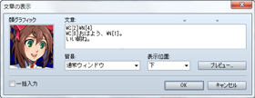
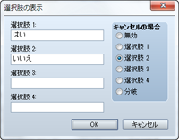
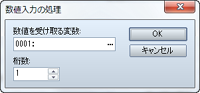
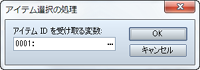
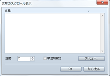

# メッセージ

## 文章の表示
 

### ●機能

メッセージウィンドウを開き、文章を表示します。

### ●設定項目

### 文章

表示する文章を入力します。1回につきメッセージウィンドウに4行までの文章を表示可能です。2行目以降に文字を表示するには［Enter］キーで改行します。

### 顔グラフィック

メッセージウィンドウ内の左端に表示する顔グラフィックを指定します。ダブルクリックすると表示される［顔グラフィック］のウィンドウで画像を指定します。

### 背景

文章を表示するメッセージウィンドウの形式を選択します。

### 表示位置

メッセージウィンドウの表示位置を［下］［中］［上］のいずれかで指定します。

### プレビュー

クリックすると文章の実際の表示を確認できます。

### 一括入力

有効にすると、一度に4行を超えて文章を入力できるようになります。4行を超える文章は、4行ごとに複数の［文章の表示］のイベントコマンドに分割したうえで実行内容のリストに設定されます。

### ●備考

・文章の入力中に［Ctrl］＋［Enter］のキーを押すと、［OK］ボタンをクリックしたときと同じ動作になります。

・［文章］の欄の上にある“▼”のマークはメッセージウィンドウに表示可能な文字数の目安を表わします（内側の“▼”は顔グラフィックを表示する場合の目安です）。文章が意図したとおりに表示されるかを［プレビュー］で確認しながら入力してください。

・［背景］と［表示位置］の設定は、戦闘中のメッセージウィンドウには反映されません。

・文章に制御文字を入力すると、変数の値やアクターの名前などを表示できます。制御文字と表示する内容は以下のとおりです。制御文字は必ず半角で入力してください。

| \V[n] | 変数n番の値に置き換えられます。 |
| --- | --- |
| \N[n] | アクターn番の名前に置き換えられます。 |
| \P[n] | パーティメンバーn番（並び順）の名前に置き換えられます。 |
| \G | 通貨単位の文字に置き換えられます。 |
| \C[n] | 以降の文字をn番の色で表示します。n番の色はウィンドウスキンに設定したグラフィックの内容に準じます。 |
| \I[n] | アイコンn番を描画します。 |
| \{ | 文字サイズを1段階大きくします。 |
| \} | 文字サイズを1段階小さくします。 |
| \$ | 所持金のウィンドウを開きます。 |
| \. | 文章の表示を1/4秒間停止します。 |
| \\| | 文章の表示を1秒間停止します。 |
| \! | 文章の途中でボタンの入力待ちを行ないます。 |
| \> | 同じ行にある残りの文字を瞬時に表示します。 |
| \< | “\>”の制御文字による表示形式の変更を取り消します。 |
| \^ | 文章表示後にボタン入力を待たないようにします。 |
| \\ | バックスラッシュに置き換えられます。 |

・制御文字で指定する番号（n）は、変数で指定することも可能です。例えば“\N[\V[1]]”と入力すると、1番の変数の値（\V[1]）と同じIDを持つアクターの名前が表示されます。

## 選択肢の表示
 

### ●機能

メッセージウィンドウに選択肢（4択まで）を表示し、プレイヤーの選択に応じて処理を分岐させます。

### ●設定項目

### 選択肢X（Xは1～4）

選択肢の語句を指定します。表示しない選択肢は空白にします。

### キャンセル

選択肢の表示中、プレイヤーがキャンセルした場合の取り扱いを指定します。［選択肢1］～［選択肢4］は、指定の選択肢を選択したものとみなします。［無効］はキャンセル操作自体を無効にします。［分岐］はキャンセルした場合の処理に分岐させます。

### ●備考

・設定項目を決定すると、［実行内容］にそれぞれの選択肢（キャンセルを含む）に対応する分岐が作られます。これらの分岐に、選択肢を選んだあとに実行する内容を設定します。

・表示中のメッセージウィンドウの余白にすべての選択肢を表示できる場合、選択肢を続けて表示します。

## 数値入力の処理
 

### ●機能

数値の入力画面を表示し、プレイヤーが入力した値を変数に代入します。

### ●設定項目

### 数値を受け取る変数

プレイヤーが入力した数値を代入する変数を指定します。

### 桁数

入力を受け付ける数値の桁数（1～8）を指定します。

### ●備考

・表示中のメッセージウィンドウに1行以上の余白がある場合、続けて数値入力の表示をします。

・数値入力の処理の開始時には、指定した変数に代入されている数値が表示されます。

## アイテム選択の処理
 

### ●機能

“大事なもの”に分類されたアイテムの選択画面を表示します。プレイヤーが選択したアイテムのIDを変数に代入します。

### ●設定項目

### アイテムIDを受け取る変数

プレイヤーが選択したアイテムの番号（アイテムID）を代入する変数を指定します。

## 文章のスクロール表示
 

### ●機能

画面の下方から上方に向けて文章をスクロール表示します。決定ボタンを押すとスクロールを早送りできます。

### ●設定項目

### 文章

表示する文章を入力します。

### 速度

スクロールの速度（1～8）を指定します。値が大きいほど高速になります。

### 早送り無効

決定ボタンで表示を早送りできないようにします。

######
