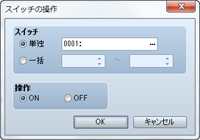
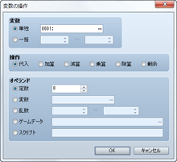
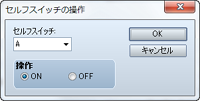
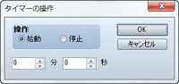

# ゲーム進行

## スイッチの操作
 

### ●機能

スイッチの値（ON／OFF）を変更します。

### ●設定項目

### スイッチ

変更対象のスイッチを指定します。ひとつのスイッチを操作する場合は［単独］を選び、対象のスイッチを指定します。連続する番号のスイッチの値をまとめて変える場合は［一括］を選び、スイッチ番号の範囲を指定します。

### 操作

 スイッチに代入する値（ON／OFF）を指定します。

## 変数の操作
 

### ●機能

変数に格納されている値を変更します。

### ●設定項目

### 変数

値を変える変数を指定します。ひとつの変数を操作する場合は［単独］を選び、対象の変数を指定します。連続する番号の変数をまとめて操作する場合は［一括］を選び、変数番号の範囲を指定します。

### 操作

値の計算方法を指定します（備考参照）。［変数］で指した変数の値は、操作前の変数の値、計算方法、オペランドの値にもとづいて計算した値に変わります。

### オペランド

［操作］の計算に用いる値を指定します（備考参照）。

### ●備考

・［操作］で指定する計算方法の内容は以下のとおりです。

| 代入 | オペランドの値を代入（計算なし） |
| --- | --- |
| 加算 | “操作前の変数の値＋オペランド”の計算値を代入 |
| 減算 | “操作前の変数の値－オペランド”の計算値を代入 |
| 乗算 | “操作前の変数の値×オペランド”の計算値を代入 |
| 除算 | “操作前の変数の値÷オペランド”の計算値を代入 |
| 剰余 | “操作前の変数の値÷オペランド”の余りを代入 |

・［オペランド］で指定する値の内容は以下のとおりです。

| 定数 | 固定値を適用します。右欄に値を指定します。 |
| --- | --- |
| 変数 | 変数の値を適用します。参照する変数を指定します。 |
| 乱数 | 乱数（不作為に決まる数）の値を適用します。発生させる乱数の範囲（-9999万9999～9999万9999）を指定します。 |
| ゲームデータ | ゲームのプレイ状況に関する値を適用します。［…］をクリックするを開くウィンドウで参照する情報を指定します（下記参照）。 |
| スクリプト | 入力したRubyスリプトの評価結果を値に適用します。 |

・［オペランド］に［ゲームデータ］を指定した場合は、オペランドの値とするデータを以下からひとつ指定します。

| プレイヤーやマップイベントの表示位置や状態に関する値を適用します。以下の参照項目からひとつ指定します。 X座標、Y座標 | ：現在地のマップ座標 |
| --- | --- |
| 向き | ：現在の向き（上＝8／左＝4／右＝6／下＝2） |
| 画面X座標、画面Y座標 | ：画面上の表示位置の座標（ドット） |
| マップID | ：現在地のマップのID |
| パーティ人数 | ：パーティに含まれるメンバーの人数 |
| 所持金 | ：パーティの所持金 |
| 歩数 | ：ゲームスタート時点からのプレイヤーの移動歩数 |
| プレイ時間 | ：ゲームスタート時点からの経過秒数 |
| タイマー | ：タイマーの残り時間（秒数） |
| セーブ回数 | ：ゲームスタート時点からのセーブ回数 |

## セルフスイッチの操作
 

### ●機能

セルフスイッチの値を操作します。バトルイベントでは使用できません。

### ●設定項目

### セルフスイッチ

対象のセルフスイッチ（A～D）を指定します。

### 操作

スイッチに代入する値（ON／OFF）を指定します。

### ●備考

・バトルイベントでは使用できません。

## タイマーの操作
 

### ●機能

制限時間（残り時間）を計測するタイマーを始動／停止します。タイマーを始動すると画面右上に残り時間が自動で表示されます。メニューの表示中は、タイマーのカウントダウンは一時停止します（計測の対象外になります）。タイマーの残り時間で処理を分岐させるには、［条件分岐］のイベントコマンドなどを使います。

### ●設定項目

### 操作

制限時間の計測を開始するには［始動］、計測を終了するには［停止］を指定します。

### 時間

［操作］に［始動］を指定した場合に、制限時間（0分0秒～99分59秒）を指定します。

######
