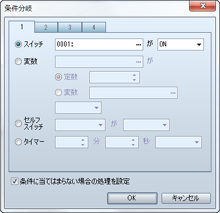
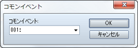
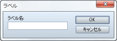
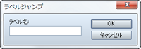
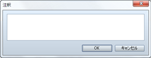

# フロー制御

## 条件分岐
 

### ●機能

指定の条件に合致した場合のみ特別な処理を実行できるように、処理を分岐させるイベントコマンドを設定します。［条件に当てはまらない場合の処理を設定］を有効にすると、指定の条件を満たさない場合に分岐させることができます。

### ●設定項目

条件は、以下の項目のなかから判定基準とともに指定します。

### スイッチ

スイッチの値を条件とします。対象のスイッチと値（ON／OFF）を指定します。

### 変数

変数の値の比較結果を条件とします。条件判定に用いる変数、比較の基準値、比較の方法を指定します。比較の基準値に変数を用いる場合は［変数］を選び、参照する変数を指定します。

### セルフスイッチ

指定のセルフスイッチの値を条件とします。対象のスイッチと判定値（ON／OFF）を指定します。

### タイマー

タイマーの残り時間を条件とします。基準の残り時間と判定基準（以上／以下）を指定します。

### アクター

アクターの情報を条件とします。対象のアクター、参照する内容（パーティにいる／名前／スキル／武器／防具／ステート）、判定基準（具体的な項目）を指定します。

### 敵キャラ

戦闘中の敵キャラの状態を条件とします。対象の敵キャラと判定基準（出現している／ステート）を指定します。バトルイベントでのみ有効です。

### キャラクター

プレイヤーまたはマップイベントの向きを条件とします。対象のキャラクターと向きを指定します。マップイベントでのみ有効です。

### 乗り物

プレイヤーが指定の乗り物（小型船／大型船／飛行船）に乗っているかどうかを条件とします。

### お金

所持金を条件とします。金額と比較方法（以上／以下）を指定します。

### アイテム

パーティが指定のアイテムを持っていることを条件とします。

### 武器

パーティが指定の武器を持っていることを条件とします。［装備品も含める］を有効すると、アクターが装備中のものも条件判定の対象とします。

### 防具

パーティが指定の防具を持っていることを条件とします。［装備品も含める］を有効すると、アクターが装備中のものも条件判定の対象とします。

### ボタン

 指定のボタンが押されていることを条件とします。

### スクリプト

 任意のRubyスクリプトを評価した結果を基準とします。

## ループ

### ●機能

繰り返し処理を行なう［ループ］と［以上繰り返し］という制御用のイベントコマンドを追加します。これらの行の間に設定したイベントが繰り返し実行できるようになります。ループ処理の中でさらにループ処理を行なう“多重ループ”も可能です。

### ●備考

・［ループ］～［以上繰り返し］内のイベントベントコマンドは無限に繰り返されます。繰り返し処理を終えるには［ループの中断］などのイベントコマンドを使います。

## ループの中断

### ●機能

［ループ］のイベントコマンドで繰り返している処理を中断します。実行すると、［以上繰り返し］の次の行に設定したイベントコマンドに処理が移ります。設定項目はありません。

## イベント処理の中断

### ●機能

実行内容の処理を終了します。これ以降のイベントコマンドは処理されません。設定項目はありません。

## コモンイベント
 

### ●機能

コモンイベントを呼び出します。呼び出したコモンイベントの処理が終了すると、次のイベントコマンドの処理に移ります。

### ●設定内容

### コモンイベント

呼び出すコモンイベントを指定します。

## ラベル
 

### ●機能

［ラベルジャンプ］のイベントコマンドによる処理の移動先（目印）を作成します。

### ●設定内容

### ラベル名

 ラベルの名前を指定します。

## ラベルジャンプ
 

### ●機能

処理対象の行を指定のラベルの位置に移動します。移動したラベルの次の行のイベントコマンドが処理されます。

### ●設定内容

### ラベル名

移動先のラベル名を指定します。指定できるラベルは、同一のイベントページの実行内容に設定したものに限られます。

## 注釈
 

### ●機能

実行内容のリストに任意の文字をメモとして登録します。ゲームのプレイには一切影響しません。

### ●設定内容

### 注釈

注釈として表示する文字を指定します。

######
