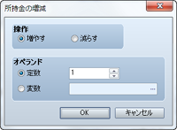
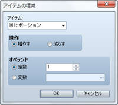
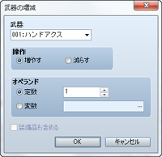
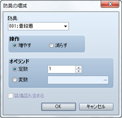
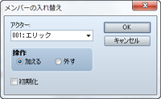

# パーティ

## 所持金の増減
 

### ●機能

パーティの所持金を増減します。

### ●設定項目

### 操作

操作の内容（増やす／減らす）を指定します。

### オペランド

増減させる額を指定します。一定額を増減する場合は［定数］を選び、金額を入力します。変数の値で額を指定する場合は［変数］を選び、参照する変数を指定します。

## アイテムの増減
 

### ●機能

パーティのアイテムの所持数を増減します。増減の結果、所持数が0～99個の範囲を超える場合は99個（最大所持数）、または0個（所持なし）に調整されます。

### ●設定項目

### アイテム

増減対象のアイテムを指定します。

### 操作

操作の内容（増やす／減らす）を指定します。

### オペランド

増減させる数量を指定します。一定数を増減する場合は［定数］を選び、数量を入力します。変数の値で数量を指定する場合は［変数］を選び、参照する変数を指定します。

## 武器の増減
 

### ●機能

パーティの武器の所持数を増減します。増減の結果、所持数が0～99個の範囲を超える場合は99個（最大所持数）、または0個（所持なし）に調整されます。

### ●設定項目

### 武器

増減対象の武器を指定します

### 操作

操作の内容（増やす／減らす）を指定します。

### オペランド

増減させる数量を指定します。一定数を増減する場合は［定数］を選び、数量を入力します。変数の値で数量を指定する場合は［変数］を選び、参照する変数を指定します。

### 装備品も含める

有効にすると、アクターが装備している武器も減らす対象にします。

## 防具の増減
 

### ●機能

パーティの武器の所持数を増減します。増減の結果、所持数が0～99個の範囲を超える場合は99個（最大所持数）、または0個（所持なし）に調整されます。

### ●設定項目

### 防具

増減対象の防具を指定します

### 操作

操作の内容（増やす／減らす）を指定します。

### オペランド

増減させる数量を指定します。一定数を増減する場合は［定数］を選び、数量を入力します。変数の値で数量を指定する場合は［変数］を選び、参照する変数を指定します。

### 装備品も含める

有効にすると、アクターが装備している防具も減らす対象にします。

## メンバーの入れ替え
 

### ●機能

パーティ内のアクターの構成を変更します。入れ替えの結果、パーティ内のアクターを0人にすることもできます。この場合、マップ上にプレイヤーは表示されなくなります。

### ●設定項目

### アクター

入れ替え対象のアクターを指定します。

### 操作

操作の内容（加える／外す）を指定します。

### 初期化

有効にすると、アクターを加えるときの設定値が［データベース］での設定にもとづいたものになります。

######
