# アクター

## HPの増減
 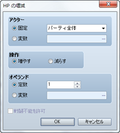

### ●機能

アクターのHPを増減します。

### ●設定項目

### アクター

対象のアクターを指定します。特定のアクターを対象とする場合は［固定］を選び、アクターを指定します（［パーティ全体］にするとパーティ内のすべてのアクターが対象になります）。ID番号で対象アクターを指定する場合は［変数］を選び、参照する変数を指定します。

### 操作

操作の内容（増やす／減らす）を指定します。

### オペランド

HPの増減値を指定します。一定の値にする場合は［定数］を選び、値（1～9999）を入力します。変数で値を指定する場合は［変数］を選び、参照する変数を指定します。

### 戦闘不能を許可

有効にすると、HPの減少によって0以下になった場合に戦闘不能状態にします。無効にすると、HPが0以下になった場合に1に調整されます。

## MPの増減
 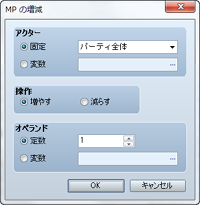

### ●機能

アクターのMPを増減します。

### ●設定項目

### アクター

対象のアクターを指定します。特定のアクターを対象とする場合は［固定］を選び、アクターを指定します（［パーティ全体］にするとパーティ内のすべてのアクターが対象になります）。ID番号で対象アクターを指定する場合は［変数］を選び、参照する変数を指定します。

### 操作

操作の内容（増やす／減らす）を指定します。

### オペランド

MPの増減値を指定します。一定の値にする場合は［定数］を選び、値（1～9999）を入力します。変数で値を指定する場合は［変数］を選び、参照する変数を指定します。

## ステートの変更
 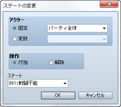

### ●機能

アクターのステートを変更します。

### ●設定項目

### アクター

対象のアクターを指定します。特定のアクターを対象とする場合は［固定］を選び、アクターを指定します（［パーティ全体］にするとパーティ内のすべてのアクターが対象になります）。ID番号で対象アクターを指定する場合は［変数］を選び、参照する変数を指定します。

### 操作

操作の内容（付加／解除）を指定します。

### ステート

操作対象のステートを指定します。

## 全回復
 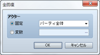

### ●機能

アクターのHPとMPを最大値まで回復し、すべてのステートを解除します。

### ●設定項目

### アクター

対象のアクターを指定します。特定のアクターを対象とする場合は［固定］を選び、アクターを指定します（［パーティ全体］にするとパーティ内のすべてのアクターが対象になります）。ID番号で対象アクターを指定する場合は［変数］を選び、参照する変数を指定します。

## 経験値の増減
 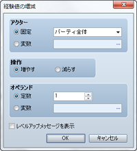

### ●機能

アクターの経験値を増減します。

### ●設定項目

### アクター

対象のアクターを指定します。特定のアクターを対象とする場合は［固定］を選び、アクターを指定します（［パーティ全体］にするとパーティ内のすべてのアクターが対象になります）。ID番号で対象アクターを指定する場合は［変数］を選び、参照する変数を指定します。

### 操作

操作の内容（増やす／減らす）を指定します。

### オペランド

経験値の増減値を指定します。一定の値にする場合は［定数］を選び、値（1～9999999）を入力します。変数で値を指定する場合は［変数］を選び、参照する変数を指定します。

### レベルアップメッセージを表示

有効にすると、経験値を増加によってレベルアップした場合、プレイ画面にその旨を知らせるメッセージを表示します。

## レベルの増減
 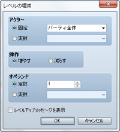

### ●機能

アクターのレベル数を増減します。

### ●設定項目

### アクター

対象のアクターを指定します。特定のアクターを対象とする場合は［固定］を選び、アクターを指定します（［パーティ全体］にするとパーティ内のすべてのアクターが対象になります）。ID番号で対象アクターを指定する場合は［変数］を選び、参照する変数を指定します。

### 操作

操作の内容（増やす／減らす）を指定します。

### オペランド

レベル数の増減値を指定します。一定の値にする場合は［定数］を選び、値（1～9999999）を入力します。変数で値を指定する場合は［変数］を選び、参照する変数を指定します。

### レベルアップメッセージを表示

有効にすると、レベルアップした場合、プレイ画面にその旨を知らせるメッセージを表示します。

## 能力値の増減
 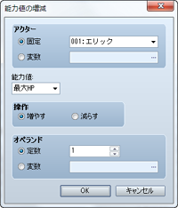

### ●機能

アクターの能力値を増減します。

### ●設定項目

### アクター

対象のアクターを指定します。特定のアクターを対象とする場合は［固定］を選び、アクターを指定します（［パーティ全体］にするとパーティ内のすべてのアクターが対象になります）。ID番号で対象アクターを指定する場合は［変数］を選び、参照する変数を指定します。

### 操作

操作の内容（増やす／減らす）を指定します。

### オペランド

能力値の増減値を指定します。一定の値にする場合は［定数］を選び、値（1～9999）を入力します。変数で値を指定する場合は［変数］を選び、参照する変数を指定します。

## スキルの増減
 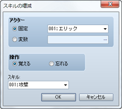

### ●機能

アクターが使用できるスキルを操作します。

### ●設定項目

### アクター

対象のアクターを指定します。特定のアクターを対象とする場合は［固定］を選び、アクターを指定します。ID番号で対象アクターを指定する場合は［変数］を選び、参照する変数を指定します。

### 操作

スキルを使用可能にするには［覚える］、使用不可にするには［忘れる］を指定します。

### スキル

操作対象のスキルを指定します。

## 装備の変更
 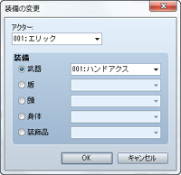

### ●機能

アクターの装備を変更します。

### ●設定項目

### アクター

対象のアクターを指定します。

### 装備

装備を変更する部位を選び、装備品を指定します。装備品を［なし］と指定すると、その部位の装備を解除します。

### ●備考

・指定の装備品をパーティが所持していない場合、装備は変更されません。何らかの装備品を強制的に装備させるには、あらかじめ［武器の増減］［防具の増減］のイベントコマンドで、装備品を持たせておく必要があります。

## 名前の変更
 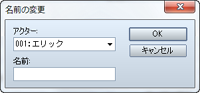

### ●機能

アクターの名前を変更します。

### ●設定項目

### アクター

対象のアクターを指定します。

### 名前

変更後の名前を指定します。

## 職業の変更
 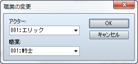

### ●機能

アクターの職業を変更します。

### ●設定項目

### アクター

対象のアクターを指定します。

### 職業

変更後の職業を指定します。

### ●備考

・職業を変更すると、アクターの現在の経験値をもとにレベルが再計算され、能力値や使用できるスキルなどが変わります。また装備できない武器や防具は、自動で装備が解除されます。

## 二つ名の変更
 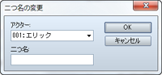

### ●機能

アクターの二つ名を変更します。

### ●設定項目

### アクター

対象のアクターを指定します。

### 二つ名

変更後の二つ名を指定します。

######
