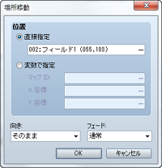
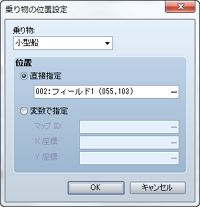
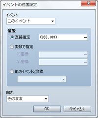
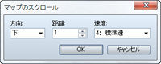

# 移動

## 場所移動
 

### ●機能

パーティの位置を変更します。

### ●設定項目

### 位置

変更後の位置を指定します。特定の位置に移動させる場合は［直接指定］を選択し、［…］をクリックすると表示されるウィンドウで移動先の位置をクリックで指定します。マップのIDや座標で指定するには［変数で指定］を選択し、［マップID］［X座標］［Y座標］に参照する変数を指定します。

### 向き

場所移動後のプレイヤーの向きを指定します。

### フェード

場所移動の際の画面の切り替え方を指定します。［通常］では黒色、［白］では白色の表示にしてから移動先のマップを表示します。

## 乗り物の位置設定
 

### ●機能

乗り物の位置を変更します。

### ●設定項目

### 乗り物

対象の乗り物（小型船／大型船／飛行船）を指定します。

### 位置

変更後の位置を指定します。特定の位置に移動させる場合は［直接指定］を選択し、［…］をクリックすると表示されるウィンドウで移動先の位置をクリックで指定します。マップのIDや座標で指定するには［変数で指定］を選択し、［マップID］［X座標］［Y座標］に参照する変数を指定します。

## イベントの位置設定
 

### ●機能

イベントの位置を変更します。

### ●設定項目

### イベント

対象のイベントを指定します。［このイベント］にすると、イベント自身が位置を変える対象になります。移動させられるのは、同じマップにあるイベントに限られます。

### 位置

変更後の位置を指定します。特定の位置に移動させる場合は［直接指定］を選択し、［…］をクリックすると表示されるウィンドウで移動先の位置をクリックで指定します。マップのIDや座標で指定するには［変数で指定］を選択し、［マップID］［X座標］［Y座標］に参照する変数を指定します。

### ●備考

・バトルイベントでは使用できません。

## マップのスクロール
 

### ●機能

プレイヤーの位置を変えずに、プレイ画面に表示されるマップの範囲を移動（スクロール）します。

### ●設定項目

### 方向

スクロール方向を指定します。

### 距離

移動距離（タイル数）を指定します。

### 速度

処理の速度（6段階）を指定します。

### ●備考

・このイベントコマンドが連続して設定されている場合、前のスクロール処理が終了するまで処理は停止します。

・範囲を移動させたマップは、その距離だけ戻さない限り、プレイヤーの位置とずれたままになります。

・バトルイベントでは使用できません。

## 移動ルートの設定

### ●機能

プレイヤーまたはマップイベントを、指定のルートに沿って強制移動させます。

### ●設定項目

### 対象キャラクター（ウィンドウ左上の項目）

対象のキャラクター（プレイヤー／イベント）を指定します。

### コマンドリスト

移動コマンドをもとにルートを指定します。詳細は[“移動ルートの設定”](5410_ev_routesetting.md)の項目を参照してください。

### オプション

有効にすると、移動ルートのコマンドリストを繰り返し実行します。

### 移動できない場合は飛ばす

有効にすると、障害物で移動できないなど、実行できないコマンドをスキップします。

### 移動が終わるまでウェイト

指定の移動コマンドがすべて終了するまで、処理を一時停止します。

### ●備考

・移動ルートを設定されたキャラクターは、すぐに移動を開始します。

・すでに移動ルートを設定しているキャラクターに対してこのイベントコマンドを実行すると、それまでの設定は破棄され、新しい設定のみが有効となります。以前の移動ルートによる移動が終了してから次の移動ルートを設定したい場合は、［移動が終わるまでウェイト］を有効にしてください。

・［移動が終わるまでウェイト］を有効にすると、移動コマンドが終了するまでプレイヤーは操作できません（並列処理中は除く）。このとき、移動ルートを指定したキャラクターが障害物にぶつかるなどして移動コマンドが実行できなくなると、そこで処理が停止したままになります。このような事態は、オプションの［移動できない場合は無視］を有効にするなどの方法で回避してください。

・このイベントコマンドでプレイヤーが移動しても、累計の移動歩数には加算されません。

・バトルイベントでは使用できません。

## 乗り物の乗降

### ●機能

乗り物の乗り降りを操作します。乗っている場合は地上に降り、乗っていない場合は乗ります。設定項目はありません。

### ●備考

・このイベントコマンドは、プレイヤーが［決定］キーで行なう乗り降りの操作を強制実行するものです。通常の乗り降りの操作ができない場合（乗れる乗り物がないとき、地上に降りられないとき）は何も起こりません。

・バトルイベントでは使用できません。

######
