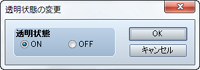
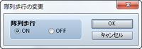
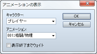
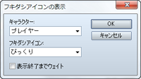

# キャラクター

## 透明状態の変更
 

### ●機能

マップ上の移動するパーティの表示（透明化）を制御します。

### ●設定項目

### 透明状態

見えなくするには［ON］、表示する場合は［OFF］を指定します。

## 隊列歩行の変更
 

### ●機能

パーティの2番目以降のアクターの歩行グラフィックを表示するかどうかを制御します。

### ●設定項目

### 隊列歩行

表示するには［ON］、表示しない場合は［OFF］を指定します。

### ●備考

・パーティが5人以上いる場合、歩行グラフィックが表示されるのは先頭から4人のみです。

## 隊列メンバーの集合

### ●機能

パーティの各アクターの歩行グラフィックを、先頭のアクターと同じ位置に表示します。設定項目はありません。

## アニメーションの表示
 

### ●機能

マップ上にアニメーションを表示します。

### ●設定項目

### キャラクター

表示場所をプレイヤーやイベントの位置をもとに指定します。

### アニメーション

表示するアニメーションを指定します。

### 表示終了までウェイト

有効にすると、アニメーションの表示が終わるまでイベント処理の進行を停止します。

### ●備考

・バトルイベントでは使用できません。

・バトル中にアニメーションを表示したい場合は、［戦闘アニメーションの表示］のイベントコマンドを使用してください。

## フキダシアイコンの表示
 

### ●機能

パーティやイベントの頭上に、感情を表現するアイコンをフキダシ付きで表示します。アイコンには驚きを表現する“！”や、ひらめきを表現する電球の絵柄など全10種類があります。

### ●設定項目

### キャラクター

表示場所をプレイヤーやイベントの位置をもとに指定します。

### フキダシアイコン

表示するフキダシアイコンを指定します。

### 表示終了までウェイト

有効にすると、フキダシアイコンの表示が終わるまでイベント処理の進行を停止します。

## イベントの一時消去

### ●機能

実行中のイベントを一時的に消去します。設定項目はありません。消去した状態はパーティが他のマップに移動するまで継続します。

### ●備考

・バトルイベントでは使用できません。

######
