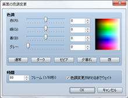
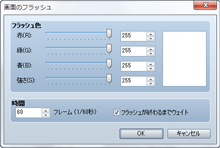
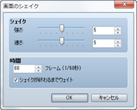

# 画面効果

## 画面のフェードアウト

### ●機能

画面を暗転します（徐々に暗くして黒一色で表示）。設定項目はありません。

### ●備考

・暗転した状態は、［画面のフェードイン］のイベントコマンドが実行されるまで継続します。

・暗転後もメニューやメッセージウィンドウ、戦闘のコマンドウィンドウなどは表示されます。

・バトルイベントで実行すると、コマンドウィンドウやメッセージ以外は黒一色で表示され、敵キャラなどが見えなくなります。

## 画面のフェードイン

### ●機能

［画面のフェードアウト］で暗転した画面を元に戻します。設定項目はありません。

## 画面の色調変更
 

### ●機能

画面全体の色調を変更します。メッセージウィンドウやピクチャの色調は変更されません。

### ●設定項目

### 色調

［赤］［緑］［青］の各色に加算する成分（-255～255）を指定します。［グレー］にはグレースケールフィルターの強さ（0～255）を指定します。値を大きいほど全体的に加算する色が強調されます。下に並ぶ［通常］［ダーク］［セピア］［夕暮れ］［夜］のボタンをクリックすると、それぞれの色調を表現する規定値を適用できます（［通常］は本来の色調に戻します）。色調の変化は右側のプレビュー領域で確認できます。

### 時間

処理にかける時間をフレーム数（1～600）で指定します。1フレームは60分の1秒に相当します。

### 色調変更が終わるまでウェイト

有効にすると、このイベントコマンドの処理が終わるまで処理の進行を停止します。

### ●備考

・変更した色調は、戦闘中も含め、再度このイベントコマンドで変更するまで有効です。

## 画面のフラッシュ
 

### ●機能

画面全体を一瞬だけ指定した色のみで表示し、徐々に元の表示に戻します。雷光の様子などを表現できます。

### ●設定項目

### フラッシュ色

表示色を［赤］［緑］［青］の各色の成分比（0～255）をもとに指定します。指定した色は右側のプレビュー領域で確認できます。［強さ］には、色の不透明度（0～255）を指定します。0にすると完全な透明になり、表示への影響はなくなります。

### 時間

処理が続く時間をフレーム数（1～600）で指定します。1フレームは60分の1秒に相当します。

### フラッシュが終わるまでウェイト

有効にすると、このイベントコマンドの処理が終わるまで処理の進行を停止します。

## 画面のシェイク
 

### ●機能

画面全体を左右に揺らします。

### ●設定項目

### シェイク

［強さ］で揺れ幅の大きさ（1～9）、［速さ］で揺れる速さ（1～9）をそれぞれ指定します。

### 時間

処理が続く時間をフレーム数（1～600）で指定します。1フレームは60分の1秒に相当します。

### シェイクが終わるまでウェイト

有効にすると、このイベントコマンドの処理が終わるまで処理の進行を停止します。

######
