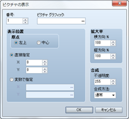
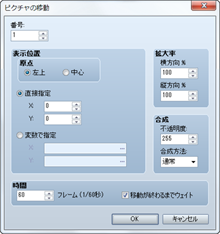
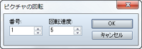
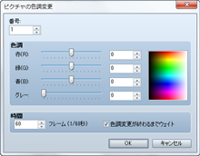
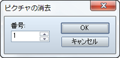
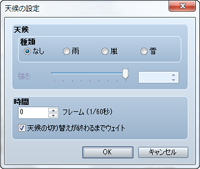

# ピクチャと天候

## ピクチャの表示
 

### ●機能

ピクチャ（静止画像）を画面に表示します。

### ●設定項目

### 番号

ピクチャにひも付ける管理番号（1～100）を指定します。

### ピクチャグラフィック

表示するピクチャのファイルを指定します。

### 表示位置

ピクチャを表示する位置を指定します。まず［原点］で基準となる位置を画面の［左上］か［中心］のどちらかを選びます。そのうえで原点を（0，0）とする座標で位置を指定します。［直接指定］の場合は［X］に横方向、［Y］に縦方向の座標（-9999～9999）を入力します。変数の値で座標を指定する場合は［変数で指定］を選択し、［X］［Y］に参照する変数を指定します。

### 拡大率

ピクチャの［横方向］［縦方向］の拡大率（元画像のサイズは100％として0～2000％）をそれぞれ指定します。

### 合成

［不透明度］でピクチャの不透明度（0～225）を指定します。数値が小さいほど画像が透過します（0の場合は表示されません）。［合成方法］ではピクチャを透過表示するときの色の合成の仕方を指定します。［通常］を標準とし、［加算］では色合いが白っぽくなり、［減算］では黒っぽくなります。

### ●備考

・ピクチャは同時に100点まで表示可能です。ピクチャの管理番号が大きいほど優先して表示されます。

・管理番号が重複した場合、最後に表示させたピクチャのみが表示されます（以前のピクチャは消去されます）。

## ピクチャの移動
 

### ●機能

表示中のピクチャを移動します。

### ●設定項目

### 番号

対象ピクチャの管理番号（1～100）を指定します。

### 表示位置

移動後のピクチャの位置を指定します。まず［原点］で基準となる位置を画面の［左上］［中心］のどちらかで指定します。次に原点を（0，0）とする座標で位置を指定します。特定の座標を指定する場合は［直接指定］を選び、［X］に左右方向、［Y］に上下方向の座標（-9999～9999）を入力します。変数の値で指定する場合は［変数で指定］を選択し、［X］［Y］に参照する変数を指定します。

### 拡大率

移動後のピクチャの［横方向］［縦方向］の表示倍率（0～2000％）を指定します。

### 合成

［不透明度］で移動後のピクチャの不透明度（0～225）を指定します。数値が小さいほど画像が透過します（0の場合は表示されません）。［合成方法］ではピクチャを透過表示するときの色の合成の仕方を指定します。［通常］を標準とし、［加算］では色合いが白っぽくなり、［減算］では黒っぽくなります。

### 時間

移動にかける時間をフレーム数（1～600）で指定します。1フレームは60分の1秒に相当します。

### 移動が終わるまでウェイト

有効にすると、このイベントコマンドの処理が終わるまで処理の進行を停止します。

## ピクチャの回転
 

### ●機能

表示されているピクチャを回転させます。

### ●設定項目

### 番号

対象ピクチャの管理番号（1～100）を指定します。

### 回転速度

回転速度（-90～90）を指定します。正の値では反時計回り、負の値では時計回りになります。回転を止めるには0を指定します。

### ●備考

・回転軸（中心点）は、対象のピクチャを最後に表示／移動するときに指定した原点（左上／中心）に準じます。

・このイベントコマンドを多用すると、ゲームの処理が遅くなる場合があります。

## ピクチャの色調変更
 

### ●機能

表示されているピクチャの色調を変更します。

### ●設定項目

### 番号

処理対象のピクチャの管理番号（1～100）を指定します。

### 色調

［赤］［緑］［青］の各色に加算する成分（-255～255）を指定します。［グレー］にはグレースケールフィルターの強さ（0～255）を指定します。値を大きいほど全体的に加算する色が強調されます。色調の変化は右側のプレビュー領域で確認できます。

### 時間

変更にかける時間をフレーム数（1～600）で指定します。1フレームは60分の1秒に相当します。

### 色調変更が終わるまでウェイト

有効にすると、このイベントコマンドの処理が終わるまで処理の進行を停止します。

### ●備考

・変更した色調は、再度このイベントコマンドで変更するまで有効です。

## ピクチャの消去
 

### ●機能

表示されているピクチャを消去します。

### ●設定項目

### 番号

消去するピクチャの管理番号（1～100）を指定します。

## 天候の設定
 

### ●機能

天候（雨／嵐／雪）を表現するエフェクト画像の表示を制御します。

### ●設定項目

### 種類

表示する画像の種類を指定します。画像の表示を止めるには［なし］を指定します。

### 強さ

画像の表示量（1～9）を指定します。

### 時間

処理の変更にかける時間をフレーム数（1～600）で指定します。1フレームは60分の1秒に相当します。

### 天候の切り替えが終わるまでウェイト

有効にすると、このイベントコマンドの処理が終わるまで処理の進行を停止します。

### ●備考

・バトルイベントでは使用できません。

######
