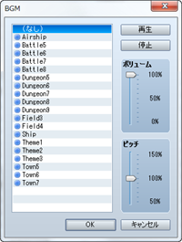
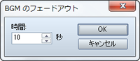
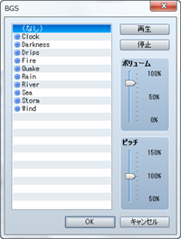
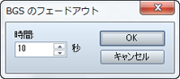
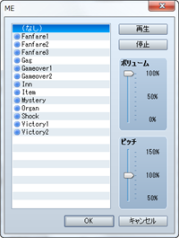
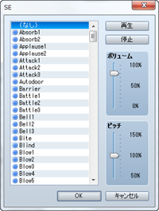

# 音楽と効果音

## BGMの演奏
 

### ●機能

BGM（背景音楽）の再生を開始します。

### ●設定項目

### ファイルリスト

再生するBGMのファイルを指定します。再生を停止するには［（なし）］を指定します。

### ボリューム

音量を指定します。

### ピッチ

ピッチ（50～150％）を指定します。100％より高くすると再生速度が速くなり、音階も高くなります。

### 再生／停止

［再生］をクリックすると現在の設定にもとづいてBGMを再生します。終了するには［停止］をクリックします。

### ●備考

・指定したBGMがすでに再生されている場合、このイベントコマンドの処理は行なわれません。

## BGMのフェードアウト
 

### ●機能

BGMの音量を下げながら再生を停止します。

### ●設定項目

### 時間

フェードアウトにかける秒数（1～60）を指定します。

## BGMの保存

### ●機能

再生中のBGMを、演奏時間の位置も含めて保存します。設定項目はありません。

## BGMの再開

### ●機能

［BGMの保存］で保存した状態からBGMの再生を開始します。設定項目はありません。

## BGSの演奏
 

### ●機能

BGS（背景音）の再生を開始します。

### ●設定項目

### ファイルリスト

再生するBGMのファイルを指定します。再生を停止するには［（なし）］を指定します。

### ボリューム

音量を指定します。

### ピッチ

ピッチ（50～150％）を指定します。100％より高くすると再生速度が速くなり、音階も高くなります。

### 再生／停止

［再生］をクリックすると現在の設定にもとづいてBGSを再生します。終了するには［停止］をクリックします。

### ●備考

・指定のBGSがすでに再生されている場合、このイベントコマンドの処理は行なわれません。

## BGSのフェードアウト
 

### ●機能

BGSの音量を下げながら再生を停止します。

### ●設定項目

### 時間

フェードアウトにかける秒数（1～60）を指定します。

## MEの演奏
 

### ●機能

ME（効果音楽）の再生を開始します。

### ●設定項目

### ファイルリスト

再生するMEのファイルを指定します。再生を停止するには［（なし）］を指定します。

### ボリューム

音量を指定します。

### ピッチ

音律（50～150％）を指定します。100％を標準とし、高くするとテンポが速くなり音階も上がります。

### 再生／停止

［再生］をクリックすると現在の設定にもとづいてMEを再生します。終了するには［停止］をクリックします。

### ●備考

・指定のMEがすでに再生されている場合、このイベントコマンドの処理は行なわれません。

## SEの演奏
 

### ●機能

SE（効果音）の再生を開始します。

### ●設定項目

### ファイルリスト

再生するSEのファイルを指定します。

### ボリューム

音量を指定します。

### ピッチ

音律（50～150％）を指定します。100％を標準とし、高くするとテンポが速くなり音階も上がります。

### 再生／停止

［再生］をクリックすると現在の設定にもとづいてSEを再生します。終了するには［停止］をクリックします。

### ●備考

・SEの再生が終了する前にこのイベントコマンドが実行されると、SEは重ねて再生されます。

・［（なし）］を再生してもSEは停止しません。SEを停止するには、［SEの停止］のイベントコマンドを使用してください。

## SEの停止

### ●機能

すべてのSE（効果音）の再生を停止します。設定項目はありません。

######
