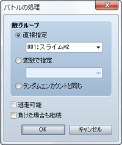
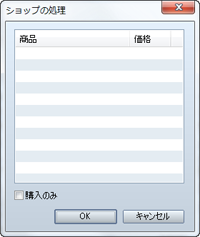
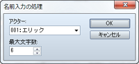

# シーン制御

## バトルの処理
 

### ●機能

敵グループを出現させて戦闘を行ないます。

### ●設定項目

### 敵グループ

対戦する敵グループを指定します。特定の敵グループと対戦させる場合は［直接指定］を選び、敵グループを指定します。敵グループのIDで指定するには［変数で指定］を選び、参照する変数を指定します。［ランダムエンカウントと同じ］を選ぶと、パーティがいるマップの［エンカウント］の設定にもとづいて選ばれた敵グループが出現します。

### 逃走可能

有効にすると戦闘中に［逃げる］のコマンドを有効にし、［勝った場合］［逃げた場合］のふたつに処理を分岐できます。

### 負けた場合も継続

有効にすると、パーティが全滅してもゲームオーバーにせず、［勝った場合］［負けた場合］のふたつに処理を分岐できます。

### ●備考

・バトルイベントでは使用できません。

## ショップの処理
 

### ●機能

武器や防具、アイテムの売買を行なうショップの処理を開始します。

### ●設定項目

### 商品リスト

販売するものを指定します。リストの空欄をダブルクリックすると表示されるウィンドウで［商品］と［価格］を指定します。価格は［標準］にするとデータに設定された価格、［指定］でこのイベントコマンドのみに適用する価格を指定します。

### 購入のみ

有効にすると、所持品の売却ができないようにします。

### ●備考

・バトルイベントでは使用できません。

## 名前入力の処理
 

### ●機能

アクターの名前の入力画面を表示し、プレイヤーが入力したものに変更します。

### ●設定項目

### アクター

名前の変更対象のアクターを指定します。

### 最大文字数

入力を受け付ける最大の文字数（1～16）を指定します。

### ●備考

・バトルイベントでは使用できません。

・プレイ中の名前入力時は、方向ボタンでカーソルを移動し、決定ボタンで文字の追加、取り消しボタンで名前の最後尾の文字を削除できます。

## メニュー画面を開く

### ●機能

メニュー画面を呼び出します。設定項目はありません。

### ●備考

・バトルイベントでは使用できません。

## セーブ画面を開く

### ●機能

セーブ画面を呼び出します。設定項目はありません。

### ●備考

・バトルイベントでは使用できません。

## ゲームオーバー

### ●機能

ゲームを強制終了し、ゲームオーバーの画面を表示します。設定項目はありません。

## タイトル画面に戻す

### ●機能

ゲームを強制終了し、タイトル画面に戻ります。設定項目はありません。

######
