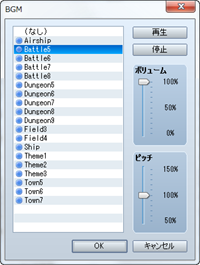
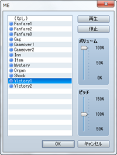
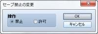
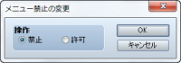
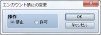
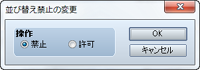
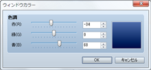
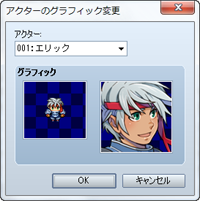
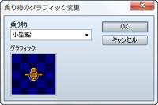

# システム

## 戦闘BGMの変更
 

### ●機能

戦闘中に再生するBGMの設定を変更します。変更後の設定は、再度このイベントコマンドで変更するまで有効です。

### ●設定項目

### ファイルリスト

使用するBGMのファイルを指定します。再生しない場合は［（なし）］を指定します。

### ボリューム

音量を指定します。

### ピッチ

音律（50～150％）を指定します。100％を標準とし、高くするとテンポが速くなり音階も上がります。

### 再生／停止

［再生］をクリックすると現在の設定にもとづいてBGMを再生します。終了するには［停止］をクリックします。

### ●備考

・戦闘中に変更した場合、次の戦闘から反映されます。

## 戦闘終了MEの変更
 

### ●機能

戦闘終了時に再生するMEの設定を変更します。変更後の設定は、再度このイベントコマンドで変更するまで有効です。

### ●設定項目

### ファイルリスト

使用するMEのファイルを指定します。再生しない場合は［（なし）］を指定します。

### ボリューム

音量を指定します。

### ピッチ

音律（50～150％）を指定します。100％を標準とし、高くするとテンポが速くなり音階も上がります。

### 再生／停止

［再生］をクリックすると現在の設定にもとづいてMEを再生します。終了するには［停止］をクリックします。

## セーブ禁止の変更
 

### ●機能

プレイヤーによるセーブ操作の可否を制御します。変更後の設定は、再度このイベントコマンドで変更するまで有効です。

### ●設定項目

### 操作

セーブ操作を不可とするには［禁止］、可能にするには［許可］を指定します。

## メニュー禁止の変更
 

### ●機能

プレイヤーによるメニュー画面の呼び出し操作の可否を制御します。変更後の設定は、再度このイベントコマンドで変更するまで有効です。

### ●設定項目

### 操作

メニュー画面の呼び出しを不可とするには［禁止］、可能にするには［許可］を指定します。

## エンカウント禁止の変更
 

### ●機能

パーティ移動中のエンカウント（ランダムで敵グループとの戦闘を発生させる処理）の有無を制御します。変更後の設定は、再度このイベントコマンドで変更するまで有効です。

### ●設定項目

### 操作

エンカウントの発生を止めるには［禁止］、発生させるには［許可］を指定します。

## 並び替え禁止の変更
 

### ●機能

プレイヤーによるパーティメンバーの並び替え操作の可否を制御します。変更後の設定は、再度このイベントコマンドで変更するまで有効です。

### ●設定項目

### 操作

並び替え操作を不可とするには［禁止］、可能にするには［許可］を指定します。

## ウィンドウカラーの変更
 

### ●機能

ウィンドウカラーの設定を変更します。変更後の設定は、再度このイベントコマンドで変更するまで有効です。

### ●設定項目

### 色調

変更後の色を［赤］［緑］［青］の成分比（0～255）をもとに指定します。指定中の色は右側のプレビュー領域で確認できます。

## アクターのグラフィック変更
 

### ●機能

アクターのグラフィックを変更します。変更後の設定は、再度このイベントコマンドで変更するまで有効です。

### ●設定項目

### アクター

対象のアクターを指定します。

### グラフィック

変更後の歩行グラフィック（左側）と顔グラフィック（右側）を、ダブルクリックすると開くウィンドウでそれぞれ指定します。［（なし）］を指定するとグラフィックが非表示になります。

## 乗り物のグラフィック変更
 

### ●機能

乗り物のグラフィックを変更します。変更後の設定は、再度このイベントコマンドで変更するまで有効です。

### ●設定項目

### 乗り物

対象の乗り物を指定します。

### グラフィック

変更後のグラフィックを、ダブルクリックすると開くウィンドウで指定します。［（なし）］を指定するとグラフィックが非表示になります。

######
