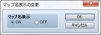
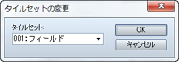
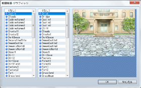
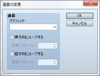
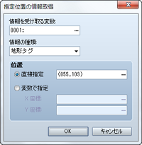

# マップ

## マップ名表示の変更
 

### ●機能

異なるマップに移動したときにマップ名を表示するかどうかを制御します。

### ●設定項目

### マップ名表示

表示するには［ON］、表示しない場合は［OFF］を指定します。

## タイルセットの変更
 

### ●機能

マップのタイルセットの設定を変更します。変更対象はイベントを配置したマップに限られます。

### ●設定項目

### タイルセット

変更後のタイルセットを指定します。

## 戦闘背景の変更
 

### ●機能

マップの戦闘背景の設定を変更します。変更対象はイベントを配置したマップに限られます。

### ●設定項目

### ファイルリスト

変更後の背景（左側）と床面（右側）のグラフィックをそれぞれ指定します。指定中のグラフィックは右側のプレビュー領域で確認できます。

### ●備考

・バトルイベント中に実行した場合、次回の戦闘から背景が変更されます。

## 遠景の変更
 

### ●機能

マップの遠景の設定を変更します。変更対象はイベントを配置したマップに限られます。

### ●設定項目

### グラフィック

変更後のグラフィックを指定します。

### 横方向にループする

有効にすると、グラフィックを横方向に循環表示します。自動で表示をスクロールさせるには［自動スクロール］で速さ（-32～32／0で停止）を指定します。

### 縦方向にループする

有効にすると、グラフィックを縦方向に循環表示します。自動で表示をスクロールさせるには［自動スクロール］で速さ（-32～32／0で停止）を指定します。

## 指定位置の情報取得
 

### ●機能

マップの特定の位置に関する値を参照し、変数に代入します。参照できるのはイベントを配置したマップに限られます。

### ●設定項目

### 情報を受け取る変数

取得した値を代入する変数を指定します。

### 情報の種類

取得する情報の種類を指定します。

### 位置

取得対象の位置を指定します。特定の位置を指定するには［直接指定］を選び、［…］をクリックすると開くウィンドウで位置を指定します。座標で指定するには［変数で指定］を選び、［X座標］［Y座標］に参照する変数を指定します。

######
