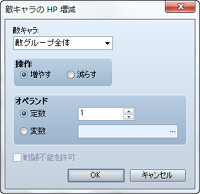
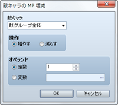
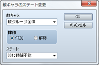
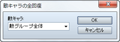
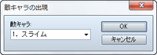
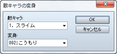
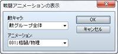
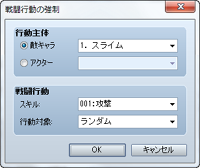

# バトル

## 敵キャラのHP増減
 

### ●機能

敵キャラのHPを増減します。

### ●設定項目

### 敵キャラ

対象の敵キャラを指定します。［敵グループ全体］とすると、すべての敵キャラが対象になります。

### 操作

［増やす］［減らす］のどちらかを指定します。

### オペランド

HPの増減量を指定します。一定の値を指定する場合は［定数］を選んで値を入力します。変数の値で指定する場合は［変数］を選んで参照する変数を指定します。

### 戦闘不能を許可

有効にすると、HPが0以下になったとき戦闘不能とします。無効の場合はHPが0以下になっても1にします。

### ●備考

・バトルイベントのみで動作します。

## 敵キャラのMP増減
 

### ●機能

敵キャラのMPを増減します。

### ●設定項目

### 敵キャラ

対象の敵キャラを指定します。［敵グループ全体］にすると、戦闘中のすべての敵キャラが対象になります。

### 操作

［増やす］［減らす］のどちらかを指定します。

### オペランド

MPの増減量を指定します。一定の値を指定する場合は［定数］を選んで値を入力します。変数の値で指定する場合は［変数］を選んで参照する変数を指定します。

### ●備考

・バトルイベントのみで動作します。

## 敵キャラのステート変更
 

### ●機能

敵キャラのステートを変更します。

### ●設定項目

### 敵キャラ

対象の敵キャラを指定します。［敵グループ全体］にすると、戦闘中のすべての敵キャラが対象になります。

### 操作

［不可］［解除］のどちらかを指定します。

### ステート

不可／解除するステートの種類を指定します。

### ●備考

・バトルイベントのみで動作します。

## 敵キャラの全回復
 

### ●機能

敵キャラのHPとMPを最大値まで回復し、すべてのステートを解除します。

### ●設定項目

### 敵キャラ

対象の敵キャラを指定します。［敵グループ全体］にすると、戦闘中のすべての敵キャラが対象になります。

### ●備考

・バトルイベントのみで動作します。

## 敵キャラの出現
 

### ●機能

敵グループのデータで［途中から出現］のオプションが設定されている敵キャラを出現させます。

### ●設定項目

### 敵キャラ

対象の敵キャラを指定します。

### ●備考

・バトルイベントのみで動作します。

## 敵キャラの変身
 

### ●機能

出現中の敵キャラを、別の敵キャラに変身させます。変身した敵キャラのHPとMPは、変身前の敵キャラの値を引き継ぎます。

### ●設定項目

### 敵キャラ

変身させる敵キャラを指定します。

### 変身

変身後の敵キャラを指定します。

### ●備考

・バトルイベントのみで動作します。

## 戦闘アニメーションの表示
 

### ●機能

敵キャラを対象として、アニメーションを表示します。

### ●設定項目

### 敵キャラ

対象の敵キャラを指定します。

### アニメーション

表示するアニメーションを指定します。

### ●備考

・バトルイベントのみで動作します。

## 戦闘行動の強制
 

### ●機能

敵キャラ／アクターに特定のスキルを強制実行させます。

### ●設定項目

### 行動主体

対象の敵キャラ／アクターを指定します。

### 戦闘行動

［スキル］で強制実行するスキルを指定します。、［行動対象］でスキルの標的を［ラストターゲット］（直前の行動者の標的と同じ）、［ランダム］（不作為に選定）、［Index X］（Xは1～8／詳細は備考参照）から指定します。

### ●備考

・バトルイベントのみで動作します。

・指定の行動が実行されるタイミングは、そのキャラクターの行動順序が回ってきたときです。そのターンでの戦闘行動はキャンセルされます。

・このイベントコマンドの実行時点で指定のキャラクターが同一ターンでの戦闘行動を終えている場合、処理は行なわれません。

・指定したスキルの効果範囲が敵キャラ／アクター全体か使用者の場合は、その設定に準じたものになり、［行動対象］の設定は反映されません。

・［行動対象］の［Index X］（Xは1～8）で指定される対象は、［行動主体］が敵キャラの場合はパーティの並び順（Xが1の場合は一人目）に相当するアクターに、［行動主体］がアクターの場合は敵キャラの設定順（Xが1の場合は1番目）に相当する敵キャラになります。

## バトルの中断

### ●機能

戦闘を強制終了してマップに戻ります。設定項目はありません。

### ●備考

・バトルイベントのみで動作します。

######
