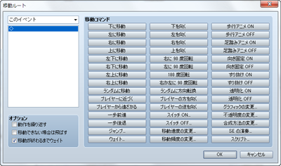

# 移動ルートの設定

## 移動ルートとは

移動ルートとは、プレイヤーやイベントをどのように移動させるかを決めるものです。イベントの［自律移動］の設定で［カスタム］を指定した場合、および［移動ルートの設定］のイベントコマンドを使用する場合に設定します。

どちらも設定は［移動ルート］ウィンドウで行ないます。ルートは、プレイヤーなどの移動や向きなどを制御する“移動コマンド”を組み合わせることで編集できる仕組みです。例えば［右に移動］［下に移動］［左に移動］［上に移動］の移動コマンドを順に登録すれば、プレイヤーなどを現在位置から右回りに一周させられます。

## 設定項目の内容
 

### ●対象キャラクター

設定対象のアクター／イベントを指定します。［移動ルートの設定］のイベントコマンドの設定時のみ指定します。

### ●コマンドリスト

登録した移動コマンドのリストです。ここに設定するルートに合わせ、実行順に移動コマンドを登録します。

リスト上の項目をクリックで選択すると、そこが移動コマンドの一覧でクリックしたものを追加する位置になります。項目を右クリックするとコンテキストメニューが表示され、設定の再編集やコピーなどの操作が行なえます。

### ●移動コマンド

キャラクター（プレイヤー／イベント）の移動や向きを制御する命令群です。ボタンをクリックすると、コマンドリスト上で選択中の位置に追加（挿入）されます。各コマンドの働きは以下のとおりです。なお、1歩の移動距離はタイルひとつぶんです。

### 下に移動／左に移動／右に移動／上に移動／左下に移動／右下に移動／左上に移動／右上に移動

コマンド名の方向に1歩移動します。

### ランダムに移動

上下左右のうち、ランダムで選ばれた方向に1歩移動します。

### プレイヤーに近づく

プレイヤーに近づく方向に1歩移動します。

### プレイヤーから遠ざかる

プレイヤーから遠ざかる方向に1歩移動します。

### 一歩前進

現在の向きの方向に1歩移動します。

### 一歩後退

現在の向きを変えず、反対方向に1歩移動します。

### ジャンプ

ジャンプで移動します。ジャンプさせる距離を［X座標］［Y座標］（それぞれ-100～100、正の値は右／下方向）にそれぞれ指定します。ジャンプ中は障害物をすり抜けます。なお、隊列歩行表示をONにしたパーティをジャンプで移動させた場合、2番目以降のメンバーはその場に留まります。

### ウェイト

処理を停止する時間をフレーム数（1～999）で指定します。1フレームは60分の1秒に相当します。

### 下を向く／左を向く／右を向く／上を向く

コマンド名の方向に向きを変えます。

### 右に90度回転／左に90度回転

コマンド名の方向に90度向きを変えます。

### 180度回転

現在と真逆の方向に向きを変えます。

### 右か左に90度回転

ランダムで向きを90度変えます。

### ランダムに方向転換

ランダムで上下左右に向きを変えます。

### プレイヤーの方を向く

プレイヤーのいる方向に向きを変えます。

### プレイヤーの逆を向く

プレイヤーがいる方向とは逆方向に向きを変えます。

### スイッチON／スイッチOFF

指定したスイッチをコマンド名の値に変えます。

### 移動速度の変更

対象のマップイベントの［自律移動］の［速度］の設定を変更します。この変更は移動終了後も継続します。

### 移動頻度の変更

対象のマップイベントの［自律移動］の［頻度］の設定値を変更します。この変更は移動終了後も継続します。

### 歩行アニメON／歩行アニメOFF

対象のマップイベントの［オプション］の［歩行アニメ］の設定値を変更します。この変更は移動終了後も継続します。

### 足踏みアニメON／足踏みアニメOFF

対象のマップイベントの［オプション］の［足踏みアニメ］の設定値を変更します。

### 向き固定ON／向き固定OFF

対象のマップイベントの［オプション］の［向き固定］の設定値を変更します。この変更は移動終了後も継続します。

### すり抜けON／すり抜けOFF

対象のマップイベントの［オプション］の［すり抜け］の設定値を変更します。この変更は移動終了後も継続します。

### 透明化ON／透明化OFF

キャラクターのグラフィックの表示／非表示を変更します。ONにすると表示されなくなります。この変更は移動終了後も継続します。

### グラフィックの変更

キャラクターのグラフィックを指定のものに変更します。この変更は移動終了後も継続します。

### 不透明度の変更

キャラクターのグラフィックの透明度（0～255）を変更します。0にすると見えなくなります。この変更は移動終了後も継続します。

### 合成方法の変更

キャラクターとマップのグラフィックの表示色の合成方法を変更します。［加算］にすると白っぽい色合いに、［減算］にすると黒っぽい色合いなります。この変更は移動終了後も継続します。

### SEの演奏

指定したSEを演奏します。

### スクリプト

入力したスクリプトを実行します。

### ●オプション

コマンドリストに登録した移動コマンド全体の処理方法です。必要に応じて適用するものを有効にします。

### 動作を繰り返す

有効にすると、コマンドリストの内容を繰り返し実行します。

### 移動できない場合は飛ばす

有効にすると、障害物などで移動コマンドによる移動ができない場合、その処理を飛ばします。

### 移動が終わるまでウェイト

有効にすると、移動コマンドの処理がすべて終了するまで、他の処理を一時停止します。［移動ルートの設定］のイベントコマンドの設定時のみ指定できます。

######
