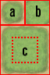
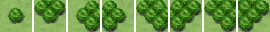
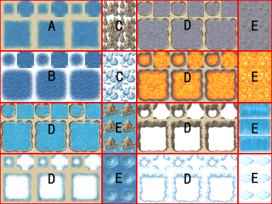
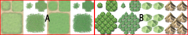
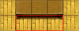
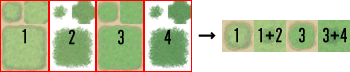
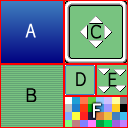

# 素材規格

- [グラフィック素材](#graphics)
- [タイルセット詳細](#tileset)
- [ウィンドウスキン詳細](#windowskin)
- [オーディオ素材](#audio)
- [ムービー素材](#movie)

VX Ace では、グラフィックやオーディオなどあらゆる素材にオリジナルの ファイルを使用することができます。

メインメニューの [ツール] から [素材管理] を選択すると、 各種素材のインポートやエクスポートをするためのダイアログボックスが 表示されます。ゲームフォルダに直接ファイルをコピーしても問題はありま せんが、素材管理ウィンドウには透明色設定などの機能もありますので、 慣れないうちはこちらを使用すると良いでしょう。

## グラフィック素材

PNG ファイルと JPG ファイルを使用することができます。 PNG ファイルは、 32 ビットカラー (アルファチャネル) に完全対応しています。

### キャラクター (Graphics/Characters)

マップ画面上で表示するキャラクターの画像を収めたファイルです。

1 キャラクターあたりのサイズは任意で、 4 方向 (下、左、右、上) × 3 パターンの計 12 パターンを規定の順序で並べます。1 点のファイルには、この 1 キャラクターを、縦に 2 体、横に 4 体の計 8 体分並べて収めてください。 1 キャラクターのサイズは、この 1 ファイルの、幅の 1/12、高さの 1/8 から算出されます。

なお、VX Ace では、建物との重なりをより自然に見せるために、キャラクターがタイルから上に 4 ドット分ずれて表示される仕様となっています。

- ファイル名の頭に "!" をつけることで、 4 ドットずれる仕様が適用されなくなり、茂み属性による半透明処理の影響も受けなくなります。主にドアや宝箱といったマップのオブジェクトタイプのキャラクターに使用します。特殊文字 "$" との併用が可能です。
- ファイル名の頭に "$" をつけることで、 1 キャラクター＝ 1 ファイルとして扱うことができるようになります。この場合、 1 キャラクターのサイズは、1 ファイルの幅の 1/3、 高さの 1/4 がキャラクターのサイズとして扱われます。特殊文字 "!" との併用が可能です。

### 顔グラフィック (Graphics/Faces)

主にメニューやメッセージウィンドウで表示する顔グラフィックの画像を収めたファイルです。

顔グラフィック 1 枚あたり 96×96 の画像を、横に 4 枚、縦に 2 枚の計 8 枚分並べたものを 1 ファイルとします。

### 戦闘グラフィック (Graphics/Battlers)

バトル画面上で表示する敵キャラの画像を収めたファイルです。

サイズは任意ですが、基本的には 544×296 のバトル画面に収まるサイズにする必要があります。

### アニメーション (Graphics/Animations)

主にバトル画面でエフェクトとして表示するアニメーション用の画像を収めたファイルです。

セル 1 枚あたり 192×192 の画像を横方向に 5 枚並べたものを 1 ブロックとし、そのブロックを必要なだけ縦に長くしたものを 1 ファイルとします。 1 ファイルには、最大で 20 ブロック (100 セルぶん) まで収められますが、読み込み速度などの関係上、あまり大きな画像は望ましくありません。

### タイルセット (Graphics/Tilesets)

マップを構成するタイルを収めたファイルです。

[タイルセット詳細](#tileset)を参照してください。

### 戦闘背景 (Graphics/Battlebacks1, Graphics/Battlebacks2)

バトル画面の背景として使用する画像を収めたファイルです。

Battlebacks1 には主に床の絵、Battlebacks2 には主に壁の絵を描き、それを任意に組み合わせて戦闘背景とします。

サイズは、画面より一回り大きい 580×444 です。

### 遠景 (Graphics/Parallaxes)

マップの奥に表示する画像 (遠景) を収めたファイルです。

サイズの制限は特にありません。ループさせたい場合は、Web サイトなどに使う壁紙の要領で上下左右がつながるように作成します。

### タイトル (Graphics/Titles1, Graphics/Titles2)

タイトル画面で表示する画像を収めたファイルです。

Titles1 にはメインの背景、Titles2 には枠などを描き、それを任意に組み合わせてタイトル画面とします。

サイズは 544×416 です。

### フキダシアイコン (Graphics/System/Balloon.png)

イベントコマンド [フキダシアイコンの表示] の実行時に表示されるアイコンを収めたファイルです。

サイズは 256×320 となります。この中に、1 パターンあたりのサイズを 32×32 とした、8 パターンのアニメーション × 10 種類のフキダシアイコンを並べてください。

### アイコン (Graphics/System/IconSet.png)

スキルやアイテムの名前の横に表示するアイコン画像を収めたファイルです。

アイコン 1 個あたり 24×24 の画像を、横方向に 16 個、縦方向に必要なだけ並べます。

なお、能力強化および弱体の状態を示すのに使うアイコン番号は 64～95 で固定となっています。

### 戦闘開始時効果 (Graphics/System/BattleStart.png)

戦闘開始時に表示するエフェクトの画像を収めたファイルです。

サイズは 544×416 で、グレースケール 256 色の PNG ファイルでなければなりません。パレット番号の小さいほうから大きいほうに向かって画面が書き換わります。

### 飛行船の影 (Graphics/System/Shadow.png)

飛行船に乗っているときに表示される影の部分の画像を収めたファイルです。

サイズは任意です。

### ゲームオーバー (Graphics/System/Gameover.png)

ゲームオーバー画面で表示する画像を収めたファイルです。

サイズは 544×416 です。

### ウィンドウスキン (Graphics/System/Window.png)

ウィンドウを構成する画像などを収めたファイルです。

[ウィンドウスキン詳細](#windowskin)を参照してください。

### ピクチャ (Graphics/Pictures)

ゲーム中にイベントを使って表示するための画像を収めたファイルです。

サイズは任意です。

## タイルセット詳細

タイル 1 個あたりは 32×32 で、これらを以下の規則に従って A ～ E の 5 種類のセットにまとめる必要があります。

なお、データベース［タイルセット］の［モード］に設定した内容によって、仕様が変化するものがあります。［モード］を［VX 互換タイプ］にした場合の仕様については、『RPGツクールVX』の素材規格をご参照ください。

### セット A

マップ描画の際に、下層扱いとなるセットです。このセットはさらに細かく 5 つのパーツにわかれており、ほとんどのパーツは "オートタイル" と呼ばれる、境界線が自動的に作成される特殊なタイルによって構成されています。

オートタイルは、原則として下図のような並びの 6 個のパターンが基本構造となります。 

### a

代表パターン (タイルパレット表示用)

### b

四隅に境界を持つパターン

### c

集合パターン ( 8 方向の境界と中央でひとまとまりの対象を表す)
 

オートタイルの画像で、右下から ( 4 , 4 ) の位置が透明だった場合、そのオートタイルは“森タイプ”と判定されます。森タイプのオートタイルに茂み属性がつけられた場合、右下隅と左下隅の境界線を含む以下の 8 種類のタイル上では歩行グラフィックが半透明になりません。

### パーツ 1

 

サイズは 512×384 です。上図のように 5 パターンのブロックを組みあわせて構成します。基本的に、このパーツにあるタイル同士は、隣接しても境界線が作成されません。

小型船・大型船での通行が可能なのは、このパーツのタイルのみです。ただし、歩行できるようにタイルセットで通行設定された場合は、小型船・大型船で進入できなくなります。

### ブロック A

海タイルとして使われるオートタイルです。オートタイル基本構造のパターンを 3 つ横に並べて配置することで、アニメーションさせることができます。

### ブロック B

深海タイルとして使われるオートタイルです。このブロックのタイルのみ、パーツ 1 のタイルと隣接したときに海タイルの境界線が作成されます。また、このブロックの透明色部分には、ブロック A のタイルが自動的に補完されます。ブロック A と同じく、オートタイル基本構造のパターンを 3 つ横に並べて配置することでアニメーションさせることが可能です。

なお、このブロックのタイルは、小型船での通行ができません。

### ブロック C

ブロック A の海タイルを装飾するオートタイルです。このブロックの透明色部分には、ブロック A のタイルが自動的に補完されます。

なお、このブロックのタイルは、小型船・大型船での通行ができません。

### ブロック D

水タイルとして使われるオートタイルです。オートタイル基本構造のパターンを 3 つ横に並べて配置することでアニメーションさせることができます。

### ブロック E

滝タイルとして使われます。横方向に 2 個のタイルで集合パターンを形成し、3 つ縦に並べて配置することでアニメーションさせることができます。

なお、このブロックのタイルは、小型船・大型船での通行ができません。

### パーツ 2

 

サイズは 512×384 です。上図のように 2 パターンのブロックを組みあわせたものを、縦に 4 つ並べて構成します。このパーツのみ、データベース［タイルセット］の［モード］に設定した内容によって、仕様が変化します。 

このパーツにカウンター属性がつけられた場合、テーブルを表現するオートタイルとして使われ、配置した際にパターン下端の 8 ドット分が下にずれて表示されます。

### ブロック A (フィールドタイプ)

 

4 パターンのオートタイルで構成され、実際のタイルセットでは、1 のみ、1 と 2 が重なったもの、3 のみ、3 と 4 が重なったものとして扱われます。

### ブロック B (フィールドタイプ)

4 つのパターンを収めることができ、実際のタイルセットではブロック A のタイルと重ねて配置できる[特殊仕様](2120_map_design.md#notice)のタイルとなります。

### ブロック A (エリアタイプ)

4 パターンのオートタイルで構成され、実際のタイルセットでは、左から 3 パターンは互いに境界線が競合し合わないもの、右端の 1 パターンが他のタイルとの境界線がつかないものとして扱われます。

### ブロック B (エリアタイプ)

4 つのパターンを収めることができ、実際のタイルセットではブロック A のタイルと重ねて配置できるタイルとなります。

### パーツ 3

主に建物の外観として使われるオートタイルです。サイズは 512×256 で、オートタイルの集合パターンのみで形成されたものを、横に 8 つ、縦に 4 つ並べて構成します。

このパーツのタイルは、マップ描画時に縦方向に 2 つ以上並べて配置することで、隣接する右側のタイルに影が自動生成されます。ただし、その隣接したタイルがパーツ 2 (ブロック C を除く) かパーツ 5 以外のものだった場合、影の自動生成は行なわれません。

### パーツ 4

主に壁として使われるオートタイルです。ダンジョン生成の壁にも使用されます。サイズは 512×480 です。オートタイル基本構造と、オートタイルの集合パターンのみを縦に並べたものを、横に 8 つ、縦に 3 つ並べて構成します。

このパーツのタイルは、マップ描画時に縦方向に 2 つ以上並べて配置することで、隣接する右側のタイルに影が自動生成されます。ただし、その隣接したタイルがパーツ 2 (ブロック C を除く) かパーツ 5 以外のものだった場合、影の自動生成は行なわれません。

### パーツ 5

サイズは 256×512 で、この中にタイルを 8×16 個並べてください。このファイルに収められているタイルは、すべて通常タイル扱いとなります。上から 3、5、7 行目のタイルはダンジョン生成の床にも使用されます。

### セット B ～セット E

マップ描画の際に、上層扱いとなるセットです。

それぞれサイズは 512×512 で、この中にタイルを 16×16 個並べてください。

- セット B の一番左上のタイルは、上層に何も置かれていない状態を表すため、必ず空白にしておきます。

## ウィンドウスキン詳細
 

ウィンドウスキンは、128×128 の画像です。通常、32 ビットの PNG ファイルを使用します。

### A

ウィンドウの背景 1 。 64×64 のパターンが、実際のウィンドウに合わせて拡大縮小して描画されます。厳密には、ウィンドウの周囲を 2 ドットずつ小さくしたサイズになります。これは角の丸いウィンドウを自然に見せるための仕様です。

### B

ウィンドウの背景 2 。 64×64 のパターンが、背景 1 の上に重なるようにタイリング状に描画されます。

### C

ウィンドウの枠および矢印。四隅の 16×16 はそのまま描画され、残りの枠 (辺の部分) はウィンドウに合わせて 16 ドットの太さでタイリング状に描画されます。矢印は、ウィンドウの内容をスクロールできる場合の目印として使用します。

### D

コマンドカーソル。ウィンドウ内で選択されている項目を表すために使用します。周囲の 2 ドットは縦横のみに拡大縮小され、残りはカーソルの大きさに合わせて平面的に拡大縮小して描画されます。

### E

ポーズサイン。メッセージウィンドウのボタン入力待ち状態を表すために使用します。 16×16 のパターン 4 種でアニメーションします。

### F

イベントコマンド [文章の表示] の制御文字で使用できる文字色です。 8×8 の画像を横方向に 8 枚 (色) 並べたものを縦方向に 4 個並べます。

## オーディオ素材

OGG、WMA、MP3、WAV、MID の 5 種類のファイルを使用することができ ます (MID 形式は BGM と ME のみ) 。原則として、全てのタイプの素材に ついて OGG ファイルの使用が推奨されます。

### BGM (Audio/BGM)

背景音楽 (BackGround Music) です。

### BGS (Audio/BGS)

背景音 (BackGround Sound) です。

### ME (Audio/ME)

効果音楽 (Music Effect) です。

### SE (Audio/SE)

効果音 (Sound Effect) です。

各ファイル形式の特徴は、以下の通りです。

| OGG | 音質、圧縮率ともに優れた音声圧縮形式である Ogg Vorbis のデータを含むファイルです。演奏時間が 3 秒以上のファイルは自動的に ストリーム再生されます。このとき、コメントとして LOOPSTART、LOOPLENGTH という値が埋め込まれていると、その数値に対応するサンプル位置をリピート の範囲として認識します。 |
| --- | --- |
| WMA | Windows Media Player で使用されている音声圧縮形式 です。DirectShow により演奏されます。 |
| MP3 | 普及率の高い音声圧縮形式です。DirectShow により演奏され ます。特徴は WMA と同じです。 |
| WAV | Windows 標準のサウンド形式です。通常の無圧縮 WAV の ほか、Microsoft ADPCM の読み込みもサポートしています。 |
| MID | DirectMusic Synthesizer で演奏される MIDI ファイル です。BGM の場合、MIDI データ中にコントロールチェンジの 111 番があると、 曲を最後まで演奏したあとのリピート位置の目印として認識します。 |

## ムービー素材

Movies フォルダに格納してください。使用できるのは、OGV (Ogg Theora形式) のファイルのみです。

ムービーはゲーム画面中央に重ねて表示されます。ムービーがゲーム画面 (544×416) を超える大きさの場合、画面に収まらない部分はカットされます。

######
