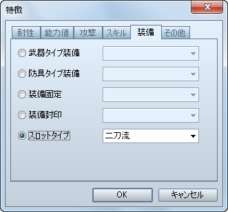
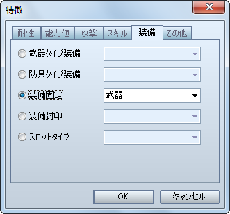
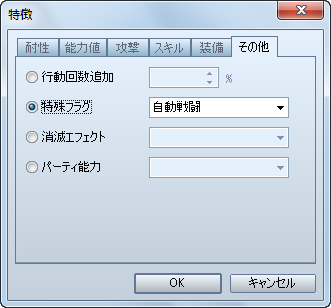
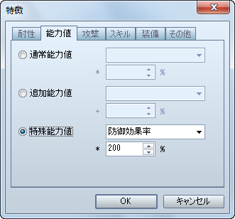
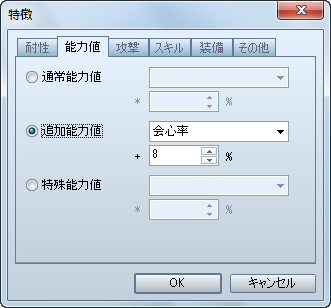

# アクター

- [［二刀流］の設定方法](#01)
- [［装備固定］の設定方法](#02)
- [［自動戦闘］の設定方法](#03)
- [［強力防御］の設定方法](#04)
- [［薬の知識］の設定方法](#05)
- [［クリティカル頻発］の設定方法](#06)

## ［二刀流］の設定方法

両方の手に武器を装備させたい場合の設定方法です。

［アクター / 職業］特徴 － 装備 － スロットタイプ － 二刀流

- これで、VX 同様の設定になります。

## ［装備固定］の設定方法

装備品の取り外しを出来なくしたい場合の設定方法です。

［アクター / 職業］特徴 － 装備 － 装備固定 － 武器 / 盾 / 頭 / 身体 / 装飾品

- VX Ace では装備部位ごとに設定出来ますので、VX と同じにしたい場合は、すべての部位に対して「装備固定」を設定してください。

## ［自動戦闘］の設定方法

戦闘中にプレイヤーがコマンド入力することが出来ず、独自に行動させたい場合の設定方法です。

［アクター / 職業］特徴 － その他 － 特殊フラグ － 自動戦闘

- これで、VX 同様の設定になります。

## ［強力防御］の設定方法

戦闘中の［防御］コマンド実行時に受けるダメージを減らしたい場合の設定方法です。

［アクター / 職業］特徴 － 能力値 － 特殊能力値 － 防御効果率

- VX 同様の設定にしたい場合は、**200%** に設定してください。

## ［薬の知識］の設定方法

使用した回復アイテムの効果を上げたい場合の設定方法です。

［アクター / 職業］特徴 － 能力値 － 特殊能力値 － 薬の知識

- VX 同様の設定にしたい場合は、**200%** に設定してください。

## ［クリティカル頻発］の設定方法

会心の一撃（VX では「クリティカルヒット」）の発生確率を上げたい場合の設定方法です。

［アクター / 職業］特徴 － 能力値 － 追加能力値 － 会心率

- VX 同様の設定にしたい場合は、**8%** に設定してください。
- VX Ace では、各職業にあらかじめ会心率 4%（モンクは 6%） が設定されていますので、それを計算に入れた場合の追加分は 4% となります。

---
