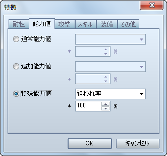
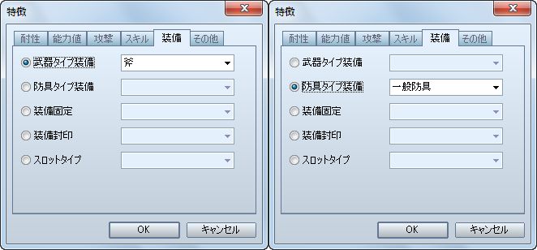
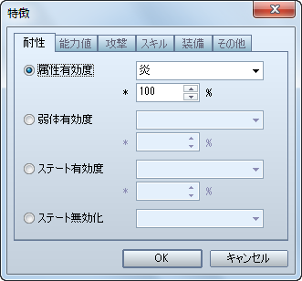
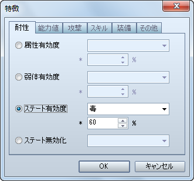
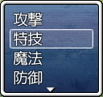
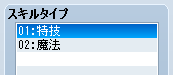
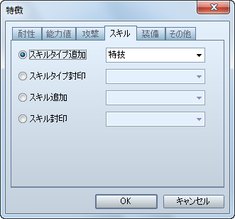

# 職業

- [［位置］の設定方法](#01)
- [装備出来る武器・防具の設定方法](#02)
- [［属性有効度］の設定方法](#03)
- [［ステート有効度］の設定方法](#04)
- [［コマンド名指定］の設定方法](#05)

## ［位置］の設定方法

戦闘において、敵からの狙われやすさに関係するパーティ内での位置関係ですが、VX Ace では廃止されています。その代わり、敵からの狙われやすさを設定することが出来ます。

［アクター / 職業］特徴 － 能力値 － 特殊能力値 － 狙われ率

- VX 同様にしたい場合は、以下の表を参考に［狙われ率］の数値を設定してください。

| VX での設定 | VX Ace での設定 |
| --- | --- |
| 前衛 | 100% |
| 中衛 | 75% |
| 後衛 | 50% |

## 装備出来る武器・防具の設定方法

VX Ace では、装備品一つ一つに装備出来るかどうかを設定するのではなく、「剣」や「盾」といったタイプ（種類）ごとに装備出来るかどうかを設定するように変更されました。

［職業］特徴 － 装備 － 武器タイプ装備 / 防具タイプ装備

- 設定した武器・防具タイプに属する装備品が装備可能になります。
- 複数設定すれば、複数の武器・防具タイプに属する装備品が装備出来るようになります。
- 事前に、装備品に任意の武器・ 防具タイプを設定しておく必要があります。
- 武器・防具タイプの追加は［用語］タブで行えます。

## ［属性有効度］の設定方法

属性を伴う攻撃がどれだけ有効かを設定する方法です。

［アクター / 職業］特徴 － 耐性 － 属性有効度

- VX 同様にしたい場合は、以下の表を参考に［属性有効度］の数値を設定してください。

| VX での設定 | VX Ace での設定 |
| --- | --- |
| A | 200% |
| B | 150% |
| C | 100% もしくは設定しない |
| D | 50% |
| E | 0% |
| F | 廃止 |

- ［属性有効度］には 0% 以上の数値を設定しなければなりませんので、VX の［F（-100%）］のような設定は出来ません。

## ［ステート有効度］の設定方法

ステートの付加がどれだけ成功するかを設定する方法です。

［アクター / 職業］特徴 － 耐性 － ステート有効度

- VX 同様にしたい場合は、以下の表を参考に［属性有効度］の数値を設定してください。

| VX での設定 | VX Ace での設定 |
| --- | --- |
| A | 100% |
| B | 80% |
| C | 60% |
| D | 40% |
| E | 20% |
| F | 0% |

## ［コマンド名指定］の設定方法

VX Ace では、スキルを使用する戦闘コマンドが VX のように［スキル］ではなく、「特技」や「魔法」といった［スキルタイプ］ごとに分かれて表示されます。また、メニュー画面でも［スキル］コマンドを選んだ後で、［スキルタイプ］を選択するようになっています。

ですので、スキルを使用するコマンドをオリジナルの名称にしたい場合は、オリジナルの［スキルタイプ］を作成してください。

［用語］スキルタイプ

- それぞれのスキルに作成した［スキルタイプ］を設定するのを忘れないようにしてください。

また、アクターがスキルを覚えていても、そのままでは［スキルタイプ］がコマンドとして表示されませんので、表示させたい（使いたい）スキルタイプを特徴で設定してください。

［アクター / 職業］特徴 － スキル － スキルタイプ追加

- VX のようにコマンド名のみを変更することは出来ません。

---
