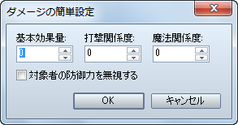
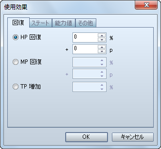
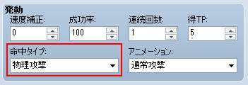
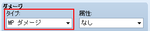
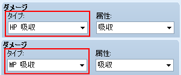
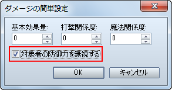
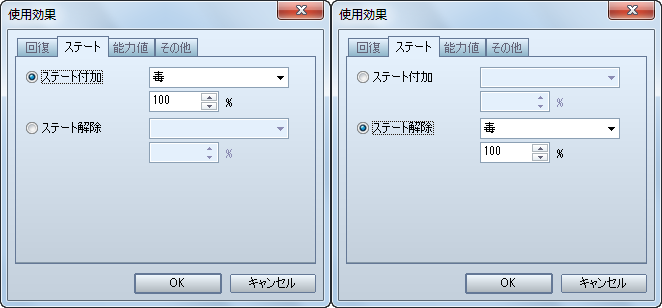
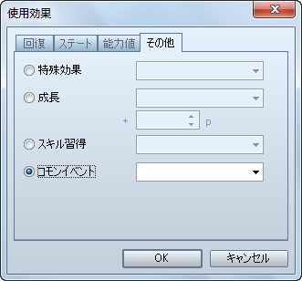
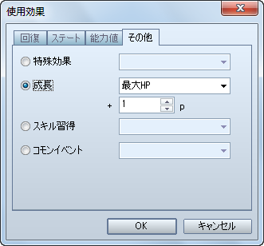
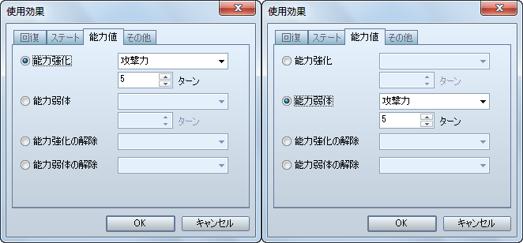

# スキル・アイテム

- [ダメージ計算式の設定方法](#01)
- [回復効果の設定方法](#02)
- [［物理攻撃］の設定方法](#03)
- [［MP にダメージ］の設定方法](#04)
- [［ダメージを吸収］の設定方法](#05)
- [［防御力無視］の設定方法](#06)
- [［ステート変化］の設定方法](#07)
- [［コモンイベント］の設定方法](#08)
- [［成長効果］の設定方法](#09)
- [「能力強化・弱体」関連スキル（アイテム）の作り方](#10)

## ダメージ計算式の設定方法

VX Ace では、一つ一つのスキル（アイテム）ごとにダメージ計算式を設定出来るようになり、様々なパラメーターを手軽に計算式に盛り込むことが出来るようになりました。ですが、［簡単設定］は設定項目が VX と同じ（「精神関係度」が「魔法関係度」に名称変更されています）ですので、これを使えば VX と同じ計算式を設定することが可能です。

なお、VX Ace では「魔法防御」という新たなパラメーターが加わっていますので、魔法（VX では精神）関連スキルの計算式が VX とは若干異なります。VXとまったく同じようにしたい場合は、次のようにしてください。

1. ［簡単設定］の［基本効果量］と［魔法関係度］に VX の時と同じ数値を設定して［OK］をクリックする
2. 表示された［計算式］にある「b.mdf」に掛けられている数値を半分にする
3. 表示された［計算式］にある「b.mdf」を「b.mat」に変更する

これで、VX とまったく同じ計算式になります。ただし、この計算式では「魔法防御」が一切関係なくなっていますので、関係させたい場合は手順 3 は行わず、手順 1 と 2 のみを行うと良いでしょう。

## 回復効果の設定方法

回復アイテムに設定する「回復効果」ですが、VX Ace ではスキルにも設定出来るようになりました。

［スキル / アイテム］使用効果 － 回復

- 回復量を「固定値 + 割合」以外で決定させたい場合は、ダメージのタイプを［HP 回復］もしくは［MP 回復］にした上でダメージ計算式を使用してください。

## ［物理攻撃］の設定方法

スキル（アイテム）の命中判定を通常攻撃と同じにしたい場合の設定方法です。

［スキル / アイテム］発動 － 命中タイプ － 物理攻撃

- これで、VX 同様の設定になります。

## ［ＭＰにダメージ］の設定方法

ダメージを与える対象を HP ではなく MP にしたい場合の設定方法です。

［スキル / アイテム］ダメージ － タイプ － MP ダメージ

- これで、VX 同様の設定になります。

## ［ダメージを吸収］の設定方法

ダメージを与えると同時に使用者が回復するようにしたい場合の設定方法です。

［スキル / アイテム］ダメージ － タイプ － HP 吸収 / MP 吸収

- これで、VX 同様の設定になります。

## ［防御力無視］の設定方法

対象者の防御力や魔法防御（VX では精神力）を無視してダメージを与えるスキル（アイテム）を作成する場合の設定方法です。

［スキル / アイテム］ダメージ － 簡単設定 － ［対象者の防御力を無視する］をチェック

- 計算式を直接編集する場合は、防御力（b.def）、魔法防御（b.mdf）に関する記述を削除してください。

| 攻撃方法 | 通常の計算式 | 防御力無視の計算式 |
| --- | --- | --- |
| 通常攻撃 | a.atk * 4 - b.def * 2 | a.atk * 4 |
| ファイア | 150 + a.mat * 2 - b.mdf * 2 | 150 + a.mat * 2 |

## ［ステート変化］の設定方法

対象者にステートを付加したり、対象者のステートを解除したりする場合の設定方法です。

［スキル / アイテム］使用効果 － ステート － ステート付加 / ステート解除

- VX 同様の設定にしたい場合は、いずれの場合も **100%** に設定してください。

## ［コモンイベント］の設定方法

スキル（アイテム）使用後にコモンイベントを呼び出す方法です。

［スキル / アイテム］使用効果 － その他 － コモンイベント

- これで、VX 同様の設定になります。

## ［成長効果］の設定方法

アクターの能力値を上昇させるスキル（アイテム）を作成したい場合の設定方法です。

［スキル / アイテム］使用効果 － その他 － 成長

- VX Ace では、スキルにも設定可能になりました。

## 「能力強化・弱体」関連スキル（アイテム）の作り方

スキル（アイテム）によって対象の攻撃力や防御力といった能力値を強化したり、弱体化したりする場合、VX ではステートを使いましたが、VX Ace ではステートを使わずに設定出来るようになりました。

［スキル / アイテム］使用効果 － 能力値 － 能力強化 / 能力弱体

- 強化、弱体化ともに 2 段階まで重ね掛けが可能です。
- 1 段階につき、能力値が 25% 変動します。
- 能力値の変動量を細かく設定したい場合は、重ね掛けが不可能になりますが VX 同様にステートを使って設定してください。

---
