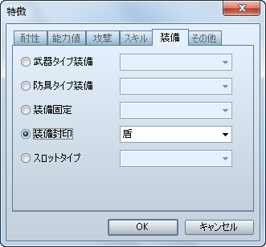
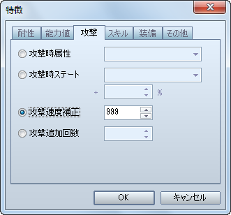
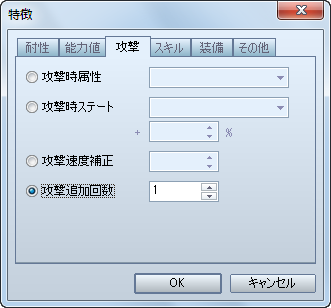
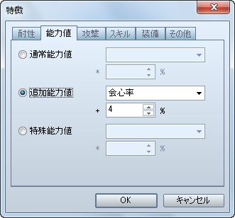
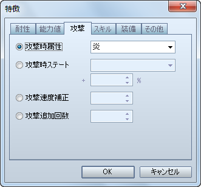
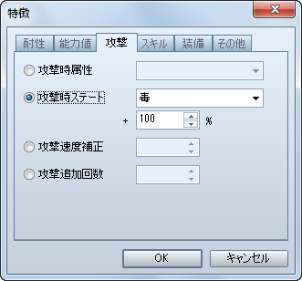

# 武器

- [［命中率］の設定方法](#01)
- [［両手持ち］の設定方法](#02)
- [［ターン内先制］の設定方法](#03)
- [［連続攻撃］の設定方法](#04)
- [［クリティカル頻発］の設定方法](#05)
- [［属性］の設定方法](#06)
- [［付加するステート］の設定方法](#07)

## ［命中率］の設定方法

武器の命中率の設定方法です。

［武器］特徴 － 能力値 － 追加能力値 － 命中率

- VX Ace では、基本的にアクターや職業に命中率が設定されていますので、その**命中率を補正する数値を設定する**ようにしてください。
- 命中率を設定しない場合は、アクターや職業に設定された命中率がそのまま適用されます。

## ［両手持ち］の設定方法

両手持ちの武器を作成する場合の設定方法です。

［武器］特徴 － 装備 － 装備封印 － 盾

- これで、VX 同様の設定になります。

## ［ターン内先制］の設定方法

敏捷性に関係なく、ターンの最初に攻撃出来る武器を作成する場合の設定方法です。

［武器］特徴 － 攻撃 － 攻撃速度補正

- VX 同様の設定にしたい場合は、**999** に設定してください。

## ［連続攻撃］の設定方法

通常攻撃 1 回につき、2 回ダメージを与える武器を作成する場合の設定方法です。

［武器］特徴 － 攻撃 － 攻撃追加回数

- VX 同様の設定にしたい場合は、**1** に設定してください。

## ［クリティカル頻発］の設定方法

会心の一撃（VX では「クリティカルヒット」）の発生確率が高くなる武器を作成する場合の設定方法です。

［武器］特徴 － 能力値 － 追加能力値 － 会心率

- VX 同様の設定にしたい場合は、**4%** に設定してください。

## ［属性］の設定方法

通常攻撃が特定の属性になる武器を作成する場合の設定方法です。

［武器］特徴 － 攻撃 － 攻撃時属性

- これで、VX 同様の設定になります。

## ［付加するステート］の設定方法

対象者にステートを付加する武器を作成する場合の設定方法です。

［武器］特徴 － 攻撃 － 攻撃時ステート

- VX 同様の設定にしたい場合は、**100%** に設定してください。

---
