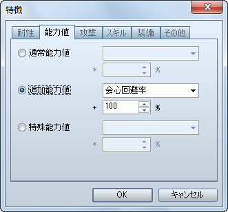
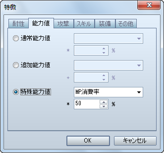
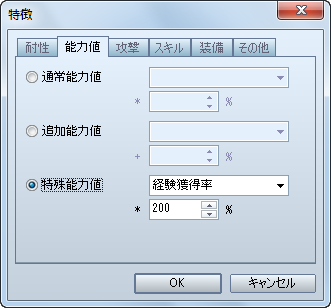
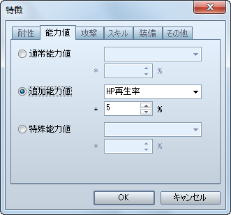
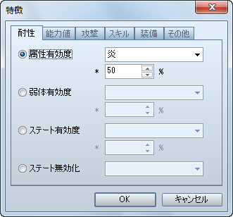
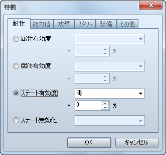

# 防具

- [［回避率］の設定方法](#01)
- [［クリティカル防止］の設定方法](#02)
- [［消費 MP 半分］の設定方法](#03)
- [［取得経験値 2 倍］の設定方法](#04)
- [［](#05)[HP 自動回復](#04)[］の設定方法](#05)
- [［半減する属性］の設定方法](#06)
- [［無効化するステート］の設定方法](#07)

## ［回避率］の設定方法

防具の回避率の設定方法です。

［防具］特徴 － 能力値 － 追加能力値 － 回避率

- VX 同様の設定にしたい場合は、［アクター］もしくは［職業］の特徴に［回避率］5% を設定した上で、防具の回避率を設定してください。

## ［クリティカル防止］の設定方法

会心の一撃（VX では「クリティカルヒット」）を防ぐ防具を作成する場合の設定方法です。

［防具］特徴 － 能力値 － 追加能力値 － 会心回避率

- VX 同様の設定にしたい場合は、**100%** に設定してください。

## ［消費ＭＰ半分］の設定方法

スキルの消費 MP を半分にする防具を作成する場合の設定方法です。

［防具］特徴 － 能力値 － 特殊能力値 － MP消費率

- VX 同様の設定にしたい場合は、**50%** に設定してください。

## ［取得経験値２倍］の設定方法

戦闘終了後に獲得出来る経験値を 2 倍にする防具を作成する場合の設定方法です。

［防具］特徴 － 能力値 － 特殊能力値 － 経験獲得率

- VX 同様の設定にしたい場合は、**200%** に設定してください。

## ［ＨＰ自動回復］の設定方法

歩行中、および戦闘中に HP が少しずつ回復する防具を作成する場合の設定方法です。

［防具］特徴 － 能力値 － 追加能力値 － HP再生率

- VX 同様の設定にしたい場合は、**5%** に設定してください。

## ［半減する属性］の設定方法

該当する属性を伴う攻撃によるダメージを半減させる防具を作成する場合の設定方法です。

［防具］特徴 － 耐性 － 属性有効度

- VX 同様の設定にしたい場合は、**50%** に設定してください。

## ［無効化するステート］の設定方法

該当するステートを無効化する防具を作成する場合の設定方法です。

［防具］特徴 － 耐性 － ステート有効度

- VX 同様の設定にしたい場合は、**0%** に設定してください。
- 特徴［ステート無効化］を設定しても同様の効果が得られますが、この場合、装備前に該当するステートになっていても、装備すると同時に該当するステートが解除されます。

---
