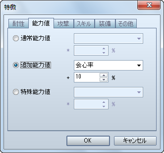
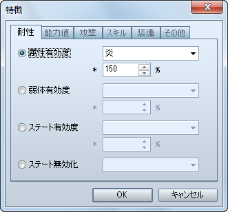
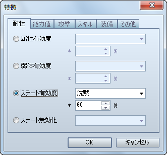

# 敵キャラ

- [［空中に配置］の設定方法](#01)
- [［クリティカルあり］の設定方法](#02)
- [［属性有効度］の設定方法](#03)
- [［ステート有効度］の設定方法](#04)

## ［空中に配置］の設定方法

VX Ace では廃止されましたので、手動で配置位置を調整してください。

## ［クリティカルあり］の設定方法

会心の一撃（VX では「クリティカルヒット」）を放つ敵キャラを作成する場合の設定方法です。

［敵キャラ］特徴 － 能力値 － 追加能力値 － 会心率

- VX 同様の設定にしたい場合は、**10%** に設定してください。

## ［属性有効度］の設定方法

属性を伴う攻撃がどれだけ有効かを設定する方法です。

［敵キャラ］特徴 － 耐性 － 属性有効度

- VX 同様にしたい場合は、以下の表を参考に［属性有効度］の数値を設定してください。

| VX での設定 | VX Ace での設定 |
| --- | --- |
| A | 200% |
| B | 150% |
| C | 100% もしくは設定しない |
| D | 50% |
| E | 0% |
| F | 廃止 |

- ［属性有効度］には 0% 以上の数値を設定しなければなりませんので、VX の［F（-100%）］のような設定は出来ません。

## ［ステート有効度］の設定方法

ステートの付加がどれだけ成功するかを設定する方法です。

［敵キャラ］特徴 － 耐性 － ステート有効度

- VX 同様にしたい場合は、以下の表を参考に［属性有効度］の数値を設定してください。

| VX での設定 | VX Ace での設定 |
| --- | --- |
| A | 100% |
| B | 80% |
| C | 60% |
| D | 40% |
| E | 20% |
| F | 0% |

---
