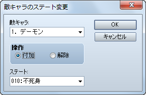

# 敵グループ

- [［不死身］の設定方法](#01)

## ［不死身］の設定方法

HP が 0 になっても戦闘不能状態にならない敵キャラを作成する場合の設定方法です。

［敵グループ］バトルイベント － イベントコマンド［敵キャラのステート変更］－ 不死身

- ステート［不死身］の付加は、0 ターン目に行うと良いでしょう。
- ステート［不死身］を解除した時点で該当する敵キャラの HP が 0 になっている場合は、解除と同時に戦闘不能状態になり、普通に倒した時と同様に消滅エフェクト処理が行われて戦闘報酬も得られます。

---
