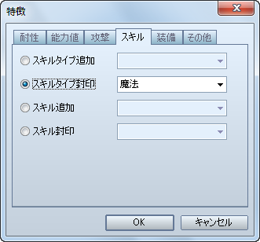
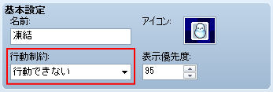
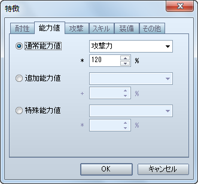
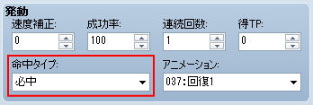
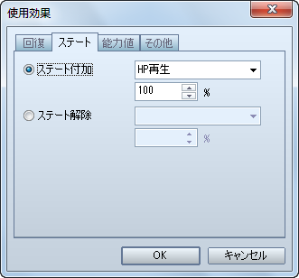
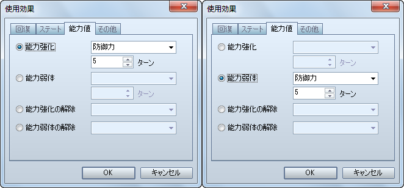
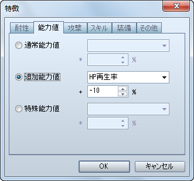
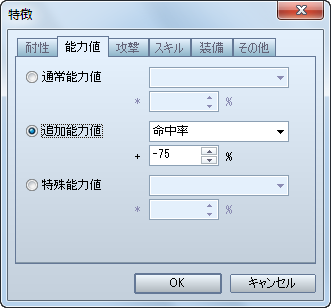
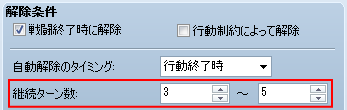
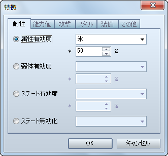

# ステート

- [［魔法を使用できない］の設定方法](#01)
- [［行動と回避ができない］の設定方法](#02)
- [［能力値変化率］の設定方法](#03)
- [［抵抗しない］の設定方法](#04)
- [［逆効果と相殺］の設定方法](#05)
- [［スリップダメージ］の設定方法](#06)
- [［命中率減少］の設定方法](#07)
- [［特定ターン経過後に特定の確率で解除］の設定方法](#08)
- [［半減する属性］の設定方法](#09)
- [［解除するステート］の設定方法](#10)

## ［魔法を使用できない］の設定方法

魔法関係度（VX では「精神関係度」）が 1 以上のスキルを使用出来なくするステートの設定方法です。

［ステート］特徴 － スキル － スキルタイプ封印

- VX Ace では、打撃関係度や魔法関係度によってではなく、スキルタイプごとに使用出来なくするかどうかを設定します。
- VX 同様の設定にしたい場合は、魔法関係度が 1 以上あるスキルに同じスキルタイプ（例：「魔法」）を設定しておき、そのスキルタイプを封印するようにしてください。

## ［行動と回避ができない］の設定方法

コマンド入力を受け付けず、さらに敵からの攻撃を回避することが出来ないステートを作成する場合、VX Ace では「行動ができない」設定と「回避ができない」設定をそれぞれ行うことになります。

###### 行動出来なくする

［ステート］基本設定 － 行動制約 － 行動できない

- これで、コマンド入力を受け付けなくなります。

###### 回避出来なくする

［ステート］特徴 － 能力値 － 追加能力値 － 回避率

- VX 同様の設定にしたい場合は、-**100%** に設定してください。
- 魔法も回避出来なくする場合は、同時に**［魔法回避率］**も **-100%** に設定してください。

## ［能力値変化率］の設定方法

攻撃力などの能力値を変化させたい場合の設定方法です。

［ステート］特徴 － 能力値 － 通常能力値

- これで、VX 同様の設定になります。

## ［抵抗しない］の設定方法

必ずこのステートにしたい場合は、このステートを付加するスキル（アイテム）側で設定を行います。

［スキル / アイテム］発動 － 命中タイプ － 必中

- ステートを付加するスキル（アイテム）が必ず命中するため、必ずステート付加の判定が行われるようになります。

［スキル / アイテム］使用効果 － ステート － ステート付加

- 通常は **100%** に設定すれば良いですが、対象者のステート有効度が 100% 未満になる可能性がある場合は、最大値である **1000%** を設定すると良いでしょう。

## ［逆効果と相殺］の設定方法

VX Ace では設定出来ません。

その代わり、スキル（アイテム）の［使用効果］に［能力強化］、［能力弱体］を設定すると、［逆効果と相殺］とほぼ同様の効果が得られます。例えば、防御力が強化されている対象に防御力を弱体するスキル（アイテム）を使用すると、防御力強化が打ち消され、対象は強化されていない元の状態になります。

## ［スリップダメージ］の設定方法

マップを移動したり、戦闘中にターンが経過したりすると HP が減るステートを作成したい場合の設定方法です。

［ステート］特徴 － 能力値 － 追加能力値 － HP再生率

- VX 同様の設定にしたい場合は、**-10%** に設定してください。
- マップ上では、20 歩に 1 回、設定したダメージを受けます。

## ［命中率減少］の設定方法

物理攻撃の命中率を下げるステートを作成したい場合の設定方法です。

［ステート］特徴 － 能力値 － 追加能力値 － 命中率

- VX 同様の設定にしたい場合は、**-75%** に設定してください。

## ［特定ターン経過後に特定の確率で解除］の設定方法

VX Ace では、ステートが解除される最短ターンと最長ターンを設定するように仕様が変更されています。ですので、解除される確率を考慮した上で、解除される最短ターンと最長ターンに幅を持たせるようにしてください。

## ［半減する属性］の設定方法

該当する属性を伴う攻撃によるダメージを半減させるステートを作成したい場合の設定方法です。

［ステート］特徴 － 耐性 － 属性有効度

- VX 同様の設定にしたい場合は、**50%** に設定してください。

## ［解除するステート］の設定方法

VX Ace では設定出来ません。

- 戦闘不能時は、自動的にすべてのステートが解除されます。
- ［ステート］特徴 － 耐性 － ステート無効化 でステートを解除することは出来ますが、以降、そのステートにならなくなってしまいます。

---
